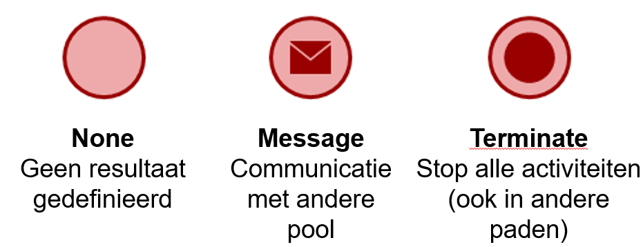

# BPMN

De meest gebruikt methode voor het vormgeven van de bedrijfsprocessen is BPMN. BPMN staat voor Business Process Model
and Notation. Het primaire doel van een BPMN is het het creëren van begrijpelijkheid voor alle belanghebbenden (denk
aan: analisten, ontwikkelaars maar ook mensen uit de business)

## BPMN onderdelen

Op hoog niveau heeft het BPMN model de volgende onderdelen:
- Start- en eindevents
  - Dit spreekt relatief voor zichtzelf. Het toont aan waar een event start of eindigt
- Swimlane
    - In BPMN is het gebruikelijk om de actor die de activiteit uitvoert op te nemen in het diagram. Dit gebeurt door middel van een swimlane. Iedere actor of participant krijgt dan een eigen swimlane.
- Pool
  - De swimlanes samen vormen een zogenaamde pool. Het is gebruikelijk om elke organisatie, die een rol speelt, een eigen pool te geven.
- Sequence flow
  - Een sequence flow zijn de lijnen tussen de verschillende elementen of activiteiten. Deze laten dus de volgorde (of 'flow') zien van de activiteiten.

## Events

Een event in het BPMN model staat voor een gebeurtenis die optreed gedurende het verloop van een proces. Dit event kan 
een proces starten, vertragen, onderbreken of beëindigen. Er zijn verschillende soorten events:
- Start event: Dit duid de start van een proces. Een start event is altijd een cirkel met een dunne rand. Dit kan op verschillende manieren getriggerd worden: \

  - Geen trigger (none): meestal wordt het proces dan handmatig gestart.
  - Timer: Dit kan een eenmalige timmer zijn of terugkerend.
  - Message: Een bericht dat uit een andere pool komt.
- End event: Dit duid het eind van een pad of proces. Een end event is altijd een cirkel met een dikke ran. Ok hier zijn er weer verschillende typen: \

  - None: er is een resultaat gedefineerd wat het proces stopt. Na de laatste activiteit is het proces klaar.
  - Message: Er is een bericht gestuurd naar een andere pool waardoor het proces klaar is.
  - Terminate: Alle activiteiten (ook in andere paden) worden gestopt.
- Intermediate event: dit vindt plaats gedurende het proces. Dit event zie je dus meestal tussen twee activiteiten. Dit event is atijd een cirkel met twee ringen. Ook hier hebben we weer verschillende triggers in: \

  - None: er is geen specifieke trigger
  - Timer: de trigger is een bepaalde tijdsperiode
  - Message: de trigger is een verzonden of ontvangen bericht

## Activiteiten

De activiteiten in het bedrijfsproces wordt vormgegeven door middel van taken. Dit kunnen we opdelen in 3 verschillende 
soorten:
- Task \

  - Dit is een omschrijving in de gebiedende wijs. Deze taak wordt niet verder opgedeeld. Denk bijvoorbeeld aan: "schrijf artikel" of "verzend goederen".
- Subprocess \

  - Dit is een deelproces, samengesteld uit meerdere activiteiten. Deze activiteit(en) worden niet verder gespecificeerd omdat ze niet van toepassing zijn voor het proces dat je wilt weergeven. Denk bijvoorbeeld aan: "Order aanmaken".
- Call activity \

  - Dit is een deelproces dat is geschikt voor hergebruik.

## Gateways

Als onderdeel van de flow kan je gebruik maken van een aantal gateways. Deze gateways zie je tussen de activiteiten staan. 
De drie meest voorkomende gateways die je vaak tegenkomt zijn:
- Exclusive gateways \

  - Een exclusive gateway sluit de alternatieven uit aan de hand van een conditie. Denk dus bijvoorbeeld aan een beslissing die gemaakt worden waar een ja of nee uit kan komen, maar nooit beide.
- Parallel gateways \
  
  - In een parallel gateway worden beide paden in willekeurige volgorde uitgevoerd. Denk eraan dat bij deze gateway er geen voorwaarden worden geschept.
- Inclusive gateway \
  
  - Bij deze gateway kunnen er 1 of meerdere paden bewandeld worden aan de hand van een conditie. Dit wijkt dus iets af van de exclusive gateway, waar maar 1 pad wordt bewandeld.

## Message flows

Bij het vormgeven van een bedrijfsproces kan het natuurlijk voorkomen dat er wordt samengewerkt met een ander (extern) 
persoon of ander bedrijf. Dit modelleren we met verschillende pools. De interactie tussen de verschillende pools worden 
weergegeven door middel van message flows. Let er wel op dat andere pools kunnen worden gezien als een black box: we hebben 
zelf geen inzicht wat er precies gebeurt. We weten alleen wat we er naartoe sturen en wat we terug krijgen. Het proces 
daartussen is dus onbekend. \

## Hoe bepaal je welke/hoeveel taken je modelleert?

Bij het bepalen van de hoeveelheid taken maak je gebruik van de granulariteit. In de ICT zien we dit als de mate waarin 
details aanwezig zijn in de modellen. In de BPMN zien we dit als het uitsplitsen van elke processtap naar de kleinst 
mogelijke handeling die door een actor kan worden uitgevoerd. Dit is toch vaak een enorme punt van discussie, want 
verschillende mensen kunnen op andere manieren kijken naar de verschillende handelingen. Kijk als voorbeeld naar het 
volgende model: \
 \
Je kan een discussie voeren of de assembleer stoelen activiteit de kleinste handeling is. Waarom niet bijvoorbeeld: 
schroef bouten vast? Of zet stoelen op lopende band? De discussie die je dan moet voeren is of deze handeling echt een 
impact hebben op het proces die je probeert vorm te geven.

## Voorbeeld van een BPMN model

Hieronder vind je een uitgewerkt voorbeeld van een BPMN model. Bekijk deze eens en probeer aan de hand van de informatie 
op deze pagina eens de volgende vragen te beantwoorden:
- Wat gebeurt er in dit proces?
- Welke typen message events vind je terug?
- Waarom is het message event linksboven een start event?
- Waarom wordt voor Ontvang producten en Rekening ontvngen een parallel gateway gebruikt?
- Wat gebeurt er als de order niet wordt geaccepteerd?
- Waarom wordt tussen Rekening verzenden en Rekening ontvangen een message flow gebruikt? \
  

Naast wat er hier is behandeld zijn er nog veel meer activiteiten, events en gateways beschikbaar. Deze kan je altijd 
terugvinden op http://bpmb.de/poster