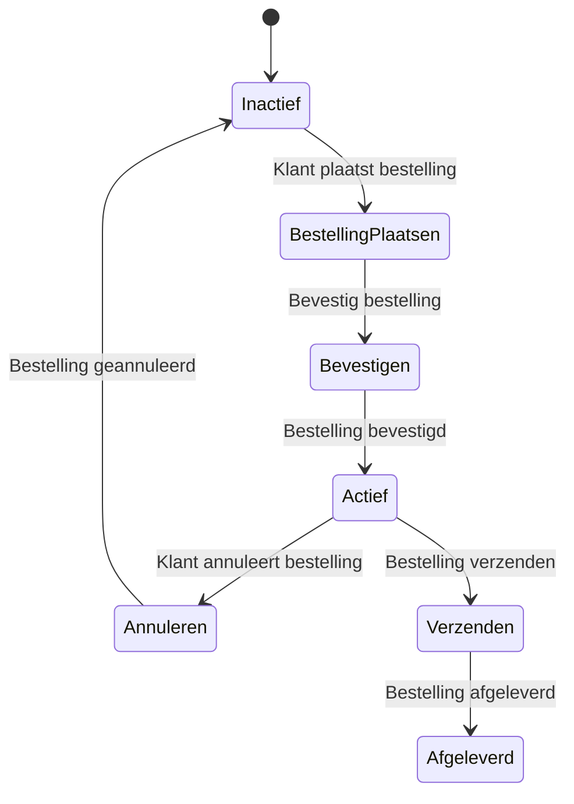

# Beschrijven van gedrag

Nu we de processen in kaart hebben gebracht, is het tijd om te kijken naar het gedrag van de processen. Dit helpt ons 
te begrijpen hoe de processen zich gedragen onder verschillende omstandigheden en hoe ze reageren op veranderingen in 
de omgeving. Dit begrip kan dan meegenomen worden door de developers bij het schrijven van de code. De beschrijving van 
het gedrag kan opgenomen worden in het zogenaamde design document, dat een belangrijk onderdeel is van het 
softwareontwikkelingsproces.

Er zijn veel manieren om het gedrag van processen te beschrijven. Wij gaan hier 2 manieren bespreken: 
- De beschrijving van het gedrag in tekstuele vorm door middel van Gherkin.
- De beschrijving van het gedrag in diagramvorm door middel van een state diagram (toestandsdiagram).

## Gherkin

Gherkin is een taal die gebruikt wordt om het gedrag van software te beschrijven in een begrijpelijke en gestructureerde 
manier. Het is een onderdeel van het Behavior Driven Development (BDD) proces en helpt teams om de vereisten van de 
software te begrijpen en te communiceren. Gherkin gebruikt een eenvoudige syntaxis die gemakkelijk te lezen en te 
schrijven is, waardoor het toegankelijk is voor zowel technische als niet-technische teamleden. 

Gherkin beschrijft het gedrag van software in termen van "features", "scenarios" en "steps":
- **Feature**: Een feature is een functionaliteit of eigenschap van de software die waarde toevoegt voor de gebruiker. 
  Het beschrijft wat de software moet doen.
- **Scenario**: Een scenario is een specifieke situatie of voorbeeld van het gebruik van de feature. Het beschrijft 
  hoe de feature in de praktijk wordt gebruikt.
- **Step**: Een step is een individuele actie of gebeurtenis die plaatsvindt binnen een scenario. Het beschrijft 
  de specifieke stappen die moeten worden uitgevoerd om het scenario te voltooien.

In Gherkin worden de stappen beschreven in de vorm van "Given", "When" en "Then":
- **Given**: Dit beschrijft de initiële toestand of context waarin het scenario zich bevindt. Het stelt de 
  voorwaarden vast voor het scenario.
- **When**: Dit beschrijft de actie of gebeurtenis die plaatsvindt binnen het scenario. Het is de trigger die 
  het scenario in gang zet.
- **Then**: Dit beschrijft het verwachte resultaat of de uitkomst van de actie die in het scenario is uitgevoerd. 
  Het definieert wat er moet gebeuren als het scenario correct is uitgevoerd.
- **And**: Dit wordt gebruikt om extra stappen toe te voegen aan een scenario, die niet noodzakelijkerwijs 
  een nieuwe actie of gebeurtenis beschrijven, maar wel relevant zijn voor het scenario.
- **But**: Dit wordt gebruikt om uitzonderingen of alternatieve scenario's te beschrijven die kunnen optreden 
  tijdens het uitvoeren van het scenario.

Hier is een voorbeeld van hoe Gherkin gebruikt kan worden om het gedrag van een proces te beschrijven:

```gherkin
Feature: Verwerken van een bestelling

  Scenario: Klant plaatst een bestelling
    Given de klant is ingelogd
    When de klant een product toevoegt aan het winkelwagentje
    And de klant gaat naar de checkout pagina
    Then de klant ziet een overzicht van de bestelling
    And de klant kan de bestelling bevestigen

  Scenario: Klant annuleert een bestelling
    Given de klant heeft een bestelling geplaatst
    When de klant gaat naar de bestelgeschiedenis
    And de klant annuleert de bestelling
    Then de bestelling is geannuleerd
```
In dit voorbeeld beschrijft de feature "Verwerken van een bestelling" twee scenario's: het plaatsen van een bestelling 
en het annuleren van een bestelling. De stappen in elk scenario beschrijven de acties die de klant uitvoert en de 
verwachte resultaten. Gherkin maakt het mogelijk om het gedrag van software op een gestructureerde en begrijpelijke 
manier te beschrijven, waardoor het gemakkelijker wordt om de vereisten te begrijpen en te communiceren binnen het team.

## State Diagram
Een state diagram is een visuele representatie van de verschillende toestanden waarin een proces zich kan bevinden en 
de overgangen tussen deze toestanden. Het helpt om het gedrag van een proces te begrijpen door de verschillende 
toestanden en de gebeurtenissen die leiden tot overgangen tussen deze toestanden te beschrijven. Een state diagram 
bestaat uit toestanden, overgangen en gebeurtenissen:
- **Toestand**: Een toestand is een specifieke situatie waarin het proces zich bevindt. Het kan worden weergegeven 
  als een rechthoek met de naam van de toestand erin.
- **Overgang**: Een overgang is een verandering van de ene toestand naar de andere. Het wordt weergegeven als een 
  pijl tussen twee toestanden, met de gebeurtenis die de overgang veroorzaakt.
- **Gebeurtenis**: Een gebeurtenis is een actie of gebeurtenis die de overgang tussen toestanden veroorzaakt. 
  Het wordt weergegeven als een label op de overgangspijl.

Hier is een voorbeeld van een state diagram voor het proces van het verwerken van een bestelling:


In dit voorbeeld begint het proces in de toestand "Inactief". Wanneer de klant een bestelling plaatst, gaat het proces 
naar de toestand "BestellingPlaatsen". Na bevestiging van de bestelling gaat het proces naar de toestand "Actief". 
Als de klant de bestelling annuleert, gaat het proces terug naar de toestand "Inactief". Als de bestelling wordt 
verzonden, gaat het proces naar de toestand "Verzenden" en uiteindelijk naar de toestand "Afgeleverd" wanneer de 
bestelling is afgeleverd. 
State diagrams zijn nuttig voor het begrijpen van de dynamiek van een proces en kunnen helpen bij het identificeren 
van mogelijke problemen of verbeteringen in het proces. Ze kunnen ook worden gebruikt om de implementatie van het proces 
te begeleiden door de verschillende toestanden en overgangen te definiëren die in de code moeten worden geïmplementeerd.

## Cucumber Framework
Zoals eerder uitgelegd, wordt Gherkin gebruikt om het gewenste gedrag van software in begrijpelijke scenario's te 
beschrijven. Maar om deze scenario's daadwerkelijk te kunnen testen en automatiseren, heb je een tool nodig die deze 
Gherkin-bestanden kan uitvoeren. Hier komt het Cucumber framework in beeld.

Cucumber is een testautomatiseringsframework dat direct werkt met Gherkin-scenario's. Het framework leest de scenario's 
uit de feature-bestanden en koppelt deze aan zogenaamde step definitions: code die de beschreven stappen uitvoert. 
Hierdoor kun je de in Gherkin beschreven requirements direct valideren met geautomatiseerde tests. Dit zorgt voor een 
naadloze verbinding tussen specificatie (Gherkin) en uitvoering (Cucumber).

### Hoe werkt Cucumber?
1. **Feature-bestanden**: Je schrijft scenario's in Gherkin in `.feature`-bestanden.
2. **Step Definitions**: Je koppelt de Gherkin-stappen aan code (meestal in Java, JavaScript, Ruby, etc.) die de stappen uitvoert.
3. **Testuitvoering**: Cucumber leest de feature-bestanden, zoekt de bijbehorende step definitions en voert de tests uit.

### Voorbeeldimplementatie (Java)
Stel je hebt het volgende Gherkin-scenario in `bestelling.feature`:

```gherkin
Feature: Bestelling verwerken
  Scenario: Klant plaatst een bestelling
    Given de klant is ingelogd
    When de klant een product toevoegt aan het winkelwagentje
    And de klant gaat naar de checkout pagina
    Then de klant ziet een overzicht van de bestelling
    And de klant kan de bestelling bevestigen
```

De bijbehorende step definitions in Java kunnen er zo uitzien:

```java
package nl.jouwproject.stappen;

import io.cucumber.java.en.Given;
import io.cucumber.java.en.When;
import io.cucumber.java.en.Then;

public class BestellingSteps {
    @Given("de klant is ingelogd")
    public void klantIsIngelogd() {
        // Code om in te loggen
    }

    @When("de klant een product toevoegt aan het winkelwagentje")
    public void productToevoegenAanWinkelwagentje() {
        // Code om product toe te voegen
    }

    @When("de klant gaat naar de checkout pagina")
    public void klantGaatNaarCheckoutPagina() {
        // Code om naar de checkout pagina te gaan
    }

    @Then("de klant ziet een overzicht van de bestelling")
    public void overzichtBestellingZien() {
        // Code om overzicht te tonen
    }

    @Then("de klant kan de bestelling bevestigen")
    public void klantKanBestellingBevestigen() {
        // Code om bestelling te bevestigen
    }
}
```

### Voorbeeld folderstructuur en Cucumber-runner in Java
Om Cucumber correct te laten werken, is het belangrijk dat je projectstructuur overeenkomt met de package-instellingen 
in je Cucumber-runner en step definitions. Hieronder een voorbeeld van een mogelijke folderstructuur, inclusief de 
locatie van de Cucumber-runner:

```
project-root/
└── src/
    └── test/
        ├── java/
        │   └── nl/
        │       └── jouwproject/
        │           └── stappen/
        │               ├── BestellingSteps.java
        │               └── RunCucumberTest.java
        └── resources/
            └── features/
                └── bestelling.feature
```

- **BestellingSteps.java**: bevat de step definitions, in de package `nl.jouwproject.stappen`.
- **RunCucumberTest.java**: de Cucumber-runner, in dezelfde package.
- **bestelling.feature**: het feature-bestand, in de map `features` onder `resources`.

Hieronder zie je hoe de Cucumber-runner eruitziet, passend bij deze structuur:

```java
package nl.jouwproject.stappen;

import org.junit.platform.suite.api.ConfigurationParameter;
import org.junit.platform.suite.api.IncludeEngines;
import org.junit.platform.suite.api.SelectClasspathResource;
import org.junit.platform.suite.api.Suite;

import static io.cucumber.junit.platform.engine.Constants.GLUE_PROPERTY_NAME;

@Suite
@IncludeEngines("cucumber")
@SelectClasspathResource("features") // map met feature-bestanden
@ConfigurationParameter(key = GLUE_PROPERTY_NAME, value = "nl.jouwproject.stappen") // package met step definitions
public class RunCucumberTest {
}
```

Zorg ervoor dat de package-namen in je Java-bestanden overeenkomen met de mappenstructuur. Zo kan Cucumber de juiste 
bestanden vinden tijdens het uitvoeren van de tests.

### Cucumber gebruiken
1. Voeg Cucumber toe aan je project (bijvoorbeeld via Maven of npm).

Voor Maven voeg je de volgende dependency toe aan je `pom.xml` (versie juni 2025):

```xml
<dependency>
  <groupId>io.cucumber</groupId>
  <artifactId>cucumber-java</artifactId>
  <version>7.15.0</version>
  <scope>test</scope>
</dependency>
<dependency>
  <groupId>io.cucumber</groupId>
  <artifactId>cucumber-junit-platform-engine</artifactId>
  <version>7.15.0</version>
  <scope>test</scope>
</dependency>
```

2. Maak een `features`-map met je `.feature`-bestanden.
3. Implementeer de step definitions in de gewenste programmeertaal.
4. Voer de tests uit met de Cucumber-runner.

Cucumber maakt het mogelijk om specificaties en tests te combineren, waardoor je requirements direct kunt valideren met 
geautomatiseerde tests.

