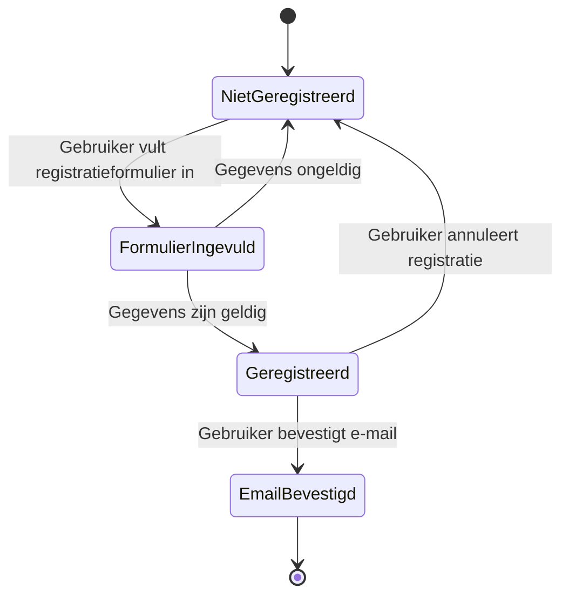

# Beschrijven van gedrag

## Behavior-Driven Development (BDD)

Behavior-Driven Development (BDD) is een manier van software ontwikkelen waarbij je het gewenste gedrag van een systeem 
beschrijft vanuit het perspectief van de gebruiker of de business. In plaats van direct te denken aan technische 
oplossingen, begin je bij BDD met het beschrijven van voorbeelden van gewenst gedrag in gewone taal. Dit helpt om 
misverstanden te voorkomen en zorgt ervoor dat iedereen (ontwikkelaars, testers, opdrachtgevers) hetzelfde beeld heeft 
van wat het systeem moet doen.

### Hoe werkt BDD?
- Je beschrijft samen met de opdrachtgever of gebruiker het gewenste gedrag van het systeem in concrete voorbeelden.
- Deze voorbeelden schrijf je op in een vaste structuur, vaak met de woorden: **Given** (gegeven), **When** (wanneer), **Then** (dan).
- Ontwikkelaars gebruiken deze voorbeelden om tests te schrijven en de software te bouwen.

### Waarom BDD?
- Het maakt requirements concreet en testbaar.
- Het bevordert samenwerking tussen ontwikkelaars, testers en opdrachtgevers.
- Het voorkomt misverstanden over wat het systeem moet doen.

### Samenvatting
- BDD helpt je om gedrag van het systeem te beschrijven in gewone taal.
- Gherkin is een veelgebruikte taal om BDD-scenario's op te schrijven.
- State diagrams geven overzicht van toestanden en overgangen; BDD-scenario's vullen deze aan met concrete voorbeelden.


## State Diagram
Een state diagram (toestandsdiagram) is een visueel hulpmiddel dat laat zien in welke verschillende toestanden (states) 
een systeem of onderdeel van een systeem zich kan bevinden, en hoe het systeem van de ene naar de andere toestand 
overgaat. Dit type diagram wordt veel gebruikt in softwareontwikkeling om het gedrag van bijvoorbeeld een object, 
proces of applicatie te modelleren.

### Waarom een state diagram?
State diagrams helpen je om:
- Het gedrag van een systeem overzichtelijk te maken.
- Te begrijpen hoe een systeem reageert op verschillende gebeurtenissen.
- Randgevallen en uitzonderingen te ontdekken.
- De implementatie van klassen of processen te structureren.

### Onderdelen van een state diagram
- **Toestand (State):** Een situatie waarin een systeem zich kan bevinden. Bijvoorbeeld: 'Inactief', 'Actief', 'Verzonden'.
- **Overgang (Transition):** De pijl tussen twee toestanden, die aangeeft hoe en wanneer het systeem van de ene naar de andere toestand gaat. Een overgang wordt meestal getriggerd door een gebeurtenis (event).
- **Gebeurtenis (Event):** De actie of gebeurtenis die een overgang veroorzaakt, bijvoorbeeld: 'Bestelling plaatsen', 'Annuleren', 'Verzenden'.

### Voorbeeld: Gebruikersregistratie
Hieronder zie je een voorbeeld van een state diagram. Het proces beschrijft de registratie van een nieuwe gebruiker.

#### State diagram voor gebruikersregistratie



- Het proces start bij 'NietGeregistreerd'.
- De gebruiker vult het registratieformulier in. Bij geldige gegevens wordt de gebruiker 'Geregistreerd', anders blijft deze 'NietGeregistreerd'.
- Na registratie kan de gebruiker de e-mail bevestigen of de registratie annuleren.
- Als de e-mail is bevestigd, gaat het proces naar 'EmailBevestigd', anders blijft de gebruiker 'Geregistreerd'.
- Het proces eindigt bij 'EmailBevestigd' of keert terug naar 'NietGeregistreerd' als de registratie wordt geannuleerd.

## Gherkin
Gherkin is een taal die gebruikt wordt om het gedrag van software te beschrijven in een begrijpelijke en gestructureerde manier. Het is een onderdeel van het Behavior Driven Development (BDD) proces en helpt teams om de vereisten van de software te begrijpen en te communiceren. Gherkin gebruikt een eenvoudige syntaxis die gemakkelijk te lezen en te schrijven is, waardoor het toegankelijk is voor zowel technische als niet-technische teamleden.

Gherkin beschrijft het gedrag van software in termen van "features", "scenarios" en "steps":
- **Feature**: Een feature is een functionaliteit of eigenschap van de software die waarde toevoegt voor de gebruiker. Het beschrijft wat de software moet doen.
- **Scenario**: Een scenario is een specifieke situatie of voorbeeld van het gebruik van de feature. Het beschrijft hoe de feature in de praktijk wordt gebruikt.
- **Step**: Een step is een individuele actie of gebeurtenis die plaatsvindt binnen een scenario. Het beschrijft de specifieke stappen die moeten worden uitgevoerd om het scenario te voltooien.

In Gherkin worden de stappen beschreven in de vorm van "Given", "When" en "Then":
- **Given**: Dit beschrijft de initiële toestand of context waarin het scenario zich bevindt. Het stelt de voorwaarden vast voor het scenario.
- **When**: Dit beschrijft de actie of gebeurtenis die plaatsvindt binnen het scenario. Het is de trigger die het scenario in gang zet.
- **Then**: Dit beschrijft het verwachte resultaat of de uitkomst van de actie die in het scenario is uitgevoerd. Het definieert wat er moet gebeuren als het scenario correct is uitgevoerd.
- **And**: Dit wordt gebruikt om extra stappen toe te voegen aan een scenario, die niet noodzakelijkerwijs een nieuwe actie of gebeurtenis beschrijven, maar wel relevant zijn voor het scenario.
- **But**: Dit wordt gebruikt om uitzonderingen of alternatieve scenario's te beschrijven die kunnen optreden tijdens het uitvoeren van het scenario.

Hier is een voorbeeld van hoe Gherkin gebruikt kan worden om het gedrag van het gebruikersregistratieproces te beschrijven:

```gherkin
Feature: Gebruikersregistratie

  Scenario: Succesvolle registratie
    Given de gebruiker is niet geregistreerd
    When de gebruiker vult het registratieformulier correct in
    And de gebruiker bevestigt de registratie via e-mail
    Then is de gebruiker geregistreerd en bevestigd

  Scenario: Registratie met ongeldige gegevens
    Given de gebruiker is niet geregistreerd
    When de gebruiker vult het registratieformulier onjuist in
    Then blijft de gebruiker niet geregistreerd

  Scenario: Gebruiker annuleert registratie
    Given de gebruiker is niet geregistreerd
    When de gebruiker vult het registratieformulier correct in
    And de gebruiker annuleert de registratie
    Then blijft de gebruiker niet geregistreerd
```

### Cucumber Framework
Zoals eerder uitgelegd, wordt Gherkin gebruikt om het gewenste gedrag van software in begrijpelijke scenario's te 
beschrijven. Maar om deze scenario's daadwerkelijk te kunnen testen en automatiseren, heb je een tool nodig die deze 
Gherkin-bestanden kan uitvoeren. Hier komt het Cucumber framework in beeld.

Cucumber is een testautomatiseringsframework dat direct werkt met Gherkin-scenario's. Het framework leest de 
scenario's uit de feature-bestanden en koppelt deze aan zogenaamde step definitions: code die de beschreven stappen 
uitvoert. Hierdoor kun je de in Gherkin beschreven requirements direct valideren met geautomatiseerde tests. Dit zorgt 
voor een naadloze verbinding tussen specificatie (Gherkin) en uitvoering (Cucumber).

#### Hoe werkt Cucumber?
1. **Feature-bestanden**: Je schrijft scenario's in Gherkin in `.feature`-bestanden.
2. **Step Definitions**: Je koppelt de Gherkin-stappen aan code (meestal in Java, JavaScript, Ruby, etc.) die de stappen uitvoert.
3. **Testuitvoering**: Cucumber leest de feature-bestanden, zoekt de bijbehorende step definitions en voert de tests uit.

#### Voorbeeldimplementatie (Java)
Stel je hebt het volgende Gherkin-scenario in `registratie.feature`:

```gherkin
Feature: Gebruikersregistratie
  Scenario: Succesvolle registratie
    Given de gebruiker is niet geregistreerd
    When de gebruiker vult het registratieformulier correct in
    And de gebruiker bevestigt de registratie via e-mail
    Then is de gebruiker geregistreerd en bevestigd
```

De bijbehorende step definitions in Java kunnen er zo uitzien:

```java
package nl.jouwproject.stappen;

import io.cucumber.java.nl.Gegeven;
import io.cucumber.java.nl.Als;
import io.cucumber.java.nl.Dan;

public class RegistratieSteps {
    @Gegeven("de gebruiker is niet geregistreerd")
    public void gebruikerNietGeregistreerd() {
        // Setup voor niet-geregistreerde gebruiker
    }

    @Als("de gebruiker vult het registratieformulier correct in")
    public void registratieformulierCorrectIngevuld() {
        // Formulier correct invullen
    }

    @Als("de gebruiker bevestigt de registratie via e-mail")
    public void registratieBevestigenViaEmail() {
        // E-mail bevestigen
    }

    @Dan("is de gebruiker geregistreerd en bevestigd")
    public void gebruikerGeregistreerdEnBevestigd() {
        // Controleer registratie en bevestiging
    }
}
```

#### Voorbeeld folderstructuur en Cucumber-runner in Java
Om Cucumber correct te laten werken, is het belangrijk dat je projectstructuur overeenkomt met de package-instellingen in je Cucumber-runner en step definitions. Hieronder een voorbeeld van een mogelijke folderstructuur, inclusief de locatie van de Cucumber-runner:

```
project-root/
└── src/
    └── test/
        ├── java/
        │   └── nl/
        │       └── jouwproject/
        │           └── stappen/
        │               ├── RegistratieSteps.java
        │               └── RunCucumberTest.java
        └── resources/
            └── features/
                └── registratie.feature
```

- **RegistratieSteps.java**: bevat de step definitions, in de package `nl.jouwproject.stappen`.
- **RunCucumberTest.java**: de Cucumber-runner, in dezelfde package.
- **registratie.feature**: het feature-bestand, in de map `features` onder `resources`.

Hieronder zie je hoe de Cucumber-runner eruitziet, passend bij deze structuur:

```java
package nl.jouwproject.stappen;

import org.junit.platform.suite.api.ConfigurationParameter;
import org.junit.platform.suite.api.IncludeEngines;
import org.junit.platform.suite.api.SelectClasspathResource;
import org.junit.platform.suite.api.Suite;

import static io.cucumber.junit.platform.engine.Constants.GLUE_PROPERTY_NAME;

@Suite
@IncludeEngines("cucumber")
@SelectClasspathResource("features") // map met feature-bestanden
@ConfigurationParameter(key = GLUE_PROPERTY_NAME, value = "nl.jouwproject.stappen") // package met step definitions
public class RunCucumberTest {
}
```

#### Cucumber gebruiken
1. Voeg Cucumber toe aan je project (bijvoorbeeld via Maven of npm).

Voor Maven voeg je de volgende dependency toe aan je `pom.xml` (versie juni 2025):

```xml
<dependency>
  <groupId>io.cucumber</groupId>
  <artifactId>cucumber-java</artifactId>
  <version>7.15.0</version>
  <scope>test</scope>
</dependency>
<dependency>
  <groupId>io.cucumber</groupId>
  <artifactId>cucumber-junit-platform-engine</artifactId>
  <version>7.15.0</version>
  <scope>test</scope>
</dependency>
```

2. Maak een `features`-map met je `.feature`-bestanden.
3. Implementeer de step definitions in de gewenste programmeertaal.
4. Voer de tests uit met de Cucumber-runner.

Cucumber maakt het mogelijk om specificaties en tests te combineren, waardoor je requirements direct kunt valideren met geautomatiseerde tests.
