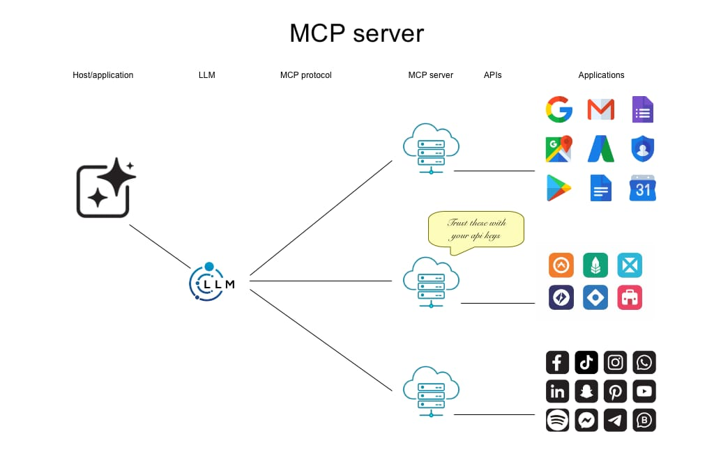

# MCP Server
In deze module leer je wat een MCP server is en hoe je deze kunt gebruiken om de kwaliteit van de code die er geschreven wordt te verbeteren.

IK HEB NIET HET GEVOEL DAT DIT ERGENS HEEN GAAT...

## Inhoud

## Wat is een MCP server?
Een LLM heeft twee grote beperkingen: 1) De dataset waarmee de LLM getraind is is statisch en 2) De antwoorden beperken zich tot tekst. 

Hierdoor lijkt het of het gebruik van een LLM beperkt is tot het reageren op en genereren van tekst. Nu is code in de basis tekst, vandaar dat een LLM nu al zo'n grote impact heeft op software development. Maar er zijn meer mogelijkheden.

Stel dat we een LLM de opdracht geven: "Zet de team meeting in mijn agenda". De LLM kan deze opdracht niet uitvoeren omdat het geen toegang heeft tot je agenda. Nu heeft je agenda wel een API die de LLM eventueel zou kunnen aanroepen, maar de LLM heeft geen toegang tot deze API. Daarnaast is de API voor elke applicatie weer anders.

Een MCP server (Model-Connected Platform server) is een server die een LLM verbindt met andere systemen via API's. Het is duus een soort van middleware tussen de LLM en andere systemen. Doordat elke MCP server gebruik maakt van hetzelfde protocol, kan een LLM die met een MCP server kan communiceren, communiceren met alle systemen die via een MCP server verbonden zijn.

Door gebruik te maken van een MCP server kan de LLM niet alleen tekst genereren, maar ook acties uitvoeren in andere systemen, de implicaties op de mogelijkheden van een LLM zijn enorm.

Maar MCP servers kunnen nog meer. Een MCP server kan ook gebruikt worden om de LLM te voorzien van extra informatie die niet in de dataset van de LLM zit. Bijvoorbeeld door een koppeling te maken met een document management systeem, kan de LLM toegang krijgen tot alle documenten die in het document management systeem zitten. Hierdoor kan de LLM veel beter antwoord geven op vragen die betrekking hebben op deze documenten.

