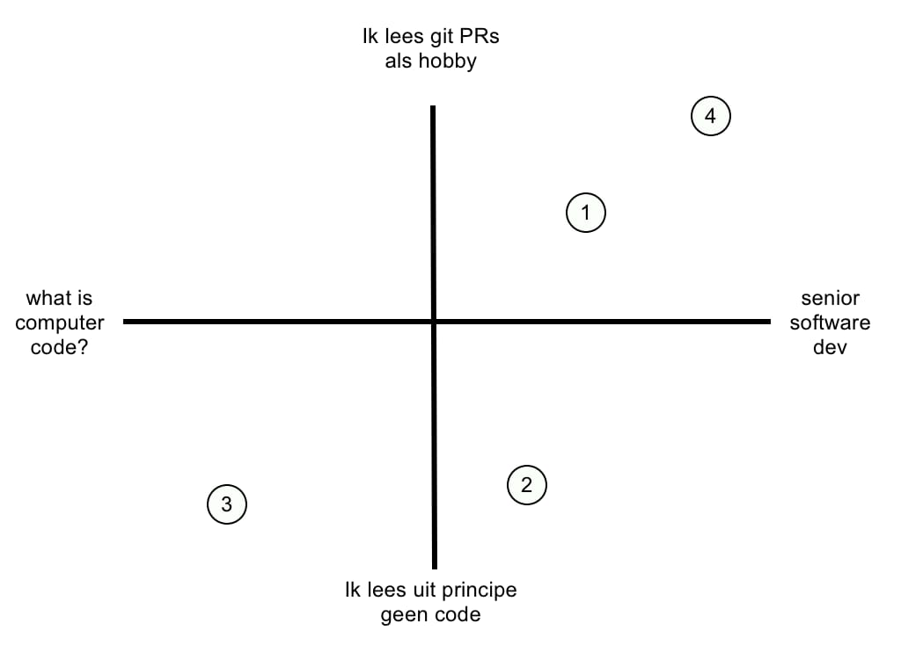

# De rol van een analist bij gebruik van AI

## What is vibe coding?
Er is veel nog onduidelijk over de toekomst van AI en LLMs, maar een van de kreten die veel gebruikt wordt is 'vibe coding'. Sommigen zijn fel tegenstander en vinden het belachelijk anderen denken dat het de toekomst is. Veel van de tegengestelde meningen komen voort uit de interpretatie van de kreet 'vibe coding'. Dus wat is het? 

Mogelijke definities
1) Doing most of the Work via plain English
2) Ignoring the code entirely and only use prompting
3) Non developers writing code using AI
4) Using auto complete (tab) in your IDE

Een serieuze software developer vindt wellicht dat 3) een belachelijk idee is, maar gebruikt 4) wel. Dit zouden we in onderstaand diagram uit kunnen zetten:

Bij 1) is het belangrijke woord 'most'. We hebben hier te maken met iemand die wel degelijk zelf code kan maken, maar zo veel mogelijk gebruik maakt van een LLM om zo veel mogelijk code te laten genereren. 

Bij 2) is een developer aan de slag die geen zin (of geen tijd) heeft om de code zelf te genereren. Hij zou het wellicht wel kunnen, maar heeft er gewoon geen interesse in.

Bij 3) gaat het om iemand die weinig of geen verstand heeft van het genereren van code en daar ook geen enkele interesse in heeft.

Bij 4) zien we een ervaren developer, die primair zijn eigen code schrijft, maar wel gebruik maakt van een LLM om het proces te versnellen.

## Waarom vibe coding?
Zoals je hierboven kan zien is daar geen simpel antwoord op te geven. Complete applicaties laten genereren door mensen die geen enkel verstand van code hebben lijkt vooralsnog weinig succesvol (en in ieder geval weinig betrouwbaar). Maar met verstand van zaken en strategisch gebruikt kan het de productiviteit van een developer aanzienlijk verhogen.

## we doen al jaren aan vibe coding...

Vibe coding kan code opleveren waarvan we niet precies weten hoe het werkt. We hebben het niet zelf geschreven, wel gedefinieerd wat het moet doen en er zelfs misschien tests voor geschreven, maar niet de code zelf.

Wat is nu precies het verschil met het gebruik maken van een package of een library? Ook daarbij gebruiken we code die we niet zelf geschreven hebben. Door een bepaalde library te gebruiken hebben we alleen gedefinieerd wat er moet gebeuren, maar we maken ons niet druk om hoe die code er precies uitziet of hoe het werkt.

Het enige verschil is dat bij vibe coding de code heel specifiek gegenereerd wordt voor jouw specificaties terwijl de meeste libraries ongeveer (met net niet helemaal) doen wat je zou willen.

### not all code is created equal
Over het algemeen gebruik je libraries niet voor het essentiële deel van je applicatie, maar voor al die zaken die 'ook moeten gebeuren'. Stel je moet de input van een gebruiker opschonen door er bijvoorbeeld alle dubbele spaties uit te halen. Dit kan je prima doen met een RegEx (zoek maar een op wat dat is), je kan ook op zoek gaan naar een library die dit soort code heeft, maar je kan het ook laten genereren door een LLM. 

Je zal als **analist** dus moeten gaan identificeren welke functionaliteit je prima door een LLM kan laten genereren en welke code je door het team laat maken (omdat daar bijvoorbeeld veel meer kennis van het klantdomein voor nodig is). Dat zal een belangrijke competentie worden in de toekomst.

## Kwaliteit van door LLMs gegenereerde code
LLMs worden in rap tempo beter en leveren ook betere code op. Toch heeft de analist een rol bij het garanderen van die kwaliteit. Als je een LLM ziet als een extra programmeur, dan zal je deze, net als elke andere developer, goed moeten instrueren over wat er gemaakt moet worden en hoe dat gemaakt moet worden. 

Als je een LLM alleen maar (een vage) omschrijving geeft van de bedoeling van een stuk code, dat zal deze (eigenlijk net als een mens) de ontbrekende stukjes informatie er zelf bij gaan verzinnen. Het is dus zaak om zo duidelijk mogelijk te zijn. Daar speelt de analist/architect een grote rol. 

Je zal niet alleen de bedoeling van een stuk code heel duidelijk moeten maken (door bv een user story), maar ook de gekozen architectuur heel exact moeten toelichten. Welke patronen moeten er gebruikt worden? Wat moet in welke file staan. Hoe ga je binnen het project om met bv de SOLID-principes? Hoe beter je dit specificeert, hoe beter de code van de LLM zal zijn. 

Verder kan je natuurlijk de verschillende test mogelijkheden ook gebruiken om de LLM te sturen. En denk hierbij niet alleen aan de unittest (ook belangrijk), maar ook aan de linter, en aan wat je eerder bij het analist-gilde geleerd hebt (BDD).

## Werken met LLMs
Er zijn helaas nog geen standaarden voor het instrueren van LLMs met betrekking tot het genereren van code. Er zijn veel initiatieven, maar het gedrag van LLMs verandert per release eigenlijk nog teveel om hier iets over vast te leggen.

Maar wat in ieder geval goed werkt is markdown. LLMs kunnen markdown prima lezen (en genereren). Dus je hebt al een mooie stap gemaakt als je de architectuur volledig en nauwkeurig in markdown hebt (iets dat je natuurlijk al gedaan hebt als projectdocumentatie, toch?).