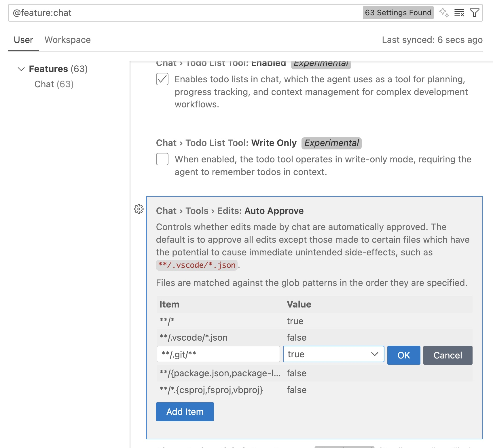
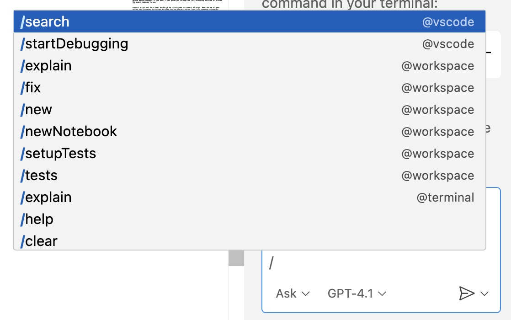
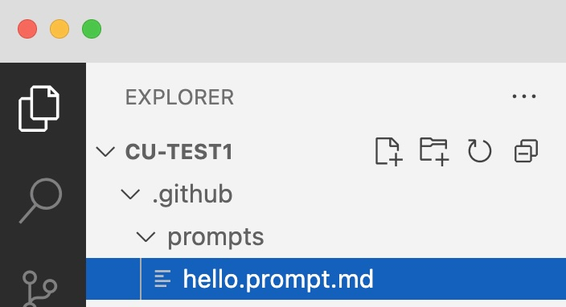
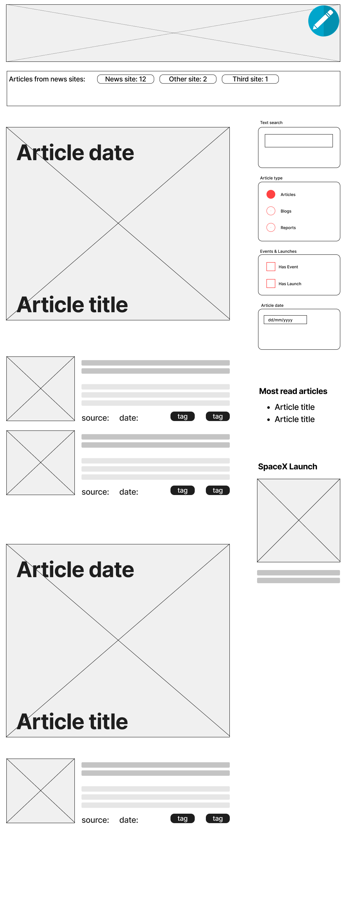
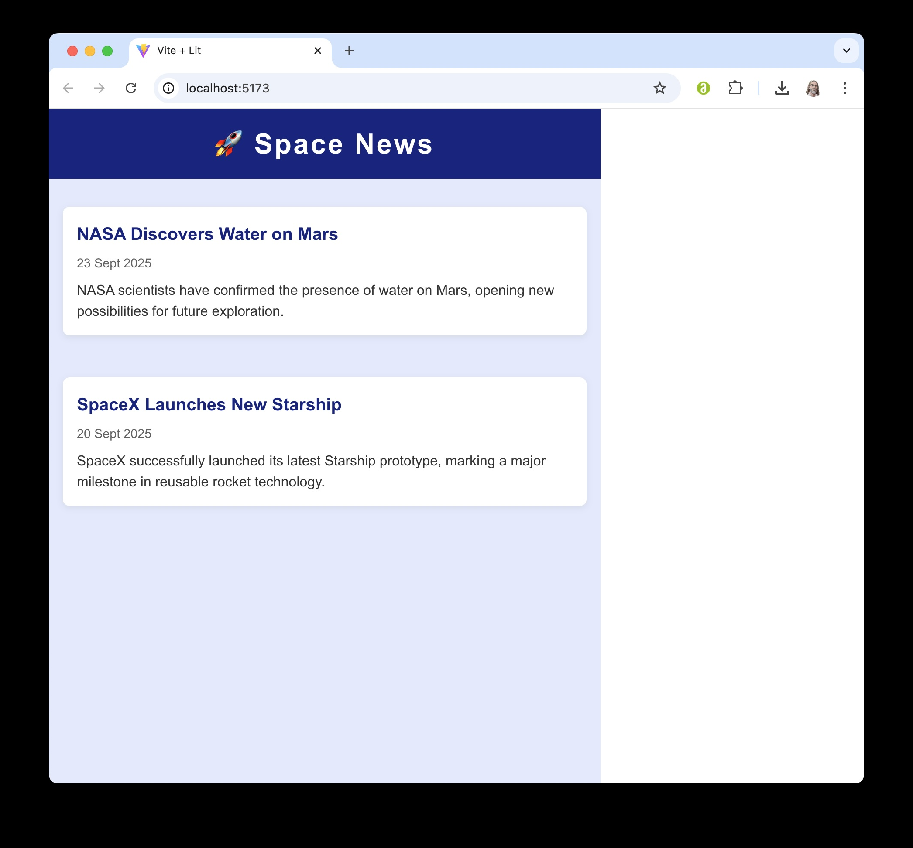

# AI in development
Hier laten we zien hoe je AI kan gebruiken in development. We gaan er hierbij vanuit dat je een IDE gebruikt die AI ondersteunt (zoals bv Visual Studio Code met copilot).

## Inhoud
- [AI in development](#ai-in-development)
  - [Inhoud](#inhoud)
  - [Tab Driven Development](#tab-driven-development)
  - [Tests genereren met AI](#tests-genereren-met-ai)
  - [De rol van de Analist/architect (en/of developer)](#de-rol-van-de-analistarchitect-enof-developer)
  - [Voorbeeld met AGENTS.md](#voorbeeld-met-agentsmd)
    - [Oefening met AGENTS.md:](#oefening-met-agentsmd)
    - [Conclusie](#conclusie)
  - [Copilot prompts](#copilot-prompts)
    - [Oefenen met prompts](#oefenen-met-prompts)
  - [UI genereren van een design](#ui-genereren-van-een-design)
    - [Oefening met Figma](#oefening-met-figma)


## Tab Driven Development
Als je de AI in je IDE aanzet dan zal je zien dat als je code aan het intikken bent dat er regelmatig suggesties komen. Dit is een vorm van AI die je helpt bij het schrijven van code. Dit is een voorbeeld van Tab Driven Development. Je typt een paar letters en de AI vult de rest aan. Dit kan je helpen om sneller code te schrijven en om fouten te voorkomen.

Nadeel is dat de AI geen idee heeft van de context van je code. De AI redeneert vanuit wat je ingetypt hebt en wat er in de omgeving van je code staat. Maar de AI heeft geen idee van wat je aan het bouwen bent. Hierdoor kan de AI soms suggesties doen die niet relevant zijn voor wat je aan het bouwen bent.

Een heel simpele stap die je kan nemen is om een comment te schrijven boven de code die je aan het schrijven bent. Bijvoorbeeld:

```javascript
// Function to calculate the sum of two numbers
```

Op deze manier geef je de AI meer context over wat je aan het bouwen bent. De AI kan dan betere suggesties doen die relevant zijn voor wat je aan het bouwen bent. 

> Eigenlijk is dat natuurlijk ook wat we ook zonder AI zouden moeten doen. Schrijf eerst op wat je wil gaan programmeren, pas dan de code. Doe dit zowel op project basis, op feature basis en op functie basis. Met AI wordt dit alleen maar belangrijker.

Een iets lastiger voorbeeld zou kunnen zijn:

```javascript
// function that shuffles an array of objects randomly
export function shuffleArray(array) {
    for (let i = array.length - 1; i > 0; i--) {
        const j = Math.floor(Math.random() * (i + 1));
        [array[i], array[j]] = [array[j], array[i]];
    }
    return array;
}
```

## Tests genereren met AI
Je kan AI ook gebruiken om tests te genereren voor je code. Dit kan je helpen om sneller tests te schrijven en om fouten te voorkomen.

Neem het bovenstaande voorbeeld. Je kan de AI vragen om tests te genereren voor de `shuffleArray` functie. Selecteer de functie en type bij de (bv copilot) AI in:

```
/tests  write a cucumber test for the selected function
```

De AI zal dan het volgende genereren:

```markdown
Workspace: **Pseudocode plan:**

1. Create a Cucumber feature file describing the behavior of `shuffleArray`.
2. Cover edge cases:
   - Empty array
   - Array with one element
   - Array with two elements
   - Array with multiple elements
   - Array with duplicate elements
   - Array with objects
   - Ensure all original elements are present after shuffle
   - Ensure no elements are lost or duplicated
   - Ensure the array is shuffled (order changes for arrays with length > 1)
3. Implement step definitions in `calc.test.js` using Jest and Cucumber.

**Code:**

**Feature file: `src/utils/shuffleArray.feature`**
```gherkin
Feature: shuffleArray function

  Scenario: Shuffle an empty array
    Given an empty array
    When I shuffle the array
    Then the result should be an empty array

  Scenario: Shuffle an array with one element
    Given an array with one element
    When I shuffle the array
    Then the result should be the same array

  Scenario: Shuffle an array with two elements
    Given an array with two elements
    When I shuffle the array
    Then the result should contain both elements

  Scenario: Shuffle an array with multiple elements
    Given an array with multiple elements
    When I shuffle the array
    Then the result should contain all original elements

  Scenario: Shuffle an array with duplicate elements
    Given an array with duplicate elements
    When I shuffle the array
    Then the result should contain all original elements including duplicates

  Scenario: Shuffle an array of objects
    Given an array of objects
    When I shuffle the array
    Then the result should contain all original objects
```

**Test file: `src/utils/calc.test.js`**
```javascript
// @jest-environment node
const { shuffleArray } = require('./calc');
const { defineFeature, loadFeature } = require('jest-cucumber');

const feature = loadFeature('./src/utils/shuffleArray.feature');

defineFeature(feature, test => {
  test('Shuffle an empty array', ({ given, when, then }) => {
    let array, result;
    given('an empty array', () => {
      array = [];
    });
    when('I shuffle the array', () => {
      result = shuffleArray([...array]);
    });
    then('the result should be an empty array', () => {
      expect(result).toEqual([]);
    });
  });

  test('Shuffle an array with one element', ({ given, when, then }) => {
    let array, result;
    given('an array with one element', () => {
      array = [42];
    });
    when('I shuffle the array', () => {
      result = shuffleArray([...array]);
    });
    then('the result should be the same array', () => {
      expect(result).toEqual([42]);
    });
  });

  test('Shuffle an array with two elements', ({ given, when, then }) => {
    let array, result;
    given('an array with two elements', () => {
      array = [1, 2];
    });
    when('I shuffle the array', () => {
      result = shuffleArray([...array]);
    });
    then('the result should contain both elements', () => {
      expect(result.sort()).toEqual([1, 2]);
    });
  });

  test('Shuffle an array with multiple elements', ({ given, when, then }) => {
    let array, result;
    given('an array with multiple elements', () => {
      array = [1, 2, 3, 4, 5];
    });
    when('I shuffle the array', () => {
      result = shuffleArray([...array]);
    });
    then('the result should contain all original elements', () => {
      expect(result.sort()).toEqual([1, 2, 3, 4, 5]);
    });
  });

  test('Shuffle an array with duplicate elements', ({ given, when, then }) => {
    let array, result;
    given('an array with duplicate elements', () => {
      array = [1, 2, 2, 3];
    });
    when('I shuffle the array', () => {
      result = shuffleArray([...array]);
    });
    then('the result should contain all original elements including duplicates', () => {
      expect(result.sort()).toEqual([1, 2, 2, 3]);
    });
  });

  test('Shuffle an array of objects', ({ given, when, then }) => {
    let array, result;
    given('an array of objects', () => {
      array = [{ id: 1 }, { id: 2 }, { id: 3 }];
    });
    when('I shuffle the array', () => {
      result = shuffleArray([...array]);
    });
    then('the result should contain all original objects', () => {
      expect(result.map(o => o.id).sort()).toEqual([1, 2, 3]);
    });
  });
});
```

## De rol van de Analist/architect (en/of developer)
Mooi dat zowel de code als de tests automatisch gegenereerd worden. Maar hoe zorg je er nu voor dat de juiste code en tests gegenereerd worden? Hier komt de rol van de analist/architect (en/of developer) om de hoek kijken.

In dit voorbeeld zal je de test moeten analyseren en beoordelen of deze de juiste dingen test. Misschien mist er een edge case, of wordt er iets getest wat niet relevant is. Dit is een taak die de AI (nog) niet kan overnemen.

Met bovenstaande voorbeelden bereik je dat de AI de code en de test schrijft, maar je hebt geen invloed op hoe dit gebeurt. Je kan de AI niet sturen in hoe de code en de test eruit zien. Dit is een taak die de analist/architect (en/of developer) moet doen.

Hiervoor gaan we dus specificaties en plannen maken. Dit is een taak die de analist/architect (en/of developer) moet doen.

## Voorbeeld met AGENTS.md
Een manier om dit te doen is door gebruik te maken van AGENTS.md. Dit is een manier om specificaties en plannen te maken die de AI kan begrijpen.

### Oefening met AGENTS.md:
Maak een nieuwe vite project aan (met lit als framework, javascript als taal):
```zsh
npm create vite@latest ai-test -- --template lit
cd ai-test
npm install
```

Maak in de root van het project een bestand aan met de naam `AGENTS.md` en voeg de volgende inhoud toe:

```markdown
# Project guidelines for agents

This document outlines the guidelines and best practices for developing and maintaining agents within this project. Agents are autonomous entities that perform specific tasks or functions, often interacting with users or other systems.

## Project Structure
The project is organized into the following main directories:
- `/src`: Contains the source code for the project.
  - `/components`: Reusable components used by agents.
  - `/pages`: Different pages or views that agents can render.
  - `/services`: Services that provide specific functionalities to agents.
  - `utils`: Utility functions and helpers (must be pure functions).
- `/docs`: Documentation related to the project.
  - `/design`: Design documents and diagrams.
- `/tests`: Unit and integration tests for the project.
- `/configs`: Configuration files for different environments.

## Coding Standards
- Follow consistent naming conventions (e.g., camelCase for variables and functions, PascalCase for components).
- Write clean, readable, and maintainable code.
- Use comments to explain complex logic or decisions.
- Split functionality into smaller, reusable functions or components.
- Use Lit HTML for rendering HTML templates.

## Process for Adding New code
1. **Create a New Branch**: Use a descriptive name for your branch (e.g `feature/add-new-feature`).
2. **Implement the Feature**: Follow the coding standards and project structure. 
3. **Write Tests**: Ensure that your code is covered by unit and integration tests. Use vitest for testing.
```

Hiermee sturen we de AI om code te genereren die past binnen de structuur en standaarden van ons project.

Zet copilot (of een andere AI) aan in je IDE zet deze in Agent mode. En geef de volgende opdracht:

```
Using the AGENTS.md as a guide add a new feature to the project; User can push a button changing the color of a square to a random color.
```

De AI gaat nu aan de slag om de code te genereren die past binnen de structuur en standaarden van ons project.

De eerste keer dat ik dit deed kreeg maakte de AI geen nieuwe branch aan. Dus heb ik de volgende vraag gesteld:

```
Why did you not create a new branch for the feature?
```

Waarop ik als antwoord kreeg:

```markdown
I did not create a new branch because I do not have direct access to your git environment or permissions to run git commands automatically. My capabilities are limited to file and code changes within your workspace.

However, according to your AGENTS.md guidelines, the correct process is to create a descriptive branch before implementing a new feature. You should run:

> git checkout -b feature/color-square

before making changes. If you want, I can guide you through the full branching workflow or provide the exact commands to use.
```

Hieruit blijkt dat de AI heel duidelijk de richtlijnen uit AGENTS.md volgt. Maar dat de AI geen acties kan uitvoeren die buiten de scope van het project vallen (zoals git commands uitvoeren).

Dit kunnen we oplossing door een setting te veranderen:


We runnen het commando opnieuw en nu maakt de AI wel een nieuwe branch aan.

Als het goed is heb je nu een nieuwe branch met de naam `feature/color-square` en de code die de AI gegenereerd heeft. 

We verwachten dat de AI de volgende bestanden heeft aangepast:
- `src/components/ColorSquare.js`
- `tests/components/ColorSquare.test.js`

Controleer of dat daadwerkelijk gebeurd is. En bekijk de code die de AI gegenereerd heeft. Is deze code goed? Volgt de code de richtlijnen uit AGENTS.md?

### Conclusie
Door gebruik te maken van AGENTS.md kunnen we de AI sturen om code te genereren die past binnen de structuur en standaarden van ons project. Dit maakt het makkelijker om de code te begrijpen en te onderhouden.

We hebben nu de feature direct in copilot ingetypt. We hebben dus niet eerst een specificatie en een plan gemaakt. Dit gaan we in het volgende deel doen.

## Copilot prompts
Naast de tab toets kan je ook copilot prompts gebruiken om de AI te sturen. Dit zijn korte zinnen die je typt om de AI te vertellen wat je wil dat de AI doet. Dat kan je doen in de copilot chat of in de code editor zelf.

Misschien heb je gemerkt dat als je de prompt begint met `/` dat de AI dan een lijst met suggesties geeft. Dit zijn de copilot prompts.



Deze prompts kan je zelf maken. Maak in de root van je project een folder met de naam `.github` (vergeet de punt niet) en maak daarin een folder met de naam `prompts`. In deze folder kan je markdown bestanden maken met de prompts die je wil gebruiken. Gebruik het format `<command>.prompt.md`. Bijvoorbeeld `hello.prompt.md` voor een prompt die tests genereert. 



In de file zet je dan de prompt die je wil gebruiken. Bijvoorbeeld:

```markdown
Tell me something about yourself
```

Als je nu in je code editor `/hello` typt dan zal de AI de prompt uit het bestand gebruiken en reageren met bijvoorbeeld: 

> I am GitHub Copilot, an AI-powered coding assistant designed to help you write, understand, and improve code efficiently. I can answer questions, generate code, automate tasks, and guide you through best practices for your projects.

Je kan deze prompts zo lang maken als je zelf wilt. Je kan zelf een parameter meegeven. Als voorbeeld maken een nieuwe prompt met de naam `inspect.prompt.md` met de volgende inhoud:

```markdown
Inspect the code using the constraints below and provide suggestions for improvement:

Constraints:
1. The render function must use Lit HTML for rendering HTML templates.
2. Utility functions must be pure functions.
3. The render function may not be longer then 30 lines of code.
```

Vervolgens type je `/inspect ColorSquare.js` in je code editor en de AI zal de code in de file `ColorSquare.js` inspecteren en suggesties geven voor verbetering op basis van de constraints die je opgegeven hebt. Hiermee kan je als Analist/architect (en/of developer) de AI gebruiken om te controleren of de geschreven code voldoet aan de richtlijnen van jou project. Dit is heel krachtig bij het doen van code reviews.

### Oefenen met prompts
Verzin een prompt die je zelf zou willen gebruiken. Maak deze prompt aan in de folder `.github/prompts` en test deze uit in je code editor.

## UI genereren van een design
Stel we hebben een design (of iig een wireframe) en we willen dat de AI code voor de componenten genereert. We maken weer gebruik van de AGENTS.md file om de AI te sturen. 

We maken een nieuw vite project aan (met lit als framework, javascript als taal). Halen de template code weg en maken een nieuwe AGENTS.md file met de zelfde inhoud als hierboven.

In de folder `docs/design` plaatsen we een wireframe van een design. Gebruik onderstaande afbeelding:



In de folder `docs/features` maken we een nieuwe file met de naam `feature.mockup-implementation.md` met de volgende inhoud:

```markdown
# Instructions for AI: Implementing the Space News Mockup

To implement the design specified by `space-news-mockup.md`, follow these steps:

1. **Review the Mockup:**  
   Open `/docs/design/space-news-mockup.md` and study the layout, components, and interactions described.

2. **Component Structure:**  
   - Create reusable components in `/src/components` for each distinct UI element (e.g., news card, header, article list).
   - Use PascalCase for component names.

3. **Page Setup:**  
   - Assemble the main page in `/src/pages` using the components.
   - Ensure the layout matches the mockup’s structure.
   - Name the main page (index.html) component `SpaceNewsPage`.
   - Insert the `SpaceNewsPage` component into `index.html` to render it. 

4. **Responsiveness:**  
   - Use CSS (preferably within Lit components) to make the design responsive for mobile and desktop.
   - Test with different screen sizes.

5. **Lit HTML:**  
   - Render all templates using Lit HTML syntax.

6. **Utility Functions:**  
   - Place pure helper functions in `/src/utils` if needed (e.g., formatting dates).

7. **Testing:**  
   - Write unit tests for components in `/tests/components` using vitest.

8. **Branching:**  
   - Before starting, create a new branch named `feature/space-news-mockup`.

9. **Documentation:**  
   - Document any design decisions or deviations from the mockup in this file.

> Follow the coding standards and project structure outlined in `AGENTS.md`.
```

We zetten copilot (of een andere AI) aan in je IDE zet deze in Agent mode. En geef de volgende opdracht: `Implement the feature described in feature.mockup-implementation.md`. De AI gaat nu aan de slag om de code te genereren die past binnen de structuur en standaarden van ons project.

Als het goed is heb je nu een nieuwe branch met de naam `feature/space-news-mockup` en de code die de AI gegenereerd heeft. Waarschijnlijk heb je nog wat handmatige acties nodig om het aan de praat te krijgen (dit kan je ook samen met de AI doen). Verder lijkt het resultaat niet echt op het design. In mijn geval kreeg ik het volgende resultaat:



Niet echt wat we verwacht hadden. Dus ik stel de AI de volgende vraag:

> A lot of the mockup is still missing, what can I do to make the mockup clearer?

Waarop ik als antwoord kreeg:

To make the mockup clearer and ensure a complete implementation, you can:

1. **Provide a detailed mockup file:**
   Include a visual design (image, wireframe, or screenshot) and a *written description of all UI elements, layout, colors, fonts, and interactions*.
2. **List all required components and features:**
   Specify each section, card, button, icon, and any dynamic behavior (e.g., filtering, loading states).
3. **Describe data structure and sample content:**
   Show example articles, images, dates, and any metadata that should appear.
4. **Clarify responsive requirements:**
   Indicate how the layout should adapt to mobile, tablet, and desktop.
5. **Add acceptance criteria:**
   Define what must be present for the mockup to be considered “done.”
6. **Reference design files directly:**
   Link to or embed the actual design file (e.g., PNG, Figma, PDF) in your documentation.

The more specific and visual your mockup and requirements, the easier and more accurate the implementation will be.

Wat we moeten doen is direct naar de figma file verwijzen en in deze file alle details (*written description of all UI elements, layout, colors, fonts, and interactions*) van het design opnemen. We kunnen dus niet volstaan met enkel een wireframe.

Dit is niets anders dan wat we ook zonder AI zouden moeten doen. Zorg dat je een goed design hebt en dat je alle details van het design hebt beschreven! Het werken met AI neemt je werk uit handen, maar het belang van een goede analyse en een goed (uitgebreid) design wordt alleen maar groter.

> Je kan de AI ook gebruiken om UI code te genereren van een design. Dit kan je doen door een design te maken in Figma en de AI te vragen om de code te genereren. Dit kan je doen door de Figma plugin van copilot te gebruiken.

### Oefening met Figma
Maak een gratis account aan bij Figma (als je die nog niet hebt). Maak een nieuw design aan met meerdere elementen. Geef via comments aan wat de verschillende elementen doen.

Maak een nieuw vite project aan (met lit als framework, javascript als taal) en haal het leeg. Gebruik de markdown file AGENTS.md zoals hierboven beschreven (of breid deze uit naar je eigen inzichten). Voeg een feature beschrijving in de feature folder toe zoals hierboven beschreven waarin je verwijst naar de Figma file.

Laat de AI de code genereren. Bekijk het resultaat. Is dit wat je verwacht had? Wat kan er beter? Hoe kan je de AI nog beter sturen?

