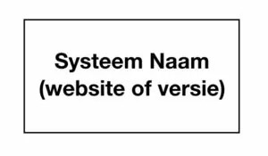
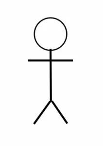
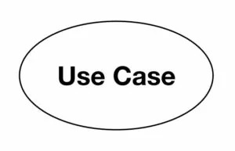
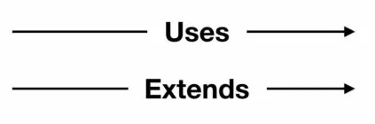
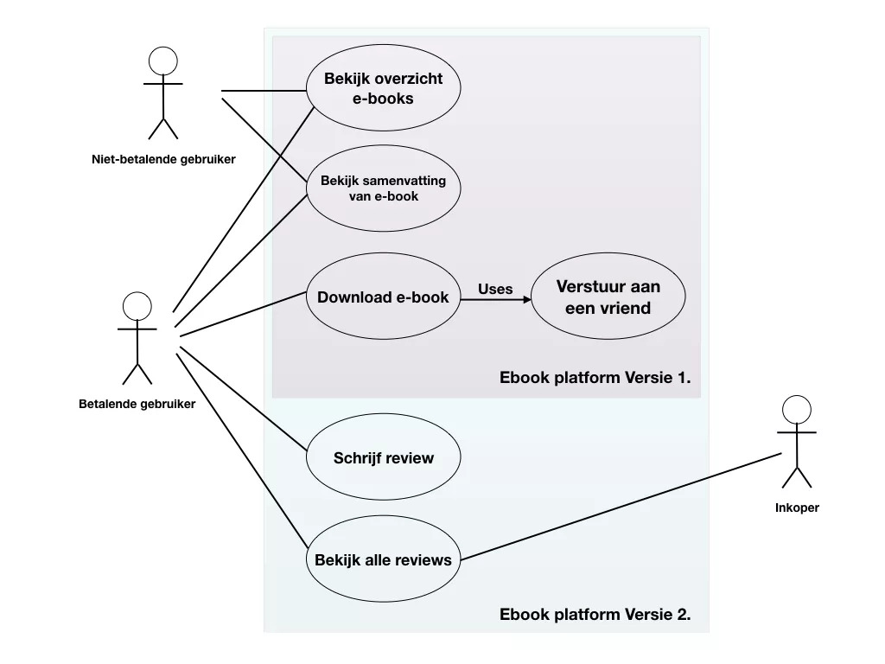

# User Stories, Acceptatiecriteria en Use Cases

In de softwareontwikkeling zijn zowel user stories als use cases belangrijke technieken om de wensen en eisen van 
gebruikers te beschrijven. Beide methoden helpen om inzicht te krijgen in wat een systeem moet doen, maar ze verschillen 
in detailniveau, structuur en toepassing.

## Wat zijn User Stories?

Een user story is een korte, eenvoudige beschrijving van een functionaliteit vanuit het perspectief van de eindgebruiker 
of klant. User stories worden veel gebruikt binnen agile methodieken zoals Scrum en vormen de basis voor het plannen en 
ontwikkelen van software.

Een typische user story heeft de volgende vorm:

> Als [gebruiker] wil ik [doel/wens] zodat [reden].

**Voorbeeld:**
> Als klant wil ik mijn bestelling kunnen volgen zodat ik weet wanneer mijn pakket wordt bezorgd.

## Acceptatiecriteria bij User Stories

Acceptatiecriteria zijn voorwaarden waaraan een User Story of Backlog Item moet voldoen om als klaar te worden gezien. 
Ze zorgen voor gedeelde verwachtingen tussen het team en de Product Owner, maken werk toetsbaar en voorkomen 
misverstanden. Acceptatiecriteria brengen duidelijkheid over wanneer iets voldoet aan de gestelde eisen.

### User Stories en acceptatiecriteria hebben elkaar nodig

Neem de volgende User Story:

> “Als huiseigenaar met een grote tuin wil ik mijn gazon op een snelle en makkelijke manier kunnen maaien zodat ik daar 
weinig tijd mee kwijt ben.”

Welke oplossing komt als eerste in je hoofd op? Wellicht een grasmaaier die je in het stopcontact moet doen? Een 
robotgrasmaaier? Of zo’n ouderwetse grasmaaier waarbij je achteraf nog alle blaadjes bij elkaar moet vegen (uit eigen 
ervaring zou ik die laatste afraden).

Eén ding is zeker. Met deze User Story krijg je het idee dat er een grasmaaier moet komen, maar de invulling hoe de 
grasmaaier eruit moet zien staat nog open. Als een Product Owner deze User Story aan zijn Developers laat zien, dan is 
het mogelijk dat de ene Developer de User Story heel anders zal interpreteren dan de ander. Dat is fijn, want diverse 
perspectieven op een probleem verhogen de kans op de beste oplossing. Echter wil je wel dat de ideeën aan de eisen van 
de opdrachtgever voldoen. Daarom moeten we de User Story nog afbakenen. Hoe doen we dat? Met acceptatiecriteria!

Zie hier vijf bijbehorende acceptatiecriteria voor de bovenstaande User Story:

- Het product heeft een benzinemotor
- Het product heeft 4 wielen
- Elk wiel heeft een rubberband
- Het product heeft een stuur
- Het product heeft een stalen carrosserie

Zoals je gelijk kunt zien waren de drie interpretaties van onze mogelijke grasmaaier allemaal verkeerd. De tuin is 
namelijk erg groot en de huiseigenaar is niet begaan met technologie en vindt alles wat digitaal is maar niks. Kortom 
een zitmaaier met een benzinemotor moet de klus klaren.

### Wat zijn de voordelen van acceptatiecriteria?

1. Acceptatiecriteria definiëren de kaders waar de User Story aan moet voldoen

Acceptatiecriteria geven de Developers kaders en richtlijnen hoe complex de oplossing voor het probleem mag zijn. Doe je 
dit niet en je hebt een paar enthousiaste Developers in je team, dan kan het zomaar zijn dat ze een robotgrasmaaierdrone 
maken die over het gras vliegt en met lasers het gazon tot op de milimeter nauwkeurig bijwerkt. Leuke gadget, maar voor 
de meeste eindgebruikers onbetaalbaar.

2. Acceptatiecriteria helpen het team om een gezamenlijk begrip te vormen van de User Story

Doordat er tijdens Sprint Planning de User Stories inclusief acceptatiecriteria worden besproken zullen de Developers 
vragen stellen aan de Product Owner over de acceptatiecriteria. Dit geeft een diepere laag aan het gesprek waardoor 
belangrijke details niet vergeten worden, die anders tijdens de sprint voor problemen kunnen zorgen.

3. Acceptatiecriteria maken het gemakkelijk om te testen

Elke User Story is pas ‘sprintklaar’ als die voldoet aan de Definition of Ready. Door het toevoegen van 
acceptatiecriteria kun je heel eenvoudig testen wanneer een User Story klaar is. Alleen wanneer aan alle 
acceptatiecriteria volledig is voldaan, kun je een User story opleveren. Let er wel op dat de User Story pas deel wordt 
van het increment als die voldoet aan de Definition of Done. Wat precies het verschil is tussen de acceptatiecriteria en 
de Definition of Done kun je in het artikel van de Definition of Done lezen.

### Hoe schrijf je acceptatiecriteria: do’s & don’ts?

Soms kan het best lastig zijn om goede acceptatiecriteria te bedenken. Mocht je hiermee problemen hebben dan kun je 
jezelf altijd het volgende afvragen: ‘Hoe weten we wanneer we klaar zijn?’. Door jezelf deze vraag te stellen kun je 
makkelijker acceptatiecriteria identificeren. Dan rest ons alleen nog de vraag hoe je ze schrijft.

Het schrijven van goede acceptatiecriteria is een kunst die je pas echt gaat beheersen door het veel te doen. Maar wat 
als je het altijd op de verkeerde manier doet? Dan doe je het na een jaar nog steeds verkeerd. De beste 
acceptatiecriteria voldoen aan het volgende:
Blijf bij de “wat” en vermijd de “hoe”

Misschien nog wel het lastigste van acceptatiecriteria is dat je de balans moet vinden tussen te gedetailleerd, precies 
goed en te onduidelijk. Dat is ook gelijk de #1 fout die sommige Product Owners maken. Wij zien te vaak dat de Product 
Owner te veel detail toevoegt waardoor de Developers helemaal geen ruimte hebben om hun creativiteit naar boven te 
brengen. Om een voorbeeld te geven:

User Story: “Als gamer wil ik digitaal mijn emotie kunnen uitdrukken, zodat andere gamers kunnen zien hoe gelukkig ik 
vandaag ben”

Acceptatiecriteria die bij deze user story kunnen horen:

- Te gedetailleerd: de gebruiker kan een computerkarakter kiezen door op een afbeelding te klikken van het hoofd van het computerkarakter.

- Precies goed: de gebruiker kan een computerkarakter kiezen.

- Te onduidelijk: de gebruiker heeft een computerkarakter.

De richtlijn is dat je de acceptatiecriteria zo wil formuleren dat het niet de oplossing definieert waardoor de 
creativiteit van de Developers wordt afgenomen om wellicht een betere oplossing te bedenken waaraan de Product Owner in 
eerste instantie niet had gedacht.

### Hoeveel acceptatiecriteria per User Story?

Elk acceptatiecriterium staat op zichzelf. Mocht dit niet het geval zijn dan wil je de acceptatiecriteria opsplitsen. 
Als vuistregel kun je aanhouden dat een User Story tussen de vier en acht acceptatiecriteria heeft. Met minder dan vier 
heeft de User Story waarschijnlijk te weinig detail en met meer dan acht kan de User Story waarschijnlijk beter gesplitst 
worden in twee kleinere User Stories.

### Vermijd subjectief en dubbelzinnig taalgebruik

“De marketingcampagne verloopt vlotter, beter, juister.” Waarschijnlijk roept de vorige zin veel vragen bij je op. Je 
bent niet de enige. Probeer acceptatiecriteria zo specifiek en SMART mogelijk te benaderen. Zoals eerder genoemd helpen 
acceptatiecriteria je om te testen en daarom moeten ze meetbaar zijn. In andere woorden: ze moeten zo helder 
geformuleerd worden dat ze niet voor verschillende interpretaties vatbaar zijn, maar niet zo gedetailleerd dat ze de 
oplossing beschrijven.

### Wat is het verschil tussen Acceptatiecriteria, Definition of Ready en Definition of Done?

Het verschil tussen acceptatiecriteria, de Definition of Ready en de Definition of Done zit in het moment waarop ze van 
toepassing zijn en waarvoor ze gebruikt worden. Acceptatiecriteria beschrijven de voorwaarden waaraan een specifieke 
user story of taak moet voldoen om door de Product Owner geaccepteerd te worden. Ze zijn per item verschillend en helpen 
bij het testen en controleren van de oplevering.

De Definition of Ready is een vaste checklist die het team gebruikt om te bepalen of een item klaar is om opgepakt te 
worden in een sprint. Denk aan zaken zoals duidelijke beschrijving, geschatte omvang en beschikbaarheid van 
afhankelijkheden.

De Definition of Done is een teamafspraak die beschrijft wanneer een item echt af is. Dit geldt voor alle werkitems en 
bevat vaak punten zoals getest, gedocumenteerd en gedeployed. Samen zorgen deze drie begrippen voor duidelijkheid, 
voorspelbaarheid en kwaliteit in het ontwikkelproces.

### Waarom zijn acceptatiecriteria belangrijk?

We hebben zojuist de voordelen van acceptatiecriteria besproken, maar nog niet stilgestaan bij wat er gebeurt als je ze 
weglaat. Daarom kijken we nu naar vier situaties waarin het ontbreken van acceptatiecriteria voor problemen zorgt.

#### Belang acceptatiecriteria tijdens refinement en planning

Tijdens refinement en sprintplanning helpen acceptatiecriteria om werk te verduidelijken. Ze maken zichtbaar wat er 
precies verwacht wordt. Als er tijdens refinement en planning geen duidelijke acceptatiecriteria zijn, blijft geeft 
iedereen vaak zijn eigen invulling aan wat er precies moet worden gebouwd of wanneer het af is. Dit leidt tot verkeerde 
aannames en foutieve inschattingen. Taken lijken kleiner of eenvoudiger dan ze zijn, of de beoogde waarde wordt niet 
geleverd. Gevolg: extra werk tijdens de sprint, onnodige discussies en het risico op een ontevreden klant of eindgebruiker.

#### Acceptatiecriteria en feedback

Zonder vooraf afgesproken criteria is het lastig om achteraf te beoordelen of iets goed is uitgevoerd. Feedback blijft 
vaag of subjectief. Teams leren daardoor minder van hun werk, omdat het onduidelijk is wat er wel of niet goed ging. 
Het verbeterproces stagneert en dezelfde fouten worden herhaald.

#### Geen basis voor testen zonder acceptatiecriteria

Wanneer acceptatiecriteria ontbreken, is het lastig om tests op te stellen. Automatisering wordt ingewikkeld of zelfs 
onmogelijk, omdat niet duidelijk is wat er precies getest moet worden. Daardoor moeten er meer handmatige tests worden 
gedaan, wat tijd kost en foutgevoeliger is. Daarnaast kan het voorkomen dat een product als succesvol word getest, maar 
in de praktijk niet de benodigde functies uitvoerd, de tester kan dit dan gemakkelijk over het hoofd zien doordat de 
acceptatiecriteria niet goed zijn vastgelegd.

#### Belemmering betrokkenheid van stakeholders

Zonder heldere afspraken over wat er geleverd wordt, weten stakeholders niet goed waar ze op moeten letten. Ze krijgen 
geen grip op het proces en geven vaak pas feedback als het te laat is. Dit zorgt voor frustratie en wantrouwen. De 
samenwerking verslechtert en doelen worden gemist.

## Wat zijn Use Cases?

Een use case is een beschrijving van een specifieke interactie tussen een gebruiker (actor) en een systeem (zoals een 
website of applicatie) die een bepaald doel dient. Use cases worden vaak gebruikt in een functioneel ontwerp om de 
functionaliteit van een systeem te beschrijven vanuit het perspectief van de gebruiker. Ze helpen bij het identificeren 
van de vereisten en functionaliteiten die het systeem moet bieden.

Use cases zijn vooral nuttig in de vroege fasen van het ontwikkelingsproces, wanneer de vereisten nog niet volledig zijn 
gedefinieerd. Ze kunnen ook worden gebruikt om de communicatie tussen verschillende belanghebbenden te vergemakkelijken, 
zoals ontwikkelaars, ontwerpers en projectmanagers.

Use cases bestaan uit twee onderdelen: een use case diagram en een gedetailleerde beschrijving van de use case zelf. Het 
use case diagram geeft een visuele weergave van de interacties tussen de gebruikers (actors) en het systeem, terwijl de 
gedetailleerde beschrijving de stappen en voorwaarden van de interactie beschrijft.

De manier waarop je use cases beschrifjt is gestandaardiseerd, dat wil zeggen dat iedereen op vrijwel dezelfde manier 
use cases documenteert. Dat is prettig want daarmee is de overdraagbaarheid van het functioneel ontwerp van je website
groter en kunnen meerdere betrokkenen (designers, developers, project managers) met dat document overweg.

Een use case diagram is een diagram opgemaakt in UML (Unified Modeling Language). Met een use case diagram noteer je de 
“use case” van je website en welke “actors” daar gebruik van maken. Actors zijn type gebruikers, groepen of rollen die 
gebruik moeten maken van die use cases. De use cases staan altijd genoteerd in een kader dat “het systeem” aanduidt, in 
ons geval een website of web applicatie.

### Hoe zien use case diagrammen eruit?

In een use case diagram gebruiken we de volgende symbolen:

Het systeem: het systeem is in ons geval de website of web applicatie. Binnen het kader van het systeem noteer je de 
specifieke use cases, de actors staan daar altijd buiten. Een systeem kan ook een versienummer hebben. Zo kun je 
bijvoorbeeld aangeven in welke versie van je website een use case wordt geïntroduceerd. In het voorbeeld verderop zie je 
hoe dat is uitgewerkt.

De actor: de actor is de uitbeelding van de rol of groep die iets moet kunnen in de website. Het is dus niet een 
individu zoals “Bob” of “Jan” maar wel “Beheerder” of “Gebruiker” of “Premium Gebruiker”.

De use case: de use case is een ovaal met daarin een naam die bepaalde functionaliteit omschrijft. Een goede use case 
is er een die het doel van de use case het best omschrijft. Bijvoorbeeld: “bekijk agenda” of “wijzig besteloverzicht” of 
“bekijk product informatie”. In het functioneel ontwerp kun je dan extra beschrijvingen toevoegen van de use case.

De pijlen: je verbindt actors en use cases met pijlen. Daarmee geef je aan welke actor gebruik moet kunnen maken van 
welke use case. Wanneer je pijlen tekent tussen use cases dan kun je aangeven of de twee use cases elkaar nodig hebben 
(noteer “uses” of “include”) of een optionele aanvulling op elkaar zijn (“extends”).

### Hoe schrijf je een use case?

Een use case is opgebouwd uit verschillende onderdelen die samen een gedetailleerde beschrijving geven van een interactie tussen een gebruiker (actor) en een systeem:

1. **Titel van de use case**
   - Een korte en duidelijke naam die de functionaliteit beschrijft.

2. **Doel van de use case**
   - Het doel dat de actor wil bereiken door interactie met het systeem.

3. **Actor(s)**
   - De gebruiker(s) of rol(len) die betrokken zijn bij de interactie.

4. **Precondities**
   - De voorwaarden die moeten gelden voordat de use case kan worden uitgevoerd.

5. **Stappen**
   - Een gedetailleerde beschrijving van de interactie tussen de actor en het systeem, stap voor stap.

6. **Postcondities**
   - De situatie die geldt nadat de use case succesvol is uitgevoerd.

7. **Uitzonderingen**
   - Mogelijke afwijkingen of fouten die kunnen optreden tijdens de uitvoering van de use case.

8. **Relaties met andere use cases**
   - Hoe de use case samenhangt met andere use cases, bijvoorbeeld door gebruik te maken van gedeelde functionaliteiten.

Door deze structuur te volgen, kun je een consistente en begrijpelijke beschrijving van een use case maken.

### Een voorbeeld van een use case voor een website

Stel, je wilt een website maken waar je een overzicht biedt van e-books en die ook als download beschikbaar stelt voor 
gebruikers met een betaald account. Er zijn dus twee soorten gebruikers, namelijk de betalende en niet-betalende 
gebruiker. De niet-betalende gebruikers kunnen het overzicht aan e-books bekijken en per e-book ook een samenvatting 
lezen. De betalende gebruikers kunnen dat ook, maar krijgen ook de mogelijkheid om die te downloaden. Na het downloaden 
kunnen betalende gebruikers een gratis kopie van dat e-book toezenden aan een bekende.

In versie twee van ditzelfde platform komt de mogelijkheid dat betalende gebruikers ook een review kunnen achterlaten op 
de site over het e-book. Ze krijgen ook de mogelijkheid om reviews te lezen van andere gebruikers. De afdeling inkoop 
wil ook graag deze reviews inzien zodat ze hun inkoopbeleid kunnen optimaliseren.

In een use case diagram zou je dit dan als volgt uittekenen:

Een voorbeeld van een uitgewerkte use case is dan als volgt:

1. **Titel van de use case**
    - Geef de use case een duidelijke en beschrijvende titel. Bijvoorbeeld: "Download e-book".

2. **Doel van de use case**
    - Beschrijf het doel van de use case. Wat wil de gebruiker bereiken? Bijvoorbeeld: "Een betalende gebruiker wil een e-book downloaden om offline te kunnen lezen."

3. **Actor(s)**
    - Identificeer de actor(en) die betrokken zijn bij de use case. Bijvoorbeeld: "Betalende gebruiker".

4. **Precondities**
    - Beschrijf de voorwaarden waaraan moet worden voldaan voordat de use case kan worden uitgevoerd. Bijvoorbeeld: "De gebruiker heeft een betaald account en is ingelogd."

5. **Stappen**
    - Beschrijf de stappen die de actor en het systeem doorlopen om het doel te bereiken. Bijvoorbeeld:
        1. De gebruiker navigeert naar de pagina van het gewenste e-book.
        2. De gebruiker klikt op de knop "Download".
        3. Het systeem controleert of de gebruiker een betaald account heeft.
        4. Het systeem genereert een downloadlink voor het e-book.
        5. De gebruiker downloadt het e-book via de link.

6. **Postcondities**
    - Beschrijf de situatie nadat de use case is uitgevoerd. Bijvoorbeeld: "Het e-book is succesvol gedownload en beschikbaar op het apparaat van de gebruiker."

7. **Uitzonderingen**
    - Beschrijf mogelijke uitzonderingen of fouten die kunnen optreden tijdens de uitvoering van de use case. Bijvoorbeeld:
        - "De gebruiker heeft geen betaald account: het systeem toont een foutmelding."
        - "De downloadlink is verlopen: het systeem genereert een nieuwe link."

8. **Relaties met andere use cases**
    - Beschrijf hoe deze use case gerelateerd is aan andere use cases. Bijvoorbeeld: "Deze use case maakt gebruik van de use case 'Inloggen' en kan worden uitgebreid met de use case 'E-book delen'."

Door deze stappen te volgen, kun je een gedetailleerde en gestructureerde beschrijving van een use case maken die helpt bij het ontwerpen en ontwikkelen van een systeem.

### Wat zijn de voordelen van use cases?

Het grote voordeel van het gebruik van use cases is dat je overzichtelijk en in één oogopslag kunt zien wat de 
verschillende typen gebruikers allemaal moeten kunnen in de website. Je ziet ook makkelijk welke functies in welke 
versie van de website moet terugkomen.

Vaak schrijf je de use cases in het functioneel ontwerp tot in detail uit. Je hebt dan een mooi overzicht van 
functionaliteiten die je naast de wireframes kunt leggen. Je kunt dan kijken of alle genoemde use cases goed zijn 
uitgewerkt of dat er wellicht nog zaken ontbreken. Die kun je dan alsnog toevoegen.

Tot slot bieden de use cases een mooi instrument om als software developer en opdrachtgever goed op één lijn te komen 
over welke  functies in welke versie van de website moeten zitten. Hier kan nooit onduidelijkheid over bestaan omdat 
alles in een duidelijk schema is opgesomd.

