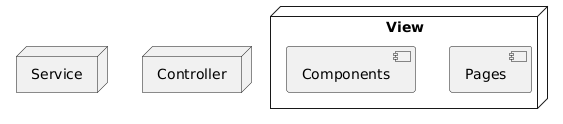

# Architectural Patterns

When we talk about architectural patterns, we are referring to the way we structure our front-end application. This
includes how we organize our code, how we separate concerns, and how we manage data flow. A good architectural pattern
can help us create a scalable, maintainable, and performant application.

## Basic Principles

We could make a front-end application by just writing a bunch of components and putting them together. But that would be
like building a house without a blueprint, which will work if the house is a shack, but not if it's a mansion or a
skyscraper.

To build a solid web application we need a plan, a structure, a way to organize our code.  
That's where architecture comes in. The key principles of front-end architecture include:

- **Separation of concerns**: We want to separate our code into different layers, so that each layer has its own
  responsibility. This makes our code easier to understand, easier to maintain, and easier to test.

- **Scalability**: We want to be able to add new features to our application without having to rewrite everything. We
  want to be able to change our application without breaking it.

- **Reusability**: We want to be able to reuse our code in different parts of our application, or in different
  applications.

- **Performance**: We want our application to be fast and responsive. We want to load only the code that we need, when
  we need it.

## Separation of Concerns

The separation of concerns is a key principle of front-end architecture. It means that we want to separate our code into
different layers, so that each layer has its own responsibility. This makes our code easier to understand, easier to
maintain, and easier to test.

Some common architectural patterns that we can use to achieve separation of concerns are:

- **MVC (Model-View-Controller)**: This is a classic pattern that separates the application into three layers: the model
  (data), the view (presentation), and the controller (logic). The model is responsible for managing the data, the view
  is responsible for displaying the data, and the controller is responsible for handling user input.

- **MVVM (Model-View-ViewModel)**: This is a variation of the MVC pattern that is often used in front-end development.
  The view is responsible for displaying the data, the model is responsible for managing the data, and the view-model is
  responsible for handling user input and updating the model.

- **MVP (Model-View-Presenter)**: This is another variation of the MVC pattern that is often used in front-end
  development. The model is responsible for managing the data, the view is responsible for displaying the data, and the
  presenter is responsible for handling user input and updating the view.

- **MVW (Model-View-Whatever)**: This is a more generic pattern that can be used to describe any architecture that
  separates the application into different layers. The model is responsible for managing the data, the view is
  responsible for displaying the data, and the "whatever" is responsible for handling user input and updating the model.

Although these patterns have different names and variations, they all share the same basic principles of separation of
concerns. They help us to organize our code into different layers, so that each layer has its own responsibility. This
makes our code easier to understand, easier to maintain, and easier to test.

We achieve this separation of concerns by organizing our code into different files that represent the `view`,
`controller`, and `service` layers.



You might have noticed that we are missing the `model` layer in this diagram. This is because in front-end applications,
the model is often represented by the data that we fetch from an API or store in local storage.

In practice, this separation of concerns means that:

- Code of the `view` layer is responsible for **rendering the user interface** and handling **user interactions**. It
  may therefore not access the local storage or call the fetch API directly.
- The main responsiblity of the `service` layer is to **manage data**. Therefore the `service` layer may access the web
  storage (local storage, session storage, ...) or call the fetch API to retrieve data from a server. It is responsible
  for transforming the data into a format that can be easily consumed by the `view` layer. The `service` layer however
  may not access the DOM directly (think about statements like the `document.querySelector`).
- The `controller` layer is responsible for **coordinating the interaction** between the `view` and `service` layers. By
  doing so, it acts as a mediator between the `view` and `service` layers, which makes it perfectly suitable for
  managing the application's state and business logic. It handles data it receives from the `view` layer, processes it
  if necessary, and interacts with the `service` layer to fetch or update data. The `controller` layer may not access
  the DOM directly (think about statements like the `document.querySelector` or `addEventListener`) and may also not
  access the web storage or call the fetch API directly.

Next we could group our code into different folders that represent the different layers of our application. This allows
us to keep our code organized and easy to navigate.

```text
frontend-root/
├── view/
│   ├── components/
│   ├── pages/
├── controller/
└── service/
```

## Scalability

The folder structure give above is fine for small applications, but it due to the low cohesion at the feature level it
is not very scalable. When the application grows, it can become difficult to navigate and maintain. This is because all
files related to a specific feature (view, controller, service) are spread across different folders, making it harder to
see everything that belongs to that feature at a glance.

In larger applications, it is often better to use a **feature-based folder structure**, where all files related to a
specific feature (view, controller, service) are grouped together. This can make it easier to develop, test, and
maintain features independently, especially as the application grows.

```text
frontend-root/
├── features/
│   ├── feature-1/
│   │   ├── view/
│   │   ├── controller/
│   │   └── service/
│   └── feature-2/
│       ├── view/
│       ├── controller/
│       └── service/
```

Here the `features` folder contains all the features of the application, and each feature has its own `view`,
`controller`, and `service` folders.
This allows us to keep all the code related to a specific feature together, making it easier to develop, test,
and maintain.

> [!NOTE]
>
> Instead of using subfolders within the `features` folder, you can also use files with a naming convention that
> indicates the layer, such as `feature-1.service.js`, `feature-1.controller.js`.

## Reusability

Reusability is a key principle in front-end architecture that helps reduce duplication, speed up development, and ensure
consistency across your application. By designing components, services, and utilities to be reusable, you can leverage
the same code in multiple places, making your application easier to maintain and extend.

The feature-based folder structure given above has the disadvantage that you might end up with duplicate code across
different features. For example, if you have an API service that is used by multiple features, you might end up
duplicating the code in each feature's `service` folder.

Another example is are the common UI components (atoms and molecules) that are used across different features. To avoid
this, we can create a `shared` folder that contains all the reusable code, like shared components, services, and
utilities. This allows us to keep our code organized and easy to navigate, while still allowing us to reuse code across
different features.

```text
frontend-root/
├── features/
│   ├── feature-1/
│   │   ├── view/
│   │   ├── controller/
│   │   └── service/
│   └── feature-2/
│       ├── view/
│       ├── controller/
│       └── service/
├── shared/
│   ├── components/
│   ├── service/
│   └── utils/
│   └── ...
```

By focusing on reusability, you create a more maintainable and robust front-end architecture that supports rapid
development and consistent user experiences.

## Performance

Performance is a crucial principle in front-end architecture, as it directly impacts user experience and satisfaction. A
performant application loads quickly, responds to user interactions without noticeable delay, and efficiently manages
resources.

To achieve good performance, consider the following strategies:

- **Code Splitting:** Break your application into smaller bundles so users only download the code they need for the
  current page or feature.
- **Lazy Loading:** Load components, images, or data only when they are needed, reducing initial load time.
- **Efficient Rendering:** Minimize unnecessary re-renders and DOM updates by using techniques like memoization,
  virtualization, and efficient state management.
- **Asset Optimization:** Compress images, minify CSS and JavaScript, and use modern formats to reduce file sizes.
- **Caching:** Use browser caching, service workers, and HTTP caching headers to avoid redundant network requests and
  speed up repeat visits.
- **Minimize Third-Party Dependencies:** Only include libraries and frameworks that are essential, as each dependency
  can increase bundle size and affect load times.

By prioritizing performance in your architecture, you ensure that your application remains fast and responsive as it
grows, providing a better user experience for users. Regularly profiling and optimizing your application can help
identify bottlenecks and areas for improvement.

However performance should not be the first priority when designing your architecture. It is more important to have a
solid architecture that is easy to maintain and extend, and then optimize for performance later on. This is because
performance optimizations can often lead to complex code that is difficult to understand and maintain. So it is better
to focus on building a solid architecture first, and then optimize for performance later on.

---

## Sources

- [Architectural Patterns](https://appmaster.io/blog/architectural-patterns-mvc-mvp-and-mvvm)
- [FINAPS - Creating Scalable and maintainable Frontend Architecture](https://finaps.nl/creating-scalable-and-maintainable-front-end-architecture/)
