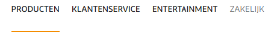
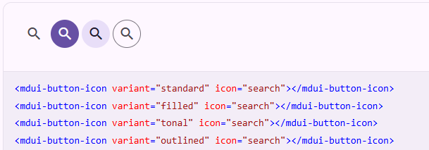

# Atomic Design

Most companys start with a design phase before they start building a web application. Designing the application before coding it has many advantages, like having a clear understanding of the functionality, user experience, and visual design. It also helps to identify the components that need to be built and how they will work together.
Designing the application is normally done by UX designers, who create mockups and prototypes of the application. These mockups are then used as a reference for the developers to build the application.

TODO: Add a paragraph about the structure of this chapter.

## Design phase using Atomic Design

As software developers we use IDE's like Visual Studio Code, IntelliJ, or Eclipse to write code and tools like Visual Paradigm, PlantUML, or Lucidchart to create diagrams. But UX designers often use tools like Figma, Penpot, or Adobe XD to create the mockups.
And there 

And they often use the principles of **Atomic Design** to create a consistent and modular design system. Atomic design is a methodology that breaks down the user interface into smaller, reusable components, starting with the smallest building blocks (atoms) and combining them to create more complex components (molecules, organisms, templates, and pages).

Designers often use tools like Figma, Penpot, or Adobe XD to create the mockups. And they often use the principles of **Atomic Design** to create a consistent and modular design system. Atomic design is a methodology that breaks down the user interface into smaller, reusable components, starting with the smallest building blocks (atoms) and combining them to create more complex components (molecules, organisms, templates, and pages).

One of the approaches that UX designers often use is **Atomic Design**. Atomic design is a methodology, introduced by
Brad Frost, that breaks down the user interface into smaller, reusable components. The idea is to start with the
smallest building blocks (atoms) and combine them to create more complex components (molecules, organisms, templates,
and pages). You can read more about atomic design in Brad Frost's book
[Atomic Design](https://atomicdesign.bradfrost.com/).

This video gives a nice summary of the concept of atomic design:  

To design the look and feel of our web application UX designers often use tools like Figma, Penpot, or Adobe XD. These
tools allow them apply the principles of atomic design to create a consistent and modular design system. They can create
components that are reusable and can be easily integrated into the web application.

But be aware that those components are not web components yet. They are just design mockups that need to be translated
into code. The next step is to implement those designs using web components, which will allow us to create a consistent
and reusable user interface.

## Design systems

You might wonder why we need to build web components at the **atom** level, if they are so small and simple like a
button or an input field. Why not just use the native HTML elements? The answer is that web components not only define
the HTML elements, but also the CSS styles and JavaScript behavior.

Take for instance the `<input type="date">` element. This element is a native HTML element that is supported by all
modern browsers. But the way it looks and behaves is different in different browsers.

|                       _Chrome_                       |                       _Firefox_                        |
| :--------------------------------------------------: | :----------------------------------------------------: |
|  |  |

With web components at the atom level we can create a custom date input element that looks and behaves the same in all
browsers. This is important for the user experience, because it makes our application look more consistent and
professional. In the business such a consistent look and feel is part of a **design system**. A design system is a
collection of components that are designed to work together to create a consistent user experience. It is a set of
guidelines and best practices that help us create a cohesive and user-friendly application.

There are many companies that have their own design system, which gives them their own unique look and feel, so that
their users can recognize their application immediately. Take for instance a look at the following screenshots and try
to guess which company they belong to (you can click on the images to reveal the name of the company):

  

    

      
    

  

  ABN AMRO

  

      

        
      

  

  ING

  

    

      
    

  

  KPN

  

    

      
    

  

  Odido

  

    

      
    

  

  Ziggo

  

    

      
    

  

  HU

So if you start to build a web site for a customer it is very likely that they already have their own design system. But
unfortunately not all of them have a design system that is based on web components. Some of them have a design system
that is based on CSS styles and JavaScript behavior, but not on web components. There are also many open design systems
available that are based on web components which we can use and customize to our needs. Some examples are:

- [Material Design User Interface](https://www.mdui.org/en/),
- [Material Web](https://material-web.dev/) van Google,
- [Lion](https://lion.js.org/) van de ING,
- [UI5](https://sap.github.io/ui5-webcomponents/) van SAP

There is no good catalog of web component based design systems available yet, but a good starting point is the
[Open-WC - Component libraries](https://open-wc.org/guides/community/component-libraries/) page. This page contains a
list of web component libraries that are available, and it also contains links to other resources that can help us find
web component libraries.

If you browse through the list of web component of the libraries you will see that there are also many components that
have a dependency on another atom web component. Take for instance the
[button-icon from the MDUI](https://www.mdui.org/en/docs/2/components/button-icon) library.

Such a component is called a **molecule**, because it is a combination of two or more atoms that work together to form a
more complex component. So we can state that design systems are a collection of web components that are consists of at
least atoms and molecules.

So external design system web components are usful for quickly building a web application, but there are also other
libraries available that might be useful to speed up our development process. Those libraries are more on the
**Organism** level, and they are often used to build more complex components that are not part of a design system. These
libraries offer a general purpose solution for a specific problem. Think about a problems like creating a map, a chart,
a calendar, or a table. These are all complex components that are not part of a design system, but they are often used
in web applications. Some examples of these libraries are:

- [**leaflet**](https://leafletjs.com/) a small JavaScript library for interactive maps,
- [**chart.js**](https://www.chartjs.org/) a simple library for creating charts,
- [**D3js**](https://d3js.org/) a library for data visualization,
- [**Schedule-x**](https://schedule-x.dev/) an event calender,

Unfortunately these libraries are not always based on web components, and often they are based on a specific framework
like React, Vue, or Angular, so you have to create a wrapper around the library to use it in your web component. And
since these libraries are often have a specific target audience and cost a lot of time to build and maintain, they are
often not open source. So you might have to pay for a license to use them in your application.

There are some libraries that are open source and based on web components, but they are often not maintained and not
well documented. On the site [webcomponents.org](https://webcomponents.org/) you can find a list of web components that
are available, like one for leaflet maps [leaflet-map](https://prtksxna.github.io/leaflet-map-component/), but as you
can see are the most of the components you can find there not well maintained and not well documented.

## Relationship between Atomic Design and Web Components
