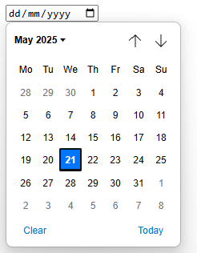

# Challenges

## Challenge 1: GMail - New Label

You can create labels in GMail to organize your emails. Adding a new label opens a dialog box as shown below:

### Task

- Give the tag(s) of the web component(s) that you would use to create a similar dialog box in your web application.
Mark the part of the dialog box that you would use each tag for, by drawing a box around the relevant part around it in the screenshot.

- Give the attributes and API that you would document for each tag.

- Determine for each web component what atomic design level it belongs to (atom, molecule, organism, template, or page) and justify your choice.

## Challenge 2: Date Input

In HTML we can use the `<input type="date">` element to allow users to select a date. However, the appearance and behavior of this element can vary across different browsers.

|                       _Chrome_                       |                       _Firefox_                        |
| :--------------------------------------------------: | :----------------------------------------------------: |
|  |  |

To get a consistent appearance and behavior across browsers, we want to create a custom date input component.

### Task

- Determine the web component(s) that you would use to create a custom date input component. Mark the part of the input that you would use each tag for, by drawing a box around the relevant part around it in the screenshots.

- Give the attributes and API that you would document for each tag.

- Determine for each web component what atomic design level it belongs to (atom, molecule, organism, template, or page) and justify your choice.

## Challenge 3: External Libraries

While we can find many web component libraries, that implements a design system, we can also find some libraries that implement something completely different.

Take for instance the following libraries:

- [**leaflet**](https://leafletjs.com/) a small JavaScript library for interactive maps,
- [**chart.js**](https://www.chartjs.org/) a simple library for creating charts,
- [**D3js**](https://d3js.org/) a library for data visualization,
- [**Schedule-x**](https://schedule-x.dev/) an event calender,

Unfortunately these libraries are not always based on web components, and often they are based on a specific framework
like React, Vue, or Angular, so you have to create a wrapper around the library to use it in your web component. And
since these libraries are often have a specific target audience and cost a lot of time to build and maintain, they are
often not open source. So you might have to pay for a license to use them in your application.

There are some libraries that are open source and based on web components, but they are often not maintained and not
well documented. On the site [webcomponents.org](https://webcomponents.org/) you can find a list of web components that
are available, like one for leaflet maps [leaflet-map](https://prtksxna.github.io/leaflet-map-component/), but as you
can see are the most of the components you can find there not well maintained and not well documented.

### Task

- Explain the atomic design level of each library and justify your choice.
