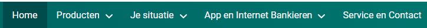
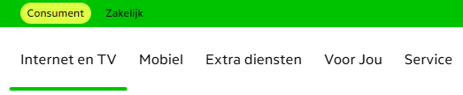
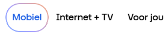
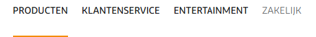
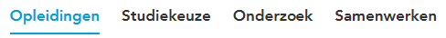
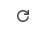
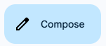
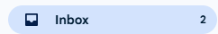
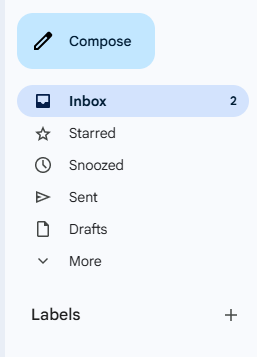
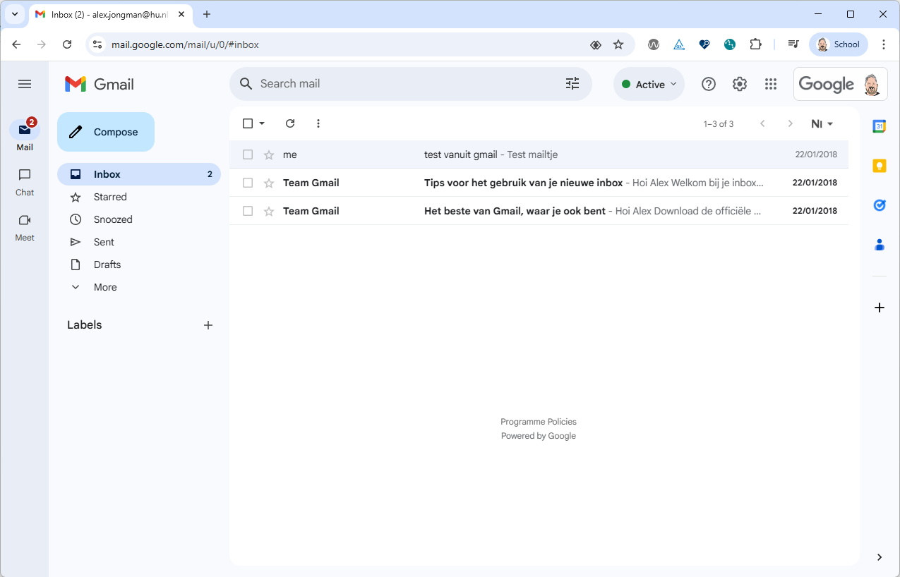

# UX Design

Most companys start with a design phase before they start building a web application. UX designers are often involved in
this phase to create the look and feel of the application. They create mockups and prototypes that show how the
application will look and how the user will interact with it. This is an important phase, because it helps to define the
requirements and the functionality of the application.

Style guides and design systems are often the base for the design phase, but atomic design is also a methodology that
is often used by UX designers to create the user interface. In this chapter we will give a short introduction to UXdesign, style guides, design systems, and atomic design. We will also show how these concepts can
be mapped to web components, and how they can help to create a consistent user experience across different platforms.

## Style Guides and Design systems

Most companies have their own **style guide** that defines the look and feel of their web applications. This style guide
defines the colors, fonts, and layout of the application. When they also describe the look and feel of common
"components" like buttons, input fields, and labels, we call this a **design system**. A design system is a collection
of reusable design and code components that are used to create a consistent user experience across different platforms,
like web, mobile, and desktop. This consistent look and feel is not only important for the user experience, but also for
the branding of the company.

The branding of the company is important, because it helps to create a recognizable identity for the company. Take for
instance a look at the following screenshots and try to guess which company they belong to (you can click on the images
to reveal the name of the company):

**Guess the Bank Company**

<details>
  <summary>
    <div style="display: inline-block; width: 600px; height: auto; padding: 2rem; border: 1px solid #ccc; border-radius: 8px;">
      
    </div>
  </summary>
  <p>This was a screenshot taken from: <strong>ABN AMRO</strong></p>
</details>

**Guess the Bank Company**

<details>
  <summary>
      <div style="display: inline-block; width: 600px; height: auto; padding: 2rem; border: 1px solid #ccc; border-radius: 8px;">
        
      </div>
  </summary>
  <p>This was a screenshot taken from: <strong>ING</strong></p>
</details>

**Guess the Telecom Operator**

<details>
  <summary>
    <div style="display: inline-block; width: 600px; height: auto; padding: 2rem; border: 1px solid #ccc; border-radius: 8px;">
      
    </div>
  </summary>
  <p>This was a screenshot taken from: <strong>KPN</strong></p>
</details>

**Guess the Telecom Operator**

<details>
  <summary>
    <div style="display: inline-block; width: 600px; height: auto; padding: 2rem; border: 1px solid #ccc; border-radius: 8px;">
      
    </div>
  </summary>
  <p>This was a screenshot taken from: <strong>Odido</strong></p>
</details>

**Guess the Telecom Operator**

<details>
  <summary>
    <div style="display: inline-block; width: 600px; height: auto; padding: 2rem; border: 1px solid #ccc; border-radius: 8px;">
      
    </div>
  </summary>
  <p>This was a screenshot taken from: <strong>Ziggo</strong></p>
</details>

**Guess the School**

<details>
  <summary>
    <div style="display: inline-block; width: 600px; height: auto; padding: 2rem; border: 1px solid #ccc; border-radius: 8px;">
      
    </div>
  </summary>
  <p>This was a screenshot taken from: <strong>HU</strong></p>
</details>

When you start to build a web site for a customer it is very likely that they already have their own design system. But
unfortunately not all of them have a design system that is based on web components. Some of them have a design system
that is based on CSS styles and JavaScript behavior, but not on web components. There are also many open design systems
available that are based on web components which we can use and customize to our needs. Some examples are:

- [Material Design User Interface](https://www.mdui.org/en/),
- [Material Web](https://material-web.dev/) van Google,
- [Lion](https://lion.js.org/) van de ING,
- [UI5](https://sap.github.io/ui5-webcomponents/) van SAP

There is no good catalog of web component based design systems available yet, but a good starting point is the
[Open-WC - Component libraries](https://open-wc.org/guides/community/component-libraries/) page. This page contains a
list of web component libraries that are available, and it also contains links to other resources that can help us find
web component libraries.

## Atomic Design

Like software developers, UX designers also have methodologies and tools to help them design the user interface
effectively. To come up with a good design, they need a clear understanding of the requirements and the functionality of
the application. They need to know what the user needs, what the user expects, and how the user will interact with the
application. This is often done by creating user stories, user flows, and wireframes.

The tools that UX designers use to create the mockups and prototypes are often different from the tools that software
developers use to write code. For example, software developers often use IDEs like Visual Studio Code, IntelliJ, or
Eclipse to write code, while UX designers often use tools like Figma, Penpot, or Adobe XD to create the mockups. These
tools allow them to create interactive prototypes that can be tested with users. This is an important step in the design
process, because it helps to validate the design and to identify any usability issues before the development phase
starts.

Except for the tools, there is also a difference in the way UX designers and software developers think about the user
interface. UX designers often think in terms of components, while software developers often think in terms of code and
functionality.

One of the approaches that UX designers often use is **[Atomic Design](https://atomicdesign.bradfrost.com/)**. Atomic
design is a methodology, introduced by Brad Frost, that breaks down the user interface into smaller, reusable
components. The idea is to start with the smallest building blocks (atoms) and combine them to create more complex
components (molecules, organisms, templates, and pages). You can read his book about atomic design for free online at
[atomicdesign.bradfrost.com](https://atomicdesign.bradfrost.com/).

But note that what a UX designer means with a component is not the same as what a software developer means with a
component. A UX designer means a component as a visual element that can be reused, while a software developer means a
component as a piece of code that can be reused. So when we talk about components in this chapter, we mean the visual
elements that are designed by UX designers, and not the code that is written by software developers!

This video gives a nice summary of the concept of atomic design:  
[](https://youtu.be/Yi-A20x2dcA?si=x8UeeYZMomRXFhvt)

> [!NOTE]
>
> Note also that for software developers a **page** in atomic design is the result of the rendering of what atomic
> design calls a **template**.

## Relationship between UX Design and Software Development

The concept of atomic design is a good common ground between UX designers and software developers, especially when it
comes to web components. It helps to create a shared understanding of the user interface and the components that are
used to create it. It also helps to bridge the gap between design and development, making it easier for both teams to
collaborate and communicate effectively.

If we map the atomic design concept to web components, we can see that the smallest building blocks (atoms) are the web
components that are used to create the user interface. These web components are often small and simple, like a button,
an input field, or a label. They are the basic building blocks that can be combined to create more complex components
(molecules, organisms, templates, and pages).

Let's explore how we can map the atomic design concept to web components, using examples of visual elements that we can
find in a web application like Google Mail.

### Example: Standard Button


This is an example of an **atom** in atomic design. It is a small and simple web component that can be reused in
different places in the application. If we would implement this button as a web component, we would create a web
component for the button that defines the style and animation of the button when it is clicked. This way we can use the
same button in different places in the application without the need of creating a new web component for each button. The
web component would also dispatch a click event when the button is clicked, so that we can handle the click event in the
application logic.

```html
<atom-button @click="handleCreateClick">Create</atom-button>
```

### Example: Icon Button

The refresh button in Google Mail could be another example of an atom.



We could build a specific web component for this button like this:

```html
<atom-refresh-button @click="handleRefreshClick"></atom-refresh-button>
```

But since there are many different icons that might be used in an application, it would be better to create a more
generic web component for the icon that can be used in different places in the application. Otherwise we would end up
with a lot of web components that are very similar, and that would make the codebase harder to maintain.

So we could create a web component for the icon that receives an icon name as an attribute, like this:

```html
<atom-icon-button name="refresh" @click="handleRefreshClick"></atom-icon-button>
```

But now we have the problem that we could use the icon only in a button, and we might want to use the icon in other
places in the application as well, like in a label or a link. So we could create a more generic web component for the
icon that receives an icon name and a label as properties, like this:

```html
<atom-icon name="refresh" label="Refresh"></atom-icon>
```

And then we could implement the icon button as a web component that combines the icon and the button, like this:

```html
<atom-button @click="handleRefreshClick">
  <atom-icon name="refresh"></atom-icon>
</atom-button>
```

But if we have a lot of different icons that we want to use in as buttons in the application, it would be better to
create a web component for the icon button like this:

```html
<molecule-icon-button name="refresh" label="Refresh" @click="handleRefreshClick"></molecule-icon-button>
```

But now the atom-icon-button web component, could internally use the atom-icon web component to render the icon, and the
atom-button web component to render the button. This way we can reuse the atom-icon and atom-button components in
different places in the application. This would make that this web component is a **molecule** in atomic design.

### Example: Compose Button

The compose button in Google Mail is another good example of a **molecule** in atomic design, because it combines the
button and the icon. It is a more complex component that is made up of two atoms: the button and the icon. The compose
button



Also the inbox button in Google Mail is a molecule, because it combines the button, the icon and the number of unread
messages.

In html the compose button could be implemented like this:

```html
<molecule-icon-button icon="refresh" @click="handleComposeClick">Compose</molecule-icon-button>
```

> [!WARNING]
>
> It might be that we already have defined a web component with this tag name, so it's advisable to have a catalog of
> the web components that we have defined in our application. This way we can avoid naming conflicts and we can easily
> find the components we need.

### Example: Inbox Button

The inbox button in GMail is another good example of a **molecule** in atomic design.



At least it could and should be a molecule. The problem you might encounter here is that this component is more dynamic
than the previous ones, because it shows the number of unread messages.

If we would implement this button as a web component, that is only usable for the inbox, the html tag might look like
this:

```html
<organism-inbox-button @click="handleInboxClick">Inbox</organism-inbox-button>
```

Now our web component would have to render the button using the icon component, but it would also have to fetch the
number of unread messages from the server and update the button accordingly. This would make the web component more
complicated, because it would have to handle the logic of fetching the data and updating the button. And the web
component would no longer be an atom or a molecule, but an **organism** in atomic design, because it combines multiple
components and has its own logic.  
So it would be better to create a more generic web component for the inbox button that can be used in different places
in the application, like this:

```html
<molecule-inbox-button icon="inbox" label="Inbox" unread-count="5" @click="handleInboxClick"></molecule-inbox-button>
```

This way the unread count is passed as an attribute to the web component, so that the web component does not have to
fetch the data itself. This keeps the web component simple and focused on the rendering.

### Example: GMail Sidebar

We could also create a more complex component that combines multiple molecules and atoms, like the sidebar.



This component needs to render the inbox button from the previous example. This component therefore needs to know the
number of unread messages, so it can pass this information to the inbox button. There are two ways to get this
information: Either this information is passed to this sidebar component as an attribute, or the sidebar component
fetches the data itself.

If we pass the number of unread messages as an attribute, the sidebar component would be a molecule, because it doesn't
have to manage its own state or fetch its own data. It's however not likely that we would use the sidebar component in
other applications, since this component is tightly coupled to the GMail application. So we could also implement the
sidebar component as an organism, because it has its own logic and manages its own state. The sidebar component would
then fetch the number of unread messages from the server and update the inbox button accordingly. The web component for
the sidebar would not need any attributes, because it would fetch the data itself and update the inbox button
accordingly. Using this web component in HTML would look like this:

```html
<organism-gmail-sidebar></organism-gmail-sidebar>
```

The render method of the sidebar component would then render the inbox button and pass the number of unread messages to
it, like this:

```js
render() {
  return html`
    <div class="sidebar">
      <organism-inbox-button icon="inbox" label="Inbox" unread-count="${this.unreadCount}"></organism-inbox-button>
      <organism-inbox-button icon="star" label="Starred" unread-count="${this.starredCount}"></organism-inbox-button>
      <organism-inbox-button icon="snoozed" label="Snoozed" unread-count="${this.snoozedCount}"></organism-inbox-button>
      <!-- ... and so on for the other buttons in the sidebar -->
    </div>
  `;
}
```

> [!NOTE]
>
> As can be seen in the example above, the naming of the web component 'organism-inbox-button' is not very consistent
> with the naming of the other web components, as is it's attribute 'unread-count'. This is something that you might
> encounter when you design you own web components. A refatoring of the web component names and attributes would be a
> good idea to make them more consistent and to avoid confusion.

### Example: Gmail Application

Like the sidebare, we could also create a set of components on the molecule level that together would form the page of
the GMail application that we see when we open the application in our browser.



The visual page that we see is the result of the rendering of what atomic design calls a **template**, but that as a
user we would call a **page**. The template is a combination of the sidebar, the header, and the main content area.

If we would use Multi-Page Application (MPA) architecture, we could create a single html file for the page that either
implements the template in body of the html file and that imports a script file that contains the logic for the
template. Or that imports a web component that implements the template by rendering the content within the web component
and handling the logic.

If we would use Single-Page Application (SPA) architecture, we could create a web component for the template and the
render method would then render the sidebar, the header, and the main content area etc. This web component then would be
responsible for managing the state of the application and for handling user interactions.

In this course we often call this web component a **page** web component, and use the name `page` in the tag name of the
web component, like this:

```html
<inbox-page></inbox-page>
```

This makes is easy to identify the web component as a page component, and it also makes it easy to use them in a router.

## Final thoughts

In this chapter we have seen how UX design and software development can work together to create a consistent user
experience. We have also seen how atomic design can help to create a shared understanding of the user interface and the
components that are used to create it. We have also seen how web components can be used to create reusable components
that can be used in different places in the application. We have seen how we can use web components to create atoms,
molecules, organisms and templates in atomic design, and how we can use them to create a consistent user experience
across different platforms.

Now that we have seen how atomic design can be mapped to web components, we can see that atomic design is a good
methodology to create a shared understanding of the user interface and the components that are used to create it. Web
components at the atom and molecule level are small and simple. They communicate via their attributes and events, and
they can easily be reused in different places in the application, since they are not tightly coupled to the application
logic. This also makes them easy to test and to maintain, because they are small and focused on a specific task. They
can be exported into a NPM package, so that they can be reused in other applications of the same company or in other
applications that use the same design system.

Web components at the organism or template level are more complex and often have their own logic. They communicate with
the underlying data and manage the state of the application. They are not suitable for reuse in other applications,
because they are often tightly coupled to the specific application. They are also harder to test and to maintain,
because they are more complex and have more dependencies. An E2E test is often needed to test the behavior of these
components, because they are often not isolated from the rest of the application.

Web components at the page level in atomic design are not reusable components, but the result of the rendering of a
template. They are the final result of the rendering of the application, and they are not reusable components. They are
the result of the rendering of the application, and they are not reusable components. They are the final result of the
rendering of the application, and they are not reusable components.

---

## Sources

- [Atomic Design](https://atomicdesign.bradfrost.com/)
- [Atomic Design - Chapter 2](https://atomicdesign.bradfrost.com/chapter-2/)