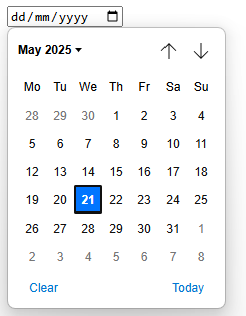
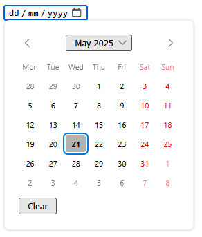
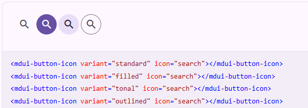

# Web Components reusability

A web component is a reusable piece of code that can be used in different parts of our application. A web component can
be something small and simple like a button, or something more complex like a whole page. This difference in granularity
is important to understand when we are building our application. We can build our application with a **bottom up
approach**, by starting with small components and then combining them to create larger components, or we can build our
application with a **top down approach**, by starting with large components (a whole page) and then breaking them down
into smaller components.

But how small or large should our components be? This is a question that is often asked when we are building our
application. There is no one size fits all answer to this question, but there are some guidelines that we can follow to
help us make this decision. Brad Frost has written a [book called "Atomic Design"](https://atomicdesign.bradfrost.com/)
that describes a way to structure our front-end application using web components. He describes five different levels of
components:

1. **Atoms**: These are the smallest components in our application. They are the building blocks of our application.
   Examples of atoms are buttons, input fields, and icons.
2. **Molecules**: These are groups of atoms that work together to form a more complex component. Examples of molecules
   are forms, cards, and lists.
3. **Organisms**: These are groups of molecules that work together to form a more complex component. Examples of
   organisms are headers, footers, and sidebars.
4. **Templates**: These are groups of organisms that work together to form a more complex component. Examples of
   templates are pages, layouts, and sections.
5. **Pages**: These are the final components that are displayed to the user. They are the result of combining all the
   other components together. Examples of pages are home pages, product pages, and checkout pages.

## Design systems

You may wonder why we would like to build web components at the **atom** level, if they are so small and simple as a
button or an input field; why not just use the native HTML elements? The answer is that web components not only define
the HTML elements, but also the CSS styles and JavaScript behavior. Take for instance the `<input type="date">` element.
This element is a native HTML element that is supported by all modern browsers. But the way it looks and behaves is
different in different browsers.

|                       _Chrome_                       |                       _Firefox_                        |
| :--------------------------------------------------: | :----------------------------------------------------: |
|  |  |

With web components at the atom level we can create a custom date input element that looks and behaves the same in all
browsers. This is important for the user experience, because it makes our application look more consistent and
professional. In the business such a consistent look and feel is part of a **design system**. A design system is a
collection of components that are designed to work together to create a consistent user experience. It is a set of
guidelines and best practices that help us create a cohesive and user-friendly application.

There are many companies that have their own design system, which gives them their own unique look and feel, so that
their users can recognize their application immediately. Take for instance a look at the following screenshots and try
to guess which company they belong to:

  
  
  
  
  

So if you start to build a web site for a customer it is very likely that they already have their own design system. But
unfortunately not all of them have a design system that is based on web components. Some of them have a design system
that is based on CSS styles and JavaScript behavior, but not on web components. There are also many open design systems
available that are based on web components which we can use and customize to our needs. Some examples are:

- [Material Design User Interface](https://www.mdui.org/en/),
- [Material Web](https://material-web.dev/) van Google,
- [Lion](https://lion.js.org/) van de ING,
- [UI5](https://sap.github.io/ui5-webcomponents/) van SAP

There is no good catalog of web component based design systems available yet, but a good starting point is the
[Open-WC - Component libraries](https://open-wc.org/guides/community/component-libraries/) page. This page contains a
list of web component libraries that are available, and it also contains links to other resources that can help us find
web component libraries.

If you browse through the list of web component of the libraries you will see that there are also many components that
have a dependency on another atom web component. Take for instance the
[button-icon from the MDUI](https://www.mdui.org/en/docs/2/components/button-icon) library.

Such a component is called a **molecule**, because it is a combination of two or more atoms that work together to form a
more complex component. So we can state that design systems are a collection of web components that are consists of at
least atoms and molecules.

## Libraries

So external design system web components are usful for quickly building a web application, but there are also other
libraries available that might be useful to speed up our development process. Those libraries are more on the
**Organism** level, and they are often used to build more complex components that are not part of a design system. These
libraries offer a general purpose solution for a specific problem. Think about a problems like creating a map, a chart,
a calendar, or a table. These are all complex components that are not part of a design system, but they are often used
in web applications. Some examples of these libraries are:

- [**leaflet**](https://leafletjs.com/) a small JavaScript library for interactive maps,
- [**chart.js**](https://www.chartjs.org/) a simple library for creating charts,
- [**D3js**](https://d3js.org/) a library for data visualization,
- [**Schedule-x**](https://schedule-x.dev/) an event calender,

Unfortunately these libraries are not always based on web components, and often they are based on a specific framework
like React, Vue, or Angular, so you have to create a wrapper around the library to use it in your web component. And
since these libraries are often have a specific target audience and cost a lot of time to build and maintain, they are
often not open source. So you might have to pay for a license to use them in your application.

There are some libraries that are open source and based on web components, but they are often not maintained and not
well documented. On the site [webcomponents.org](https://webcomponents.org/) you can find a list of web components that
are available, like one for leaflet maps [leaflet-map](https://prtksxna.github.io/leaflet-map-component/), but as you
can see are the most of the components you can find there not well maintained and not well documented.

---

## Sources

- [Atomic Design](https://atomicdesign.bradfrost.com/)
- [Atomic Design - Chapter 2](https://atomicdesign.bradfrost.com/chapter-2/)
