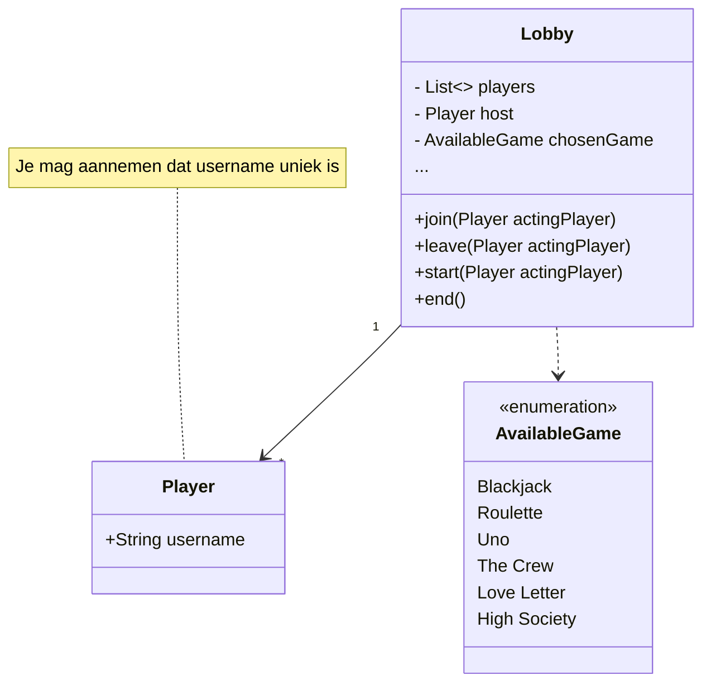

# Oefenopdracht OOP (15-30min)

In deze oefenopdracht willen we weer even een klein beetje oefenen met Java en OOP.

Je kunt een nieuw Project aanmaken in IntelliJ via ```New Project / Java / Maven```

## Schets



## Requirements

* Alleen de Host mag de game starten
* Er mogen geen dubbele spelers in de lobby 

Klaar? Hand omhoog, docent checkt het even. Docent(en) druk? Extra uitdagingen.

Was het goed? Top, jij bent nu ook (even) docent.

## Extra uitdagingen

* Na het starten van het spel mogen nieuwe spelers niet meer joinen. 
  * Reeds gejoinede spelers mogen wel leaven en later terugkomen.
* Nadat het spel is afgelopen mogen spelers niet meer joinen.
* ...