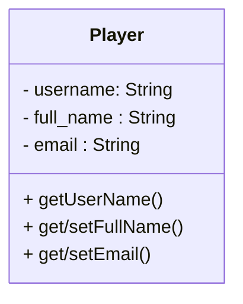
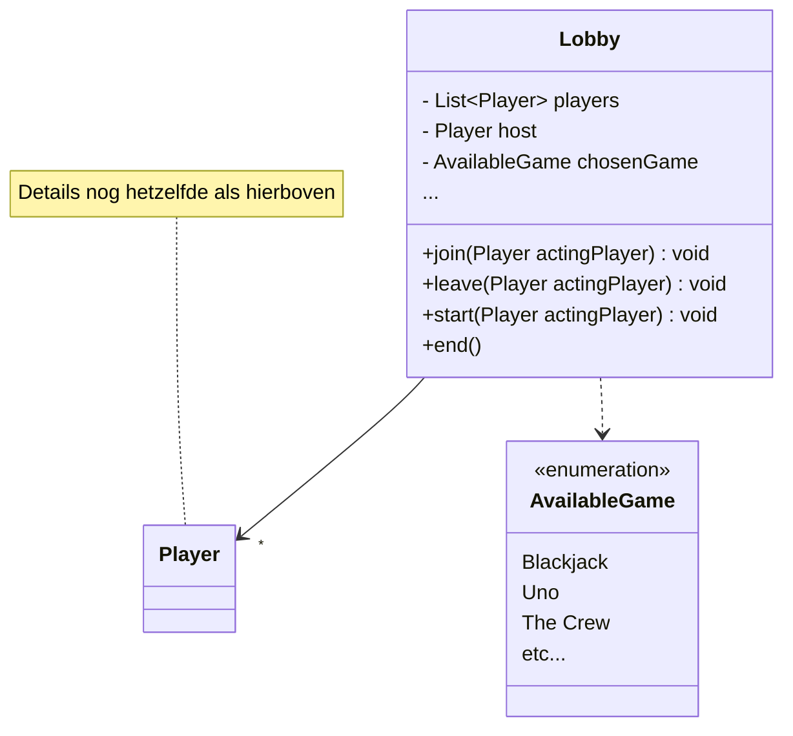

# ORMs

## Opdracht 1: ORMs

We gaan in een aantal stappen kennismaken met ORMs.

* Haal de initDb method uit de playerController weg, en voeg een @Entity annotatie toe op Player. Voeg ook een @Id toe aan de username. JPA/Hibernate zal nu automatisch de tabellen voor je maken! Je zult mogelijk wat @Table en @Column annotaties moeten toevoegen om de gegenereerde tabel en column-names overeen te laten komen met de selects/insert/updates die je in opdracht 2 hebt geschreven.

* Verwijder de dependency op je DAO (dit mag pijn doen, afhankelijk van hoe mooi je 'm vindt), en vervang die met een dependency op de JPA EntityManager. Gebruik nu de EntityManager om je Player objecten te Find'en, Persisten, Removen en Updaten!

## Opdracht 2: Relaties

Nu is het tijd om de Lobby, en de relatie toe te voegen.

* Zorg eerst dat je een Lobby tabel kan aanmaken. Je zult een @Id attribuut moeten toevoegen, want zo 1,2,3 is er niets gegarandeerd unieks aan een Lobby. Maak een bewuste keuze tussen @One-to-Many, @Many-to-One of @Many-to-Many. Zoek op hoe je de Enum het beste kan opslaan!

* Zodra de Lobby tabel correct gegenereerd wordt kun je de LobbyController (of die V2 met DTOs) gaan aanpassen. Zorg dat er een EntityManager in ge-injecteerd wordt. Verder zul je ipv. 'new Player(...)' calls juist de bestaande Player uit de database moeten gaan zoeken.

* Welke Cascade zou je kunnen toevoegen aan de relatie tussen Lobby en Player? En welke *zeker niet*?

* Voeg PlayerRepository en LobbyRepository classes toe, en verplaats de dependency van EntityManager daarin (net zoals we eerder met de Datasource en de DAO deden!)

* Optioneel: In Lobby hebben we uiteindelijk 2 verschillende Lists. Zou niet 1 'iets complexere' tabel dit beter kunnen oplossen?

* Optioneel: Gebruik in plaats van zelf-gemaakte classes de Automagische JPA-interface-Repositories voro Player/Lobby