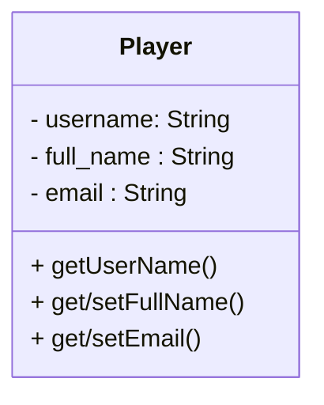
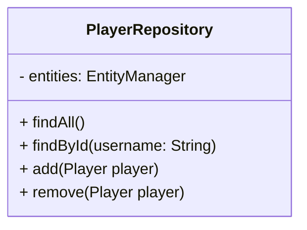
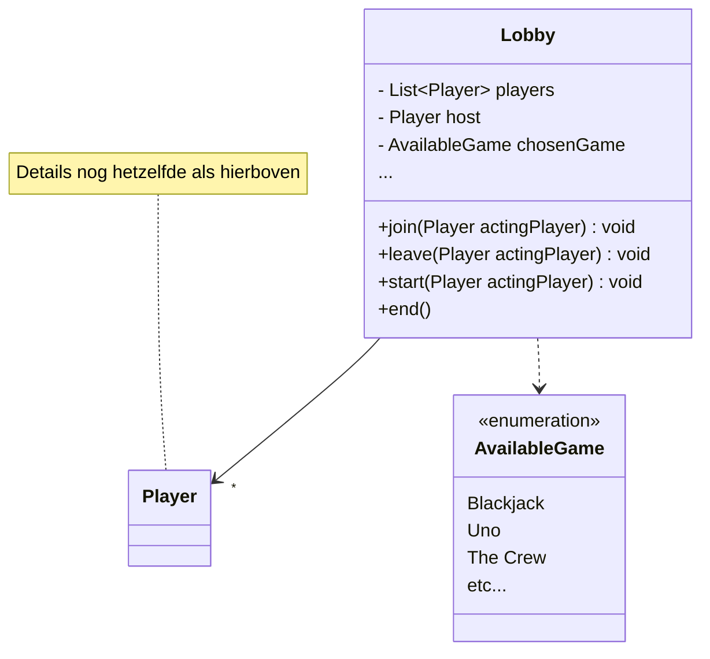

# ORMs


## Opdracht 0: Docker Database

In de Classroom repository gebruiken we H2, een In-Memory database. Het nadeel hiervan is dat je elke applicatie-herstart al je data kwijt bent.

* Probeer met de Docker-Compose file een PostGres database op te starten. Pas de application-properties aan zodat de postgres database gebruikt wordt.

Als je nu de applicatie afsluit en opnieuw opstart zou je data gewoon bewaard moeten worden.

* Waarschijnlijk heb je nog PGAdmin van S2 op je laptop staan. Probeer met PGAdmin te connecten op de Postgres database van de container. (als je geen PGAdmin meer hebt zit er ook een ingebouwde database-client in IntelliJ)

Wat vind je fijner als Developer? H2 of Postgres+Docker?


## Opdracht 1: ORMs



We gaan in een aantal stappen kennismaken met ORMs.

* Haal de initDb method uit de playerDAO weg (en ook de plek waar deze werd aangeroepen), en voeg een @Entity annotatie toe op Player. Voeg ook een @Id toe aan de username. JPA/Hibernate zal nu automatisch de tabellen voor je maken! Je wat @Table en @Column annotaties moeten toevoegen om de gegenereerde tabel en column-names overeen te laten komen met de selects/insert/updates.

* We gaan de DAO vervangen door een Repository. Maak een class PlayerRepository aan. Gebruik "Dependency Injection" om een ```Entity Manager``` in deze class te injecteren en implementeer de volgende methodes:


    
* Voeg @Transactional toe aan de ```PlayerController```, en injecteer je PlayerRepository naast de DAO. Herschrijf de methodes zodat alle functionaliteit weer werkt!
Zodra alles werkt kun je de DAO-injectie verwijderen.

## Opdracht 2: Relaties




Nu is het tijd om de Lobby, en de relatie toe te voegen. We volgen dezelfde stappen als hierboven.

* Zorg eerst dat je de Lobby tabellen kan aanmaken. Gebruik JPA annotaties zoals @Id, @Table, @Column, @Enumerated, @One-to-Many, @Many-to-One en/of @Many-to-Many om de juiste tabelstructuur te maken. De koppeltabel kun je specificeren met @JoinTable, die is een beetje lastig.

* Maak een LobbyRepository class aan, zoals hierboven voor Players, en migreer de controller naar de LobbyRepository class.

* Welke Cascade zou je kunnen toevoegen aan de relatie tussen Lobby en Player? En welke *zeker niet*?

* Optioneel: Gebruik in plaats van zelf-gemaakte classes de Automagische JPA-interface-Repositories voor Player/Lobby