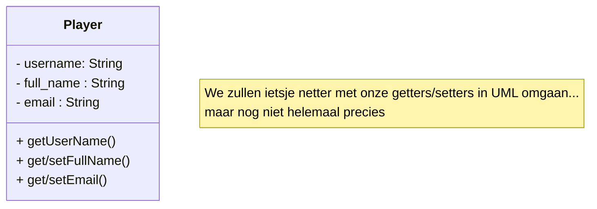

# Persistentie

## Opdracht 1: Player SQL

We hebben de player class van vorige keer een heel klein beetje uitgebreid:




In de start-repository van deze oefening (zie Canvas) zie je ook een stukje SQL om de bijbehorende tabel aan te maken. 
```Let op: dit is geen fraaie manier om tabellen aan te maken. Het is alleen simpel genoeg voor deze oefening ```

Schrijf de volgende endpoints om gebruik te maken van de database:
* GET /players
* POST /players
* GET /player/{username}
* DELETE /player/{username}
* PUT /player/{username}

Het staat je vrij om wel/geen DTOs te gebruiken in deze opdracht. Uiteraard is het netter, maar het is ook prima om qua oefening daar even niet op te focussen.

(het is niet erg als je een beetje roestig bent en niet alle endpoints voor elkaar krijgt, maar minstens 2 is wel echt verstandig)

## Opdracht 2: DAO's en DI

Maak een nieuwe class (PlayerDAO). Wat is de primaire dependency van die class? Zorg dat die door Spring ge-injecteerd wordt.
Verplaats vervolgens alle SQL van de vorige opdracht naar nieuwe methods op deze DAO class.
Gebruik een @Component annotatie om die DAO te injecteren in de @RestController.

Vervang nu de methods in je Controller met doorverwijzingen naar de DAO class.

Dit lijkt als het goed is op hoe het in S2 ging!
(maar dan in Spring)

## Opdracht 3: Docker Database

In de Classroom repository gebruiken we H2, een In-Memory database. Het nadeel hiervan is dat je elke applicatie-herstart al je data kwijt bent.
Probeer met de Docker-Compose file een PostGres database op te starten.

Als het goed is werkt je bovenstaande SQL nog gewoon (er zijn hele kleine verschillen tussen het H2 dialect, en het Postgres dialect, dus misschien dat er een klein foutje optreedt als je ergens net-niet standaard syntax hebt gebruikt).

Als je nu de applicatie afsluit en opnieuw opstart zou je data gewoon bewaard moeten worden.

Verwijder nu de container, en maak 'm opnieuw aan. Waarom is je data nog steeds bewaard?

Gooi alle data een keer weg, en zorg ervoor dat je echt met een clean slate begint!

Wat vind je fijner als Developer? H2 of Postgres+Docker?

## Opdracht 4: ORMs

We gaan in een aantal stappen kennismaken met ORMs.

* Haal de initDb method uit de playerController weg, en voeg een @Entity annotatie toe op Player. Voeg ook een @Id toe aan de username. JPA/Hibernate zal nu automatisch de tabellen voor je maken! Je zult mogelijk wat @Table en @Column annotaties moeten toevoegen om de gegenereerde tabel en column-names overeen te laten komen met de selects/insert/updates die je in opdracht 2 hebt geschreven.

* Verwijder de dependency op je DAO (dit mag pijn doen, afhankelijk van hoe mooi je 'm vindt), en vervang die met een dependency op de JPA EntityManager. Gebruik nu de EntityManager om je Player objecten te Find'en, Persisten, Removen en Updaten!


## Opdracht 5: Relaties

Hier gaan we probably geen tijd voor hebben ;)