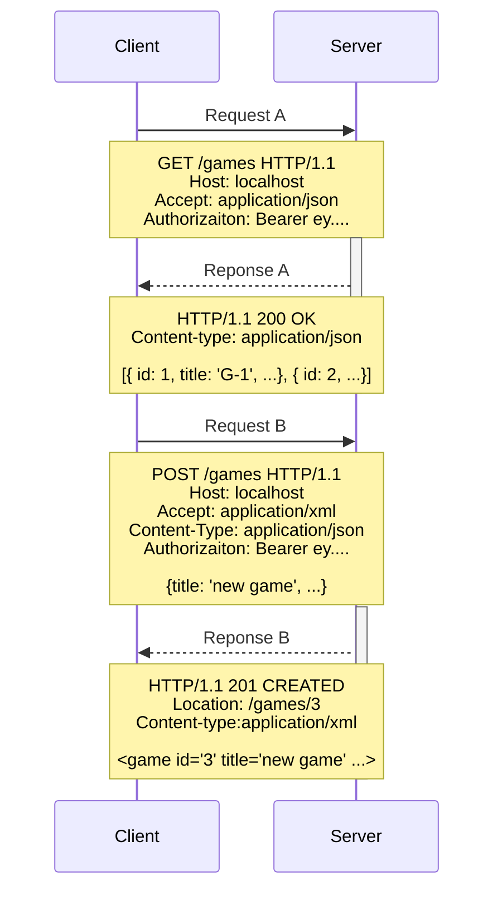

# Web development

Onze applicatie presenteert zichzelf naar buiten toe via het web: we
reageren op HTTP requests en geven HTTP responses terug.

Voor nu verwijzen we vooral door naar H1-6 en H8 van [Restful Web
Services](https://www.crummy.com/writing/RESTful-Web-Services/html). Een
prima (gratis) boek (wel een beetje oud) dat grotendeels deze stof
behandelt. Maar ondertussen bouwen we het hier ook zelf op.

## Client/server-architectuur

Het web werkt volgens een client/server-architectuur (of
klant/bediende-model): We hebben een client, bijvoorbeeld een web
browser, die een verzoek doet aan een server die dit afhandelt. 

Een voorbeeld:

We zien hier een client (bijv. een javascript frontend) een lijst games ophalen (zeg potjes Blackjack in een casino) met Request A. Het fraaie aan HTTP (Hypertext transfer protocol) is dat het een text-based protocol is. We kunnen dit dus relatief makkelijk lezen en schrijven. In tegenstelling tot bijv. een binair protocol zoals TCP, waarbij je expliciet moet weten dat nulletje of eentje 101 en 102 je vertellen of het om een nieuwe verbinding gaat, of dat het een voortgang van een oude is.

Het tweede wat belangrijk (en tegenintuïtief) is, is om te realiseren dat elke request-response interactie stateless is. Dat houdt in dat elk request volledig los van alle anderen staat. Het lijkt nu zo dat Request A & B met elkaar te maken hebben (en dat zal in het echt ook zo zijn), maar er zit niets in het protocol om aan te geven dat deze twee requests van hetzelfde 'gesprekje' zijn.

## HTTP requests

Een HTTP request wordt gevormd door:

1.  Een beschrijving van method, URI en protocol

2.  Headers

3.  Optioneel: een request body met een representatie volgens
    Content-Type

### HTTP methods

De HTTP-specificatie beschrijft een aantal methodes waarmee een client
allerlei zaken kan vragen aan een server. Het is belangrijk om de juiste
HTTP-methodes te gebruiken omdat deze in de eerste plaats het soort
actie aangeven die wordt verzocht.

In de tweede plaats staat in de protocol-specificatie van HTTP heel
nauwkeurig beschreven wat clients en servers mogen verwachten van een
bepaalde HTTP-methodes. Twee van de te verwachten eigenschappen zijn
*safety* en *idempotentie*.

Een HTTP-method wordt als *safe* beschouwt als deze niet de intentie
heeft om de servertoestand aan te passen. Dat betekent dat het gaat om
read-only methoden. Safe methoden kunnen helpen bij het cachen van
resultaten (zie: REST). Bij safety gaat het dus niet om de beveiliging,
het ziet erop dat het veilig is omdat het geen toestand kan aanpassen.

Wanneer een HTTP-method *idempotent* wordt genoemd, betekent dat dat we
het verzoek meerdere keren kunnen herhalen zonder dat de uitkomst op
server verandert. Denk bijvoorbeeld aan het tweemaal uitvoeren van een
`DELETE`-methode. Beide keren is de betreffende resource verwijderd.
Idempotentie helpt een API betrouwbaar te maken tegen fouten: het
betekent dat je een verzoek kan herhalen zonder als je als client niet
zeker weet of het is aangekomen of niet.

We kennen de volgende HTTP-methods:

| Method    | Bedoeling                                                                  | Safe | Idempotent | 
|-----------|----------------------------------------------------------------------------|------|------------|
| `GET`     | opvragen van resource(s)                                                   | Ja   | Ja         |
| `POST`    | aanmaken nieuwe resource op onder een bepaalde URL (zonder identifier)     | Nee  | Nee        |
| `PUT`     | aanmaken/wijzigen van gehele resource op basis van URL (met identifier)    | Nee  | Ja         |
| `DELETE`  | verwijderen van gehele resource op basis van URL (met identifier)          | Nee  | Ja         |
| `HEAD`    | opvragen van headers (voordat je een mogelijk grote GET-request doet)      | Ja   | Ja         |
| `OPTIONS` | opvragen van toegestane communicatiewijzen voor een bepaalde URL of server | Ja   | Ja         |
| `PATCH`   | wijzigen van deel van resource op basis van URL (met identifier)           | Nee  | Nee        |

## HTTP responses

Een HTTP response wordt gevormd door:

1.  Een beschrijving van protocol en statuscode

2.  Headers

3.  Optioneel: response body met een representatie volgens Content-Type

### Status codes

Het teruggeven van de juiste statuscode is erg belangrijk wanneer je een
API ontwerpt. Het maakt een bepaalde verwachting duidelijk en clients
krijgen zo de mogelijkheid om slim om te gaan als er bijvoorbeeld een
redirection moet plaatsvinden of als de client wat verkeerd heeft
gedaan.

HTTP status codes worden onderverdeeld 5 categorieën, waarbij het eerste
getal steeds de categorie aangeeft (we noemen er hier een paar):

-   **1xx Informational**: request ontvangen, verwerking gaat door

    -   **100 Continue**: wordt gebruikt als een client eerst wil
        checken of de server het verzoek gaat accepteren, bijvoorbeeld
        bij grote request bodies.

-   **2xx Successful**: request ontvangen, begrepen, en geaccepteerd
    zonder problemen

    -   **200 OK**: standaardresponse voor succesvolle afhandeling

    -   **201 Created**: verzoek is afgehandeld; een resource is
        succesvol aangemaakt

    -   **202 Accepted**: verzoek is succesvol binnengekomen, maar de
        uitvoering volgt nog

-   **3xx Redirection**: meer actie is vereist om het verzoek af te
    handelen

    -   **303 See Other**: de response voor het request kan worden
        opgehaald (met GET) via de getoonde URI

    -   **307 Temporary Redirect**: dit verzoek, niet volgende
        verzoeken, moet worden herhaald naar een andere URI (met
        dezelfde method)

    -   **308 Permanent Redirect**: dit verzoek en volgende verzoeken
        moeten worden herhaald naar een andere URI (met dezelfde method)

-   **4xx Client Error**: de client heeft iets fout gedaan bij het doen
    van het verzoek

    -   **400 Bad Request**: algemene fout om aan te geven dat het
        request van de client niet klopt

    -   **401 Unauthorized**: lijkt op 403, maar client moet zich
        authenticeren

    -   **402 Payment Required**: er moet betaald worden om de request
        af te handelen (wordt weinig gebruikt)

    -   **403 Forbidden**: client heeft geen toestemming om de request
        te laten afhandelen

    -   **404 Not Found**: resource kan niet gevonden worden

    -   **405 Method not Allowed**: de betreffende HTTP-methode mag niet
        worden uitgevoerd

    -   **406 Not Acceptable**: de gespecificeerde Content-Type kan niet
        afgehandeld worden

-   **5xx Server Error**: het verzoek lijkt er goed uit te zien, maar er
    gaat iets fout op de server

    -   **500 Internal Server Error**: algemene fout om aan te geven dat
        er iets fout is gegaan op de server

    -   **502 Bad Gateway**: de server gaf de afhandeling door aan een
        ander systeem, maar daar gaat iets fout

    -   **503 Service Unavailable**: de server kan het verzoek niet
        afhandelen vanwege onderhoud of drukte

Deze statuscodes zijn als enum opgenomen in Spring, te vinden in
[`HttpStatus`](https://docs.spring.io/spring-framework/docs/current/javadoc-api/org/springframework/http/HttpStatus.html).
Standaard geeft Spring een `200 OK` terug als het een object in de
controller teruggeeft en een `500 Server Error` als er iets fout gaat
bij de verwerking.

## Content negotiation

Zoals in ons voorbeeld is te zien, onderhandelen client en
server over het ophalen van een *representatie* van een bepaalde
*resource*. We zien dat de client een GET-verzoek doet naar localhost
voor een Games-resource te vinden via de Uniform Resource Locator
(URL) '/games' (in combinatie met de token in de Authorization
header) De gewenste representatie geven we aan in de accept header en moet in dit geval 'application/json' zijn.

Deze interactie tussen client en server noem je *content negotation*: er
is een scheiding tussen de abstractie en de verschijningsvorm ervan.

De server antwoord vervolgens met een lijst games, en zegt dat de inhoud van de response ook 'application/json' is (door de Content-type header).

Bij Request B/Reponse B zie je hier een verschil: Request B stuurt zelf JSON, maar vraagt om XML. En de server werkt hier aan mee. Dit is puur om te illustreren wat het verschil tussen de 'Accept' en 'Content-type' header is, in de praktijk is het waarschijnlijk heel onhandig om op deze manier met twee verschillende formats te werken, en gebruik je gewoon één standaard.

## Representational State Transfer (REST)

*Representational State Transfer (REST)* is een architecturele stijl,
een set aan afspraken om een aantal problemen van het vroege web op te
lossen. Het is een standaard die door de meeste webapplicaties, bewust
of onbewust, wordt toegepast.

Deze eigenschappen en aanbevelingen zijn beschreven in de baanbrekende
PhD-thesis van Roy Fielding.

Er zijn een aantal eigenschappen waar REST een oplossing voor wil
bieden:

-   performance in de communicatie tussen componenten

-   schaalbaarheid van componenten en interactie ertussen

-   een eenvoudige, voorspelbare interface (API)

-   aanpasbaarheid van componenten

-   zichtbaarheid van communicatie tussen componenten

-   portabiliteit van componenten door het versturen van data te
    verrijken met code (JavaScript)

-   betrouwbaarheid bij foutafhandeling binnen en tussen componenten

Deze eisen hebben geleid tot zes architecturele *constraints*
(beperkingen):

### Client/server

Een scheiding van client en server leidt tot *separation of concerns* en
zorgt voor portabiliteit. Een server kan verschillende soorten clients
bedienen.

### Stateless communicatie

Client-servercommunicatie moet stateless zijn. Dat betekent dat alle
benodigde informatie om het request af te handelen in het request (url,
headers, body) moet zijn opgenomen.

Dit brengt een hoop voordelen met zich mee. Dit leidt tot schaalbaarheid
van servers. Het maakt niet uit welke fysieke server het request
afhandelt, omdat er alle benodigde informatie in de request zit. Zo kan
je honderden (virtuele) servers neerzetten met dezelfde code om
overbelasting te voorkomen. Tegenwoordig zie je de grootste
performance-problemen ontstaan in de inrichting van de persistentie. Dit
is lastig op te schalen, omdat de application state ergens moet leven.

Het maakt het ook makkelijker voor servers om te herstellen van fouten.
Het request kan immers gewoon volledig ge-retried worden door de client.

Ten slotte zijn requests over het algemeen makkelijker af te handelen
omdat de server niet hoeft bij te houden waar elke client zich bevindt
in het systeem en welke informatie voor een bepaalde sessie nog
onthouden moet worden. Dat moet de client allemaal doen.

Session state moet dus op de client bewaard worden, bijvoorbeeld met een
local storage. Wij sturen dan ook steeds de session state mee in de
JWT-token in de Authorization header. De Postman-collectie zorgt ervoor
dat dit automatisch gebeurt.

### Cacheability

Om de netwerk-efficiëntie nog meer te vergroten, moeten we slim omgaan
met caching. Een *cache* zorgt ervoor dat we niet het verzoek nogmaal in
zijn volledigheid hoeven te verwerken, maar dat we het resultaat van
eenzelfde eerdere request kunnen teruggeven. Dat is wel zo snel.

Caching is in de praktijk erg moeilijk om te regelen. Daarom zijn er op
het gebied van HTTP en REST een aantal afspraken ten aanzien van het
soort *request methods* die veilig zijn om te gebruiken of niet.

### Uniform interface

We kennen het ontwerpprincipe dat we willen programmeren tegen
standaardabstracties (*program to an interface*), zodat de onderliggende
implementatie kan variëren. Om een gestandaardiseerde interface te
behouden, moeten we rekening houden met:

1.  Uniform Resource Identifiers (URIs)

2.  manipuleren van resources via representaties

3.  self-descriptive messages

4.  Hypermedia As The Engine Of Application State (HATEOAS)

Voor de uniform interface is het belangrijk om in de URL te werken met
identificeerbare resources! Stop geen acties in de URL, maar gebruik
daar de HTTP-methodes voor. Denk niet in termen van uitvoering, maar in
termen van het aanmaken, verwijderen of wijzigen van resources door een
representatie van die resource te sturen.

In het ideale geval zit alle informatie in de response ingebakken, ook
welke acties nog meer mogelijk zijn met de betreffende resource. Dat is
wat HATEOAS inhoudt.

### Layered system

Clients zouden alleen maar weet moeten hebben van één server om een
bepaalde resource op te vragen of te bewerken. Dat er op de achtergrond
allerlei andere systemen spelen zou niet relevant moeten zijn. Dit zorgt
ervoor dat de client kan koppelen tegen een centrale API (ook wel een
API-gateway) genoemd, terwijl er op de achtergrond allerlei wijzigingen
en optimalisaties plaats kunnen vinden. Caching kan worden toegevoegd,
de dataopslag kan slimmer ingericht worden, hele back-ends kunnen worden
herschreven: de client hoeft hier (wat de API betreft) weinig van te
merken. Dit is *high cohesion* en *loose coupling* op HTTP niveau!

### Code-on-demand (optional)

Binnen REST kunnen we de mogelijkheid aan servers bieden om gedrag op de
client uit te breiden. Het eerste verzoek aan een server geeft meestal
een hele set aan JavaScript terug om zo de gebruikerservaring te
verrijken!

Een RESTful systeem moet zo zijn opgezet dat dit mogelijk is.

### RESTful of niet?

Striktgenomen noemen we een web service RESTful als deze voldoet aan
alle principes van REST. In de praktijk is dat helaas niet het geval en
worden veel web APIs RESTful genoemd zonder dat aan alle voorwaarden
wordt voldaan.