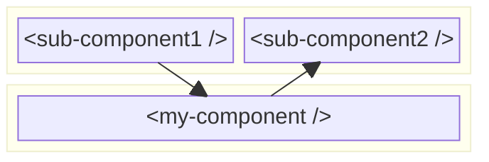

# Attributes based communication

Attributes based communication is one of the most common ways to communicate data between web components. You might use it without realizing it. Take for example the following html snippet:

```html

```

This is a simple image tag with two attributes. The src and alt attributes. The src attribute is used to specify the URL of the image, while the alt attribute is used to provide a text description of the image. This is a common pattern in web development, where you use attributes to pass data to HTML elements.

## One-way vs Two-way data binding

To explain data binding and the difference between one-way and two-way data binding, we will use the input tag as an example. The input tag is a common HTML element that is used to get user input. It has a value attribute that is used to specify the initial value of the input tag.

```html
<input type="text" id="name" name="name" value="Wally" />
```

We can use the value attribute to pass data to the input tag. The input tag will see this data as its initial value. If we change the value of the input tag, the content of the value attribute will change as well.

So if we want to use the input tag in the render method of our web compoent, we have to use a property variable to store the value of the input tag. This is called data binding. In LIT our code would than look like this:

```javascript
import { LitElement, html } from "lit";

export class MyComponent extends LitElement {

  static get properties() {
    return {
      value: { type: String },
    };
  }

  constructor() {
    super();
    this.value = "Suske";
  }

  render() {
    return html`
      <label for="name">Name:</label>
      <input
        type="text"
        id="name"
        name="name"
        value="${this.value}"
      />

      <p>current value: ${this.value}</p>
    `;
  }
}

customElements.define("my-component", MyComponent);
```

Running this code will show an input tag with the value "Suske" and a paragraph tag with the text "current value: Suske".  
However if we change the value of the input tag form "Suske" to "Wiske", the paragraph tag will not update. This is called **one-way data binding**. The data flows from the component to the input tag, but not the other way around.

If we want to update the content of the value property variable when the user changes the value of the input tag, we have to add an event listener to the input tag, that listens to changes on the input tag. So our code would then look like this:

```javascript
import { LitElement, html } from "lit";

export class MyComponent extends LitElement {

  static get properties() {
    return {
      value: { type: String },
    };
  }

  constructor() {
    super();
    this.value = "Suske";
  }

  _onInput(event) {
    this.value = event.target.value;
  }

  render() {
    return html`
      <label for="name">Name:</label>
      <input
        type="text"
        id="name"
        name="name"
        value="${this.value}"
        @input="${this._onInput}"
      />

      <p>current value: ${this.value}</p>
    `;
  }
}

customElements.define("my-component", MyComponent);
```

If we would have used the `Polymer` library (an anchestor of `Lit` and `LitElement`), we could have used the **two-way data binding** feature of Polymer. This would have allowed us to use the value property variable directly in the input tag, without having to add an event listener to the input tag. The Polymer library would have taken care of the data binding for us.

```javascript
import { PolymerElement, html } from '@polymer/polymer/polymer-element.js';

class MyComponent extends PolymerElement {
  static get properties() {
    return {
      value: {
        type: String,
        value: 'Suske',
        notify: true, // Enables two-way data binding
      },
    };
  }

  static get template() {
    return html`
      <label for="name">Name:</label>
      <input
        type="text"
        id="name"
        name="name"
        value="{{value::input}}" <!-- Two-way binding -->
      />

      <p>current value: [[value]]</p> <!-- One-way binding for display -->
    `;
  }
}

customElements.define('my-component', MyComponent);
```

The two-way data binding feature however didn't make it into the `Lit` library, because it was a performance issue. That was a design decision of the `Lit` team. Other front-end frameworks like `Angular` and `Vue` do support two-way data binding, but their web components are not based on the web components standard and are therefor not interoperable with other web components from other libraries and/or frameworks.

## Mediator pattern

TODO: Common problem of two web components that need to communicate with each other. They are however not in a parent-child relationship, but a sibling relationship who share a common parent. This is a good example of the mediator pattern, in which the parent component acts as a mediator between the two sibling components. The parent component listens to attribute change events from one sibling component and passes the data to the other sibling component.

TODO: If the two components are cousins, then their grandparent would be the common component that could act as a mediator. But then you first have to pass the data up to the parent component and then down to the grandparent before it can be passed up to the other sibling component and then further up to their child component. This is called `prop drilling` and it's a lot of overhead and an example of a bad design, because it violates the single responsibility principle. The parent component should not be responsible for passing data between its children.



## Passing attribute data with Lit

TODO: In HTML attributes are always strings. As described in [Lit Attributes](../lit-web-components/lit-attributes.md) you can also pass other data types like numbers, booleans and objects. Lit provides a simple way to typecast / convert the data to the correct type on the receiving end.
In the [Lit Attributes](../lit-web-components/lit-attributes.md) section we discussed that passing complex data types like objects we have to stringify the data before passing it to the component.
Lit however provides a simpler way to pass complex data types like objects, called property expressions. This is a more advanced way of passing data to a component, but it is not part of the web components specification. It is a Lit specific feature that allows you to pass complex data types like objects and arrays to a component without having to stringify them first.

---

## Sources

- [Lit.dev - Property expressions](https://lit.dev/docs/templates/expressions/#property-expressions)

---

:house: [Home](../README.md) | :arrow_backward: [Backend Communication](./backend-communication.md) | :arrow_up:
[Data Exchange](./README.md) | [Event based communication](./events-based-communication.md) :arrow_forward:
