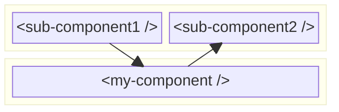

# Attributes based communication

Attributes based communication is one of the most common ways to communicate data between web components. You might use it without realizing it. Take for example the following html snippet:

```html

```

This is a simple image tag with two attributes. The src and alt attributes. The src attribute is used to specify the URL of the image, while the alt attribute is used to provide a text description of the image. This is a common pattern in web development, where you use attributes to pass data to HTML elements.

## One-way vs Two-way data binding

TODO: Example of one-way vs two-way data binding using the input tag.

> [!NOTE]
>
> LIT only supports one-way data binding. That was a design desision made by the LIT team, because of performance reasons.

TODO: Implementing the data binding in Lit.
- if the LIT component is sending data to it's child component (easy to implement within the render)
- if the LIT component is receiving data from it's child component (now you need a listener to listen to the attribute change event and then pass the data to the parent component)

## Mediator pattern

TODO: Common problem of two web components that need to communicate with each other. They are however not in a parent-child relationship, but a sibling relationship who share a common parent. This is a good example of the mediator pattern, in which the parent component acts as a mediator between the two sibling components. The parent component listens to attribute change events from one sibling component and passes the data to the other sibling component.

TODO: If the two components are cousins, then their grandparent would be the common component that could act as a mediator. But then you first have to pass the data up to the parent component and then down to the grandparent before it can be passed up to the other sibling component and then further up to their child component. This is called `prop drilling` and it's a lot of overhead and an example of a bad design, because it violates the single responsibility principle. The parent component should not be responsible for passing data between its children.



## Passing attribute data with Lit

TODO: In HTML attributes are always strings. As described in [Lit Attributes](../lit-web-components/lit-attributes.md) you can also pass other data types like numbers, booleans and objects. Lit provides a simple way to typecast / convert the data to the correct type on the receiving end.
In the [Lit Attributes](../lit-web-components/lit-attributes.md) section we discussed that passing complex data types like objects we have to stringify the data before passing it to the component.
Lit however provides a simpler way to pass complex data types like objects, called property expressions. This is a more advanced way of passing data to a component, but it is not part of the web components specification. It is a Lit specific feature that allows you to pass complex data types like objects and arrays to a component without having to stringify them first.

---

## Sources

- [Lit.dev - Property expressions](https://lit.dev/docs/templates/expressions/#property-expressions)

---

:house: [Home](../README.md) | :arrow_backward: [Backend Communication](./backend-communication.md) | :arrow_up:
[Data Exchange](./README.md) | [Event based communication](./events-based-communication.md) :arrow_forward:
