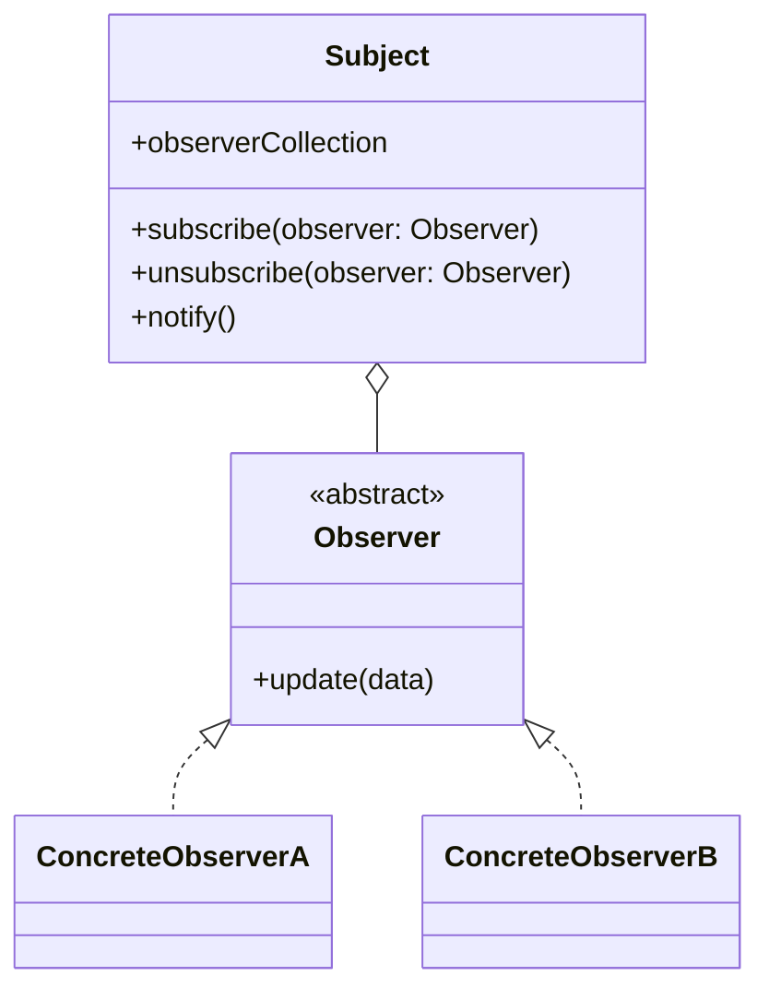

# Vanilla JS Observables

In this subsection we will implement the Observer pattern in vanilla JavaScript using Lit.

The class `Subject` is a class that holds the data we want to observe. This makes that in our architecture the `Subject` is part of the service layer and should be part of the `/src/service` folder. Because we might have different Services we will rename the class to `DataSubjectService`.

---

## Sources

---

:house: [Home](../README.md) | :arrow_backward: [Observables](./observables.md) |
:arrow_up: [Data Exchange](./README.md) | [RxJS Observables](./observables-rxjs.md) :arrow_forward:
