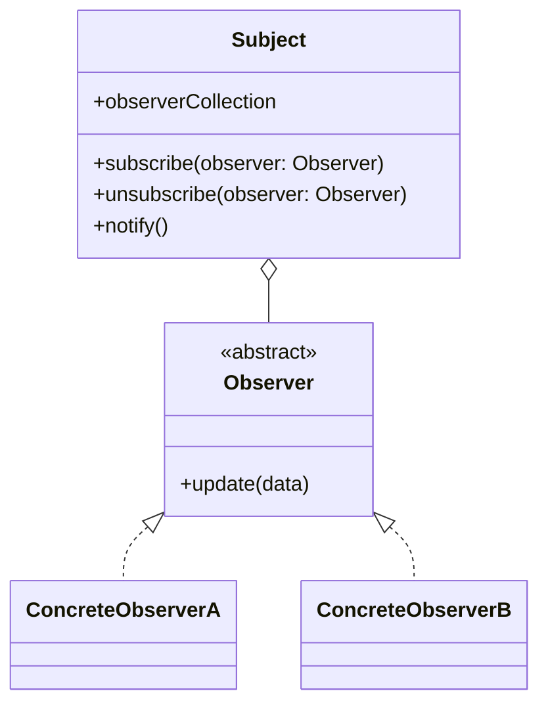

# Observables

In the previous chapters we discussed different ways of exchanging data between web components. What most of them had in common was that the communication was triggered by something the user did. For example clicking a button or changing the value of an input field. And for such cases where the data is exclusiefly exchange within the view layer, events are a good solution.

But for the scenario when the data or changes of the data needs to be stored by the service layer and other components are interested in this data, events originated from the view layer are not the best solution. This is because the view layer is not responsible for the data. The view layer is only responsible for the view (separation of concerns principle). The service layer is responsible for the data. So if you want to inform other components about changes in the stored data, you should use a different approach.

Another scenario occurs when the service layer fetches some new data from the server, based on active polling (regularly checking for new data) or a push notification (the server informs the client that there is new data). In this case, the service layer needs to inform the view layer that there is new data.

In both scenarios events originated from the service layer are not the best solution. This is because the service layer should not invoke DOM API calls and therefore could not trigger such an event. So we need a different approach. This is where observables come into play. They can be compared to push notifications, which will be send to everyone who is subscribed to specific data. They are based on the observer pattern, which is a design pattern that allows an object (the observable) to notify other objects (the observers) about changes in its state. The observer pattern is a common pattern in programming and is used in many libraries and frameworks, including RxJS.

In general the Observer pattern is looks like this:

The this pattern the Subject holds the data our Concrete Observer instances are interested in. The Concrete Observer instances take a subscription on the Subject to get notified when the data changes. With the subscription they provide the Subject with a callback function (`update()`)  that will be called when the data changes. The Subject holds a collection of observers and notifies them when the data changes. The Concrete Observer instances implement the `update()` method to handle the notification, which holds the changed data, from the Subject.

In the next two sub-chapters we will implement the Observer pattern, first we implement the [Observable in vanilla JavaScript](./observables-vanilla-js.md) from scratch and then with the help of a library called [RxJS](./observables-rxjs.md).

---

## Sources

[Wikipedia - Observer pattern](https://en.wikipedia.org/wiki/Observer_pattern)

---

:house: [Home](../README.md) | :arrow_backward: [Signals](./signals.md) |
:arrow_up: [Data Exchange](./README.md) | [Vanilla JS Observables](./observables-vanilla-js.md) :arrow_forward:
