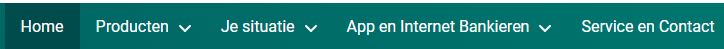
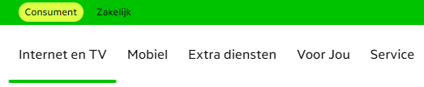
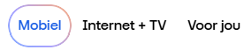
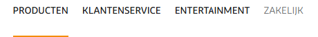
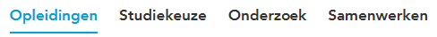
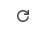
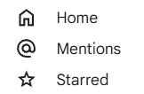
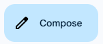
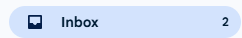
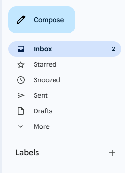

# UX Design

Most companys start with a design phase before they start building a web application. UX designers are often involved in
this phase to create the look and feel of the application. They create mockups and prototypes that show how the
application will look and how the user will interact with it. This is an important phase, because it helps to define the
requirements and the functionality of the application.

Style guides and design systems are often the base for the design phase, but atomic design is also a methodology that
is often used by UX designers to create the user interface. In this chapter we will give a short introduction to UXdesign, style guides, design systems, and atomic design. We will also show how these concepts can
be mapped to web components, and how they can help to create a consistent user experience across different platforms.

## Style Guides and Design systems

Most companies have their own **style guide** that defines the look and feel of their web applications. This style guide
defines the colors, fonts, and layout of the application. When they also describe the look and feel of common
"components" like buttons, input fields, and labels, we call this a **design system**. A design system is a collection
of reusable design and code components that are used to create a consistent user experience across different platforms,
like web, mobile, and desktop. This consistent look and feel is not only important for the user experience, but also for
the branding of the company.

The branding of the company is important, because it helps to create a recognizable identity for the company. Take for
instance a look at the following screenshots and try to guess which company they belong to (you can click on the images
to reveal the name of the company):

**Guess the Bank Company**

<details>
  <summary>
    <div style="display: inline-block; width: 600px; height: auto; padding: 2rem; border: 1px solid #ccc; border-radius: 8px;">
      
    </div>
  </summary>
  <p>This was a screenshot taken from: <strong>ABN AMRO</strong></p>
</details>

**Guess the Bank Company**

<details>
  <summary>
      <div style="display: inline-block; width: 600px; height: auto; padding: 2rem; border: 1px solid #ccc; border-radius: 8px;">
        
      </div>
  </summary>
  <p>This was a screenshot taken from: <strong>ING</strong></p>
</details>

**Guess the Telecom Operator**

<details>
  <summary>
    <div style="display: inline-block; width: 600px; height: auto; padding: 2rem; border: 1px solid #ccc; border-radius: 8px;">
      
    </div>
  </summary>
  <p>This was a screenshot taken from: <strong>KPN</strong></p>
</details>

**Guess the Telecom Operator**

<details>
  <summary>
    <div style="display: inline-block; width: 600px; height: auto; padding: 2rem; border: 1px solid #ccc; border-radius: 8px;">
      
    </div>
  </summary>
  <p>This was a screenshot taken from: <strong>Odido</strong></p>
</details>

**Guess the Telecom Operator**

<details>
  <summary>
    <div style="display: inline-block; width: 600px; height: auto; padding: 2rem; border: 1px solid #ccc; border-radius: 8px;">
      
    </div>
  </summary>
  <p>This was a screenshot taken from: <strong>Ziggo</strong></p>
</details>

**Guess the School**

<details>
  <summary>
    <div style="display: inline-block; width: 600px; height: auto; padding: 2rem; border: 1px solid #ccc; border-radius: 8px;">
      
    </div>
  </summary>
  <p>This was a screenshot taken from: <strong>HU</strong></p>
</details>

When you start to build a web site for a customer it is very likely that they already have their own design system. But
unfortunately not all of them have a design system that is based on web components. Some of them have a design system
that is based on CSS styles and JavaScript behavior, but not on web components. There are also many open design systems
available that are based on web components which we can use and customize to our needs. Some examples are:

- [Material Design User Interface](https://www.mdui.org/en/),
- [Material Web](https://material-web.dev/) van Google,
- [Lion](https://lion.js.org/) van de ING,
- [UI5](https://sap.github.io/ui5-webcomponents/) van SAP

There is no good catalog of web component based design systems available yet, but a good starting point is the
[Open-WC - Component libraries](https://open-wc.org/guides/community/component-libraries/) page. This page contains a
list of web component libraries that are available, and it also contains links to other resources that can help us find
web component libraries.

## Atomic Design

Like software developers, UX designers also have methodologies and tools to help them design the user interface
effectively. To come up with a good design, they need a clear understanding of the requirements and the functionality of
the application. They need to know what the user needs, what the user expects, and how the user will interact with the
application. This is often done by creating user stories, user flows, and wireframes.

The tools that UX designers use to create the mockups and prototypes are often different from the tools that software
developers use to write code. For example, software developers often use IDEs like Visual Studio Code, IntelliJ, or
Eclipse to write code, while UX designers often use tools like Figma, Penpot, or Adobe XD to create the mockups. These
tools allow them to create interactive prototypes that can be tested with users. This is an important step in the design
process, because it helps to validate the design and to identify any usability issues before the development phase
starts.

Except for the tools, there is also a difference in the way UX designers and software developers think about the user
interface. UX designers often think in terms of components, while software developers often think in terms of code and
functionality.

One of the approaches that UX designers often use is **[Atomic Design](https://atomicdesign.bradfrost.com/)**. Atomic
design is a methodology, introduced by Brad Frost, that breaks down the user interface into smaller, reusable
components. The idea is to start with the smallest building blocks (atoms) and combine them to create more complex
components (molecules, organisms, templates, and pages). You can read his book about atomic design for free online at
[atomicdesign.bradfrost.com](https://atomicdesign.bradfrost.com/).

But note that what a UX designer means with a component is not the same as what a software developer means with a
component. A UX designer means a component as a visual element that can be reused, while a software developer means a
component as a piece of code that can be reused. So when we talk about components in this chapter, we mean the visual
elements that are designed by UX designers, and not the code that is written by software developers!

This video gives a nice summary of the concept of atomic design:  
[](https://youtu.be/Yi-A20x2dcA?si=x8UeeYZMomRXFhvt)

> [!NOTE]
>
> Note also that for software developers a **page** in atomic design is the result of the rendering of what atomic
> design calls a **template**.

## Relationship between UX Design and Software Development

The concept of atomic design is a good common ground between UX designers and software developers, especially when it
comes to web components. It helps to create a shared understanding of the user interface and the components that are
used to create it. It also helps to bridge the gap between design and development, making it easier for both teams to
collaborate and communicate effectively.

> [!NOTE]
> 
> In the examples we discuss in this chapter, we make use of the Google Mail application as an example site to illustrate the different levels in atomic design.
> The components we design for that application in this chapter however are not the actual components that are used in the Google Mail application, but are only examples to illustrate the concept of atomic design and how it can be mapped to web components.

### Atoms

If we map the atomic design concept to web components, we can see that the smallest building blocks (atoms) are the web
components that are used to create the user interface. These web components are small and simple, like a button,
an input field, or a label. They are the basic building blocks that can be combined to create more complex components
(molecules, organisms, templates, and pages).

Since atoms are as small and simple as the HTML element they often represent, you might wonder if it is worth the effort to create a web component for them. The answer is yes, because web components provide encapsulation, reusability, and maintainability. By creating web components for atoms, we can ensure that they are consistent across the application, and we can easily update them if needed. This also makes it easier to test and maintain the application, because we can test and maintain the web components independently from the rest of the application. But keep in mind that creating a web component for an atom should be done only when it adds value to the application, and not just for the sake of creating a web component.

Let's explore how we can map the atomic design concept to web components, using examples of visual elements that we can
find in a web application like Google Mail.


In Google mail you can find simple buttons with rounded corners like this create button. This is an example of an **atom** in atomic design. It is a small and simple web component that can be reused in
different places in the application. Note that we don't create a web component for each button in the application (like a `create-button` and a `cancel-button`), but we create a generic web component for the button that can be used in different places in the application. This way we can ensure that all buttons in the application have the same look and feel, and we can easily update the button if needed. This also implies that you should not name the web component after the specific use case of the button, so you might think that `atom-button` is a better name for this web component, but that too is not a good name, because you should avoid using the atomic design level in the name of the web component, because the level might change over time. So a better name for this web component would be something like `action-button`. 

We than can think if we want to use a slot for the label of the button, or if we want to use a property for the label of the button. Using a slot would make it possible to add more complex content to the button, like an icon or a badge. Using a property would make it easier to set the label of the button, but it would limit the content of the button to plain text only. In this case we choose to use a slot for the label of the button, so that we can add more complex content to the button if needed.

We can also think about other attributes that we might want to add to the button, like a `disabled` attribute, or a `type` attribute which we can derive from the HTML button element. But we can also add custom attributes to the button that would determine the style of the button, like a `variant` attribute that can be used to define different styles for the button, like `primary`, `secondary`, or `tertiary`. This way we can create different styles for the button without having to create a new web component for each style.

We also need to think about the events that the button should dispatch, like a `click` event that is dispatched when the button is clicked. This way we can handle the click event in the application logic. The `click` event is already provided by the HTML button element, so we don't need to create a new event for this, but we could create custom events for other interactions if needed, like a `hover` event that is dispatched when the button is hovered over.

You should also avoid adding too much logic to the web component, because this would make the web component more complex and harder to maintain. The web component should be focused on rendering the visual element and handling user interactions, but not on managing the state of the application or fetching data from the server. This keeps the web component simple and focused on a specific task. This is also why web components at the atom level are often stateless, because they don't need to manage their own state and therefor only require communicate via their attributes and events.

The logic of what happens when the button is clicked should be handled by the component that uses the button. Using the button in the render of another web component therefore would look like this:

```html
<action-button @click="handleCreateClick">Create</action-button>
```

The refresh button in Google Mail could be another example of an atom.



Given the considerations describe above, we could build a specific web component for this button that could be used like this:

```html
<icon-button icon="refresh" @click="handleRefreshClick"></icon-button>
```

This would allow us to reuse the icon button with different icons in different places in the application.

But what if we want to use the icon not as a button but for instance as a label for an input field, or as part of a text. We can't use our `icon-button` for that, since those items are not buttons. So we might also create a more generic web component for the icon expects an attribute to indicate which icon to show and a label that you can use for accessibility purposes, like this:

```html
<inline-icon icon="refresh" label="Refresh"></inline-icon>
```

This `inline-icon` web component would also be an atom in atomic design, because it is a small and simple web component that can be reused in different places in the application.
And now we also would be able to combine our `inline-icon` web component with our `action-button` web component to create a button that shows an icon followed by a label, like this:

```html
<action-button @click="handleRefreshClick">
  <inline-icon icon="refresh" label="Refresh"></inline-icon>
  Refresh
</action-button>
```

### Molecules

If you application only occasionally uses a button with an icon followed by a label, the example above is sufficient.
But if you have a lot of those items in your application, like these navigation links in the Chat of Google Mail for instance:



you might consider to create a web component that combines the icon and the link into a single web component. 

```html
<icon-link href="/home" icon="home">Home</icon-link>
<icon-link href="/mentions" icon="at">Mentions</icon-link>
<icon-link href="/starred" icon="star">Starred</icon-link>
```

The `icon-link` web component would then be responsible for rendering the link with the icon and should use the `inline-icon` web component internally to render the icon and the link.

```javascript
render() {
  return html`
    <a href="${this.href}">
      <inline-icon icon="${this.icon}" label="${this.label}">
        <slot></slot>
      </inline-icon>
    </a>
  `;
}
```

The `icon-link` web component therefore is a more complex component that uses at least one other atom, and therefore by itself can't be an atom.

However if the complexity of the `icon-link` web component is limited to rendering the icon and the link, it can still be considered a small and simple web component, that does not manage its own state or fetch its own data. 
This would make the `icon-link` web component a good candidate for a **molecule** in atomic design.

Another example of a molecule could be a button that shows an icon followed by a label.

The compose button in Google Mail is another good example of a **molecule** in atomic design, because it combines the
button and the icon. It is a more complex component that is made up of two atoms: the button and the icon. The compose
button



Also the inbox button in Google Mail is a molecule, because it combines the button, the icon and the number of unread
messages.

In html the compose button could be implemented like this:

```html
<action-icon-button icon="refresh" @click="handleComposeClick">Compose</action-icon-button>
```

The `action-icon-button` web component would then be responsible for rendering the button with the icon and the label, like this:  

```javascript
render() {
  return html`
    <action-button @click="${this.handleClick}">
      <inline-icon icon="${this.icon}" label="${this.label}"></inline-icon>
      <slot></slot>
    </action-button>
  `;
}
```

The last example of a molecule we will discuss is the inbox button in Google Mail.



Except for the icon and the label, this button also shows the number of unread messages. The number of unread messages is
dynamic, so it can change over time and is information the frontend needs to fetch from the backend.

You therefore might choose to let the inbox button web component fetch the number of unread messages itself from the backend. But adding this logic to the web component would make it more complex, harder to maintain and less reusable, because it would be tightly coupled to the backend of the application. Think for instance about the consequences if you would like to use this kind of button also for the starred and snoozed messages. You would then have to create a new web component for each of these buttons, because the logic to fetch the number of unread messages would be different for each button. 
It also would mean that such a web component would not be a molecule anymore, because it would have its own logic and manage its own state.

So ideally the inbox button web component should not fetch the number of unread messages itself, but should receive this information as an attribute from the component that uses the inbox button web component.
So by using a more generic web component name like `stat-icon-button` would the html for the inbox button could look like this:

```html
<stat-icon-button icon="inbox" label="Inbox" counter="5" @click="handleInboxClick"></stat-icon-button>
```

### Organisms

But where should we put the logic like fetching the number of unread messages from the server and updating the button accordingly?

For this we need to create a more complex component that manages its own state and has its own logic. This kind of component is called an **organism** in atomic design.

Components at the organism level are the onces that fetches the data. However, as described in the [data-exchange backend-communicationchapter](../data-exchange/backend-communication.md), it is often better to have a separate service that handles the communication with the backend, since communicating with the backend is not the responsibility of the view layer.

The render of such an organism component delegates the rendering of the data to the molecule or atom components, by passing the data as attributes to these components. 

If we would create an organism component for the inbox button, the render method of this component could look like this:

```javascript
render() {
  return html`
    <stat-icon-button icon="inbox" label="Inbox" counter="${this.unreadCount}" @click="${this.handleInboxClick}"></stat-icon-button>
  `;
}
```

This might seem a bit overkill for a single button, but organisms often combine multiple molecules and atoms into a more complex component. So in this case the organism component could also render other buttons like the starred and snoozed buttons, which would make it more useful. Something we can find back in the sidebar of Google Mail.



> [!NOTE]
>
> Note that if we would take a look at the DOM-tree of an application, organisms and higher level atomic design web components would not appear as leaf nodes in the tree, but as nodes that have child nodes. These child nodes would be the atoms and molecules that are used to render the visual elements of the application.

But be aware that you are not placing all the page logic in a single organism component. Design the organism components so that they are focused on a specific feature or functionality of the application. This way you can keep the organism components small and focused, and you can easily test and maintain them.

### Templates

If the feature or functionality of the application becomes more complex, you might consider to create a component that combines multiple organism components into a more complex component. This component would then be responsible for coordinating the organism components and managing the state of the application. But it would still be a component at the organism level and not at the template level.

This is because their is no mapping between the atomic design template level and web components. In atomic design a template is what we would call a wireframe, and is used in the communication between UX designers and software developers to describe the layout of a page in the application. The implementation of the template however results in a visually complete page, which in atomic design is called a page.

### Pages

UX designers differ between wireframes (templates in atomic design) and a final design that looks like a screenshot of the final application (pages in atomic design). This is why we don't map the template level in atomic design to web components, but only the page level.

The **page** level is the final level in atomic design. We already encountered components of this level in the [routing chapter](./routing.md), where we created web components that represented a page in the application. At this level you can use grid and flexbox layouts to create the layout of the page based on organism components, to match the **template** design created by the UX designers.
Unlike atoms, molecules and organisms components are page level components not reusable components, since they are responsible for rendering of a specific page in the application and are not focused on a specific feature or functionality of the application.
This is why including the level in the name of the web component is acceptable for page components, so you could name the web component `inbox-page` for instance.

Another difference with the other levels in atomic design is that page components should be the only components that have knowledge about the sitemap and therefore routing paths of the application. And they should also be the only components that are allowed to use the JS navigation API to read or change the URL in the browser.
So in case the application provides data using URL parameters, the page component should be the only component that reads these parameters from the URL and passes them as attributes to the underlying components.

That you would create a page component for a Single-Page Application (SPA) is obvious, since in a SPA the entire application is rendered within a single HTML page. But you could also create page components for a Multi-Page Application (MPA), where each page in the application is rendered within its own HTML page.
This would make it easier to migrate an existing MPA to a SPA, because you could start by creating page components for each page in the MPA, and then gradually migrate the underlying components to web components.

## Final thoughts

In this chapter we have seen how UX design and software development can work together to create a consistent user experience. We have also seen how atomic design can help to create a shared understanding of the user interface and the components that are used to create it. We have also seen how web components can be used to create reusable components that can be used in different places in the application. We have seen how we can use web components to create atoms, molecules, organisms and templates in atomic design, and how we can use them to create a consistent user experience across different platforms.
There are however still some challenges that need to be addressed, like how to identify new web components based on atomic design principles, and how to organize the components in a way that makes it easy to maintain and reuse them. Challenges we will discuss in the next sections.

### Identifying new web components

When you are building a web application, it is important to keep an eye on the code that you are writing, to identify opportunities to create new web components based on atomic design principles. This can be done during the code review process, where you can look for patterns in the code that indicate that a new web component could be created.
Here are some clues to help you identify new web components:

#### Repeating visual elements

Look for repeated visual elements in your render method. If you see the same visual element being rendered multiple times, it might be a good candidate for a new web component.
For example:

```javascript
render() {
  return html`
    <div class="user-card">
      
      <h2>${this.user.name}</h2>
      <p>${this.user.email}</p>
    </div>
    <div class="user-card">
      
      <h2>${this.admin.name}</h2>
      <p>${this.admin.email}</p>
    </div>
  `;
}
```

In this example, the `user-card` visual element is repeated twice, so it might be a good candidate for a new web component.

#### Folds of code

Look for folds of code in your render method. If you see a large block of code that is responsible for rendering a specific part of the visual elements, it might be a good candidate for a new web component.
For example:

```javascript
render() {
  return html`
    <div class="user-profile">
      
      <h2>${this.user.name}</h2>
      <p>${this.user.email}</p>
      <div class="user-address">
        <h3>Address</h3>
        <p>${this.user.address.street}</p>
        <p>${this.user.address.city}, ${this.user.address.state} ${this.user.address.zip}</p>
      </div>
    </div>
  `;
}
```

In this example, the `user-address` block of code is responsible for rendering a specific part of the visual elements, so it might be a good candidate for a new web component.

#### Helper functions

Look for helper functions that are only used to render a specific part of the visual elements. If you see a helper function that is only used to render a specific part of the visual elements, it might be a good candidate for a new web component.
For example:

```javascript
renderUserAvatar() {
  return html``;
}

render() {
  return html`
    <div class="user-profile">
      ${this.renderUserAvatar()}
      <h2>${this.user.name}</h2>
      <p>${this.user.email}</p>
    </div>
  `;
}
```

In this example, the `renderUserAvatar` helper function is only used to render a specific part of the visual elements, so it might be a good candidate for a new web component.

#### Other clues

Other clues to identify new web components are the use of conditional rendering, loops, or event handlers in your render method.
But also think about the use of statements like `alert()`, `confirm()`, or `prompt()` that create browser native prompts. These prompts often have a different look and feel than the rest of the application, so it might be a good idea to create a custom web component that mimics the look and feel of the rest of the application.

### Folder structure and naming conventions

Web components at the organism or template level are more complex and often have a dependency on an external data source or service (e.g., a REST API or a GraphQL endpoint). They not reusable as a standalone component, but if their external dependencies (REST API, GraphQL endpoint, etc.) are also available in another application, the feature can be reused as a whole.

Web components at the page level in atomic design are not reusable components. They are designed for a specific site and represent the final application. The need to reuse them in another application therefore also is not likely.

With all those different levels of web components in atomic design and their different levels of complexity, it is important to keep track of the different web components their relationships and therefore to maintain a good documentation of the web components that are used in the application. Thinking about a naming convention for your web components is also important to avoid naming conflicts or confusion.

A good way to organize the components is by creating a folder structure that separates the features of the application, with a shared folder for the common web components that are used across different features. This folder structure should also reflect the different levels in atomic design, like this:

```text
src/
  features/
    mail/
      components/
        mail-form.js
        mail-list.js
        ...
      controllers/
        mail-controller.js
        ...
      services/
        mail-service.js
        ...
    chat/
      components/
        chat-form.js
        chat-list.js
      controllers/
        chat-controller.js
      services/
        chat-service.js
      ...
  shared/
    components/
      atoms/
        action-button.js
        inline-icon.js
      molecules/
        icon-link.js
        stat-icon-button.js
    services/
      api-service.js
  pages/
    mail-page.js
    chat-page.js
```

### Existing Web Component based Design System libraries

Now that we have seen how atomic design can be mapped to web components, we can see that atomic design is a good methodology to create a shared understanding of the user interface and the components that are used to create it. Web components at the atom and molecule level are small and simple. They communicate via their attributes and events, and they can easily be reused in different places in the application, since they are not tightly coupled to the application logic. This also makes them easy to test and to maintain, because they are small and focused on a specific task. They can be exported into a NPM package, so that they can be reused in other applications of the same company or in other applications that use the same design system. The components library of ING called [Lion](https://lion.js.org/), SAP called [UI5 Web Components](https://sap.github.io/ui5-webcomponents/), and Google called [Material Web](https://material-web.dev/) are good examples of such a reusable component library.

---

## Sources

- [Atomic Design](https://atomicdesign.bradfrost.com/)
- [Atomic Design - Chapter 2](https://atomicdesign.bradfrost.com/chapter-2/)
  
---

:house: [Home](../README.md) | :arrow_backward: []() | :arrow_up:
[Architecture](./README.md) | [Architectural Patterns](./architectural-patterns.md) :arrow_forward:
