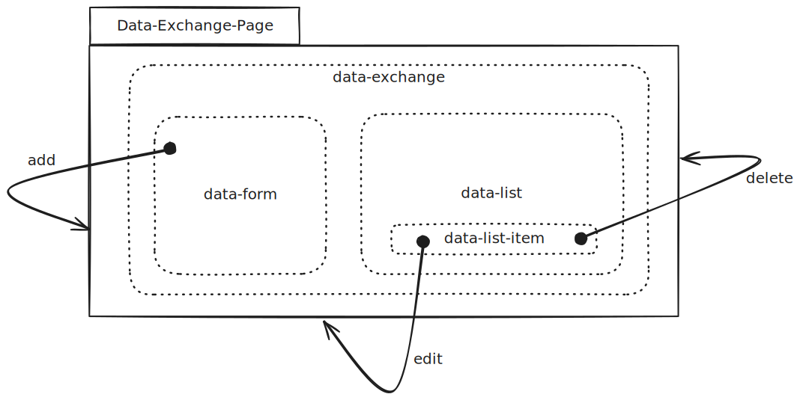
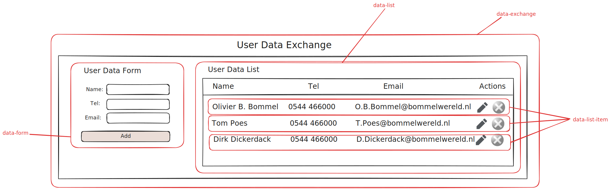

# Data Exchange Challenge Documentation

This challenge is about the data exchange between different web components.
In the core the site will show a form to submit user data and a list to display the submitted data.
The user should be able to add, edit and delete data entries.

## Frontend design

### Sitemap

The site of this challenge will be divided into two main parts:

- A form to submit data
- A list of items to display the submitted data

Adding data will trigger an update of the list as does editing or deleting an item from the list.
This results in three web components:

- `data-form`: A form to submit new data or edit existing data
- `data-list`: A list to display the submitted data
- `data-list-item`: An item in the list representing a single data entry

To facilitate a mediator pattern between the data-list en data-form components, a parent component `data-exchange` will also be created.

### Wireframe

The wireframe below shows the layout of the components on the page.

In case of editing an item, the form will be pre-filled with the data of the selected item and the button text will change from "Add" to "Update".

### Components documentation

Select the component to view its documentation:

- [data-exchange](./data-exchange.md)
- [data-form](./data-form.md)
- [data-list](./data-list.md)
- [data-list-item](./data-list-item.md)

## Backend design

To store the submitted data, we will use a simple REST API with the following endpoints:

- `GET /api/user`: Retrieve all data entries
- `POST /api/user`: Create a new data entry
- `PUT /api/user/:id`: Update an existing data entry
- `DELETE /api/user/:id`: Delete a data entry

The backend will be realized by using JSON Server, a simple tool to create a REST API with zero coding.