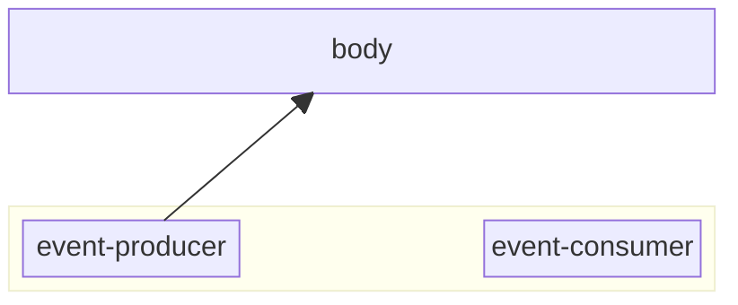
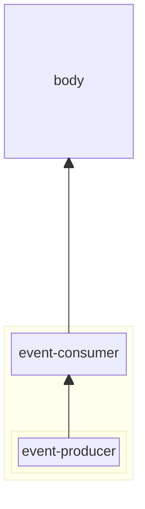

# Event based communication

We already discussed events in the [Lit Web Components - Inputs and Events](../lit-web-components/inputs-and-events.md)
chapter, but that were only standard events like click, submit, etc. In this chapter we will discuss custom events and
how to use them for communication between web components.

## Why

To understand the need for custom events, we need to understand the limitations of standard events. Standard events are
great for handling user interactions, but they are not always sufficient for communication between components. Let's
take a look at the limitations by using a simple example using two components, `event-producer` and `event-consumer`.

In the HTML we will use them like this:

```html
<body>
  <event-producer></event-producer>
  <event-consumer></event-consumer>
</body>
```

The `event-producer` component will have the following code:

```javascript
import { LitElement, html } from 'lit';

export class EventProducer extends LitElement {
  static properties = {
    clickEventData: { type: String },
    submitEventData: { type: String },
    data: { type: Object },
  };

  constructor() {
    super();
    this.submitEventData = null;
    this.clickEventData = null;
    this.data = {};
    this.clickHandler = this.clickHandler.bind(this);
  }

  connectedCallback() {
    super.connectedCallback();
    this.addEventListener('click', this.clickHandler);
  }

  disconnectedCallback() {
    super.disconnectedCallback();
    this.removeEventListener('click', this.clickHandler);
  }

  clickHandler(event) {
    // Extract relevant properties from the event
    this.clickEventData = JSON.stringify({
      type: event.type,
      bubbles: event.bubbles,
      cancelable: event.cancelable,
      composed: event.composed,
      detail: event.detail,
      target: event.target.tagName,
    });

    console.log('Event produced!', event);
  }

  submitHandler(event) {
    event.preventDefault();

    // Extract relevant properties from the event
    this.submitEventData = JSON.stringify({
      type: event.type,
      bubbles: event.bubbles,
      cancelable: event.cancelable,
      composed: event.composed,
      detail: event.detail,
      target: event.target.tagName,
      submitter: event.submitter?.tagName || 'unknown',
    });

    const formData = new FormData(event.target);
    this.data = Object.fromEntries(formData.entries());

    console.log('Form submitted event!', event);
  }

  render() {
    return html`
      <fieldset>
        <legend>Event Producer</legend>

        <form @submit=${this.submitHandler}>
          <label for="message">Message:</label>
          <input type="text" id="message" name="message" />

          <button type="submit">Send message</button>
        </form>
        <p>Click event: ${this.clickEventData}</p>
        <p>Submit event: ${this.submitEventData}</p>
      </fieldset>
    `;
  }
}

customElements.define('event-producer', EventProducer);
```

While the `event-consumer` component will have the following code:

```javascript
import { LitElement, html } from 'lit';

export class EventConsumer extends LitElement {
  static properties = {
    clickEventData: { type: String },
    submitEventData: { type: String },
  };

  constructor() {
    super();
    this.submitEventData = null;
    this.clickEventData = null;
    this.clickHandler = this.clickHandler.bind(this);
    this.submitHandler = this.submitHandler.bind(this);
    this.scope = this;
  }

  connectedCallback() {
    super.connectedCallback();
    this.scope.addEventListener('click', this.clickHandler);
    this.scope.addEventListener('submit', this.submitHandler);
  }

  disconnectedCallback() {
    this.scope.removeEventListener('click', this.clickHandler);
    this.scope.removeEventListener('submit', this.submitHandler);
    super.disconnectedCallback();
  }

  clickHandler(event) {
    console.log('Click event consumed!', event);

    // Use composedPath to get the target inside the shadow DOM
    // eslint-disable-next-line prefer-destructuring
    const target = event.composedPath()[0];

    this.clickEventData = JSON.stringify({
      type: event.type,
      bubbles: event.bubbles,
      cancelable: event.cancelable,
      composed: event.composed,
      detail: event.detail,
      target: target.tagName,
      textContent: target.textContent,
    });
  }

  submitHandler(event) {
    console.log('Submit event consumed!', event);

    // Use composedPath to get the target inside the shadow DOM
    // eslint-disable-next-line prefer-destructuring
    const target = event.composedPath()[0];

    this.submitEventData = JSON.stringify({
      type: event.type,
      bubbles: event.bubbles,
      cancelable: event.cancelable,
      composed: event.composed,
      detail: event.detail,
      target: target.tagName,
      textContent: target.textContent,
    });
  }

  render() {
    return html`
      <fieldset>
        <legend>Event Consumer</legend>
        <p>Click event data: ${this.clickEventData || 'none'}</p>
        <p>Submit event data: ${this.submitEventData || 'none'}</p>
      </fieldset>
    `;
  }
}

customElements.define('event-consumer', EventConsumer);
```

If you run this code, you will see that the `event-consumer` and the `event-producer` component are not able to show
events from the each other. They only sees events that are generated within their own DOM tree. This is locgical,
especially when you look at the addEventListener statements within the `event-consumer` component. They are listening
for event on the `this.scope` element, which we have set to `this` in the constructor. This means that the event
listener is only listening for events on the `event-consumer` component itself, and not on the `event-producer`
component. If we change the `this.scope` to `document`, we will be able to listen for events on the whole document as
long as the event bubbles up to the document level. What you can see is that the `event-consumer` now receives click
events originating from the `event-producer` component, but it will not receive submit events. Looking at an extract of
the event data shown in the `event-producer` component, we can see that like the click event, the submit event has set
the `bubbles` property to true. However on the submit event, the `composed` property is set to false. This means that
the event will not bubble up through the shadow DOM boundary, and therefore the `event-consumer` component will not
receive the submit event. We cannot change this behavior, because the submit event is a standard event and we cannot
change the properties of standard events. This is where custom events come in.

## CustomEvents

Custom events are a way to create your own events that can be dispatched and listened to. They are created using the
`CustomEvent` constructor, which takes two arguments: the name of the event and an options object. The options object
can contain properties like `bubbles`, `cancelable`, `composed`, and `detail`. The `detail` property is used to pass
data with the event.

We can change the submitHandler in the `event-producer` component to dispatch a custom event, that not only will bubble
up through the shadow DOM (because the `composed` option will be set to `true`), but also will contain the data from the
form in the `detail` property.

```javascript
  submitHandler(event) {
    event.preventDefault();

    // Extract relevant properties from the event
    this.submitEventData = JSON.stringify({
      type: event.type,
      bubbles: event.bubbles,
      cancelable: event.cancelable,
      composed: event.composed,
      detail: event.detail,
      target: event.target.tagName,
      submitter: event.submitter?.tagName || 'unknown',
    });

    const formData = new FormData(event.target);
    this.data = Object.fromEntries(formData.entries());

    const customEvent = new CustomEvent("form-submitted", {
      detail: this.data,
      bubbles: true,
      composed: true,
    });
    this.dispatchEvent(customEvent);

    console.log("Form submitted event!", event);
  }
```

To catch the custom event in the `event-consumer` component, we need to add an event listener for the custom event in
the `connectedCallback` method, that will call a `customEventHandler` method that we will have to define. To prevent
side effects it's important to also remove the event listener in the `disconnectedCallback` method. We can do this by
adding the following line:

```javascript
  connectedCallback() {
    super.connectedCallback();
    this.scope.addEventListener('click', this.clickHandler);
    this.scope.addEventListener('submit', this.submitHandler);
    this.scope.addEventListener('form-submitted', this.customEventHandler);
  }

  disconnectedCallback() {
    this.scope.removeEventListener('click', this.clickHandler);
    this.scope.removeEventListener('submit', this.submitHandler);
    this.scope.removeEventListener('form-submitted', this.customEventHandler);
    super.disconnectedCallback();
  }
```

To make sure that the event handler has the correct context when it is called we need to bind `this` to it, which we can
do in the constructor:

```javascript
  static properties = {
    clickEventData: { type: String },
    submitEventData: { type: String },
    customEventData: { type: String },
  };

  constructor() {
    super();
    this.submitEventData = null;
    this.clickEventData = null;
    this.customEventData = null;
    this.clickHandler = this.clickHandler.bind(this);
    this.submitHandler = this.submitHandler.bind(this);
    this.customEventHandler = this.customEventHandler.bind(this);
    this.scope = document;
  }
```

As you can see from the code we also defined a property `customEventData` to store the data from the custom event. The
`customEventHandler` method will look like this:

```javascript
  customEventHandler(event) {
    console.log('Custom event consumed!', event);

    // Use composedPath to get the target inside the shadow DOM
    // eslint-disable-next-line prefer-destructuring
    const target = event.composedPath()[0];

    this.customEventData = JSON.stringify({
      type: event.type,
      bubbles: event.bubbles,
      cancelable: event.cancelable,
      composed: event.composed,
      detail: event.detail,
      target: target.tagName,
      textContent: target.textContent,
    });
  }
```

The only thing that remains to do is to show the data in the render method.

```javascript
  render() {
    return html`
      <fieldset>
        <legend>Event Consumer</legend>
        <p>Click event data: ${this.clickEventData || 'none'}</p>
        <p>Submit event data: ${this.submitEventData || 'none'}</p>
        <p>Custom event data: ${this.customEventData || 'none'}</p>
      </fieldset>
    `;
  }
```

## Using the declarative @ syntax

In the example above we used the imperative way of adding event listeners. However, Lit also provides a declarative way
of adding event listeners using the `@` syntax. This is a more concise way of adding event listeners and is recommended
for most use cases. We already used this syntax in the render method of the `event-producer` where we added the
`@submit` event listener to the form element and discussed them in the
[Lit Web Components - Inputs and Events](../lit-web-components/inputs-and-events.md) chapter.

What we didn't discussed, was that we can also use them with custom events, preventing the need to add the event
listener and binding the handler function.

Use this syntax for the `form-submitted` event in our `event-consumer` means that we can cleanup the `connectedCallback`
and `disconnectedCallback` methods, because we don't need to add and remove the event listener manually. The `@` syntax
will take care of that for us. We can also remove the binding of the `customEventHandler` method in the constructor,
because Lit will bind the method to the correct context for us. All that remains to do is apply the `@form-submitted`
event listener to an element in the `render` method of the `event-consumer` component.

```javascript
  render() {
    return html`
      <fieldset @form-submitted="${this.customEventHandler}">
        <legend>Event Consumer</legend>
        <p>Click event data: ${this.clickEventData || 'none'}</p>
        <p>Submit event data: ${this.submitEventData || 'none'}</p>
        <p>Custom event data: ${this.customEventData || 'none'}</p>
      </fieldset>
    `;
  }
```

> [!NOTE]
>
> It would be great if we could store the event name in a variable which we could export to ensure that the event name
> is the same at the sender and the listeners. That would also make renameing the event easier. However, this is not
> possible because the `@` syntax is a special syntax that is processed by Lit and it expects a string literal for the
> event name. This means that you can't use a variable or a template literal for the event name.

But if you run the code there is a problem, that makes that it looks like the `@` syntax is not working. The problem is
that the `@form-submitted` event is listening on the `fieldset` element. It only triggers the customEventHandler if the
event passes through the `fieldset` element.

Given our current HTML layout the `form-submitted` event bubbles up to the body element, but not to the `event-consumer`
component. We can exchange the position of the `event-producer` and the `event-consumer` component in the HTML, but that
would not solve the issue because the event will not bubble down within the `event-consumer` component to reach the
`fieldset` element.



The solution is to resturcture our HTML layout so that the `event-consumer` component is the parent of the `event-producer`
component. This way the `form-submitted` event will bubble up to the `event-consumer` component and then down to the `body`.



This means that our `event-consumer` component will need a slot to render the `event-producer` component resulting in a render method like this:

```javascript
  render() {
    return html`
      <fieldset @form-submitted="${this.customEventHandler}">
        <slot></slot>
        <legend>Event Consumer</legend>
        <p>Click event data: ${this.clickEventData || 'none'}</p>
        <p>Submit event data: ${this.submitEventData || 'none'}</p>
        <p>Custom event data: ${this.customEventData || 'none'}</p>
      </fieldset>
    `;
  }
```

And the HTML will look like this:

```html
<body>
  <event-consumer>
    <event-producer></event-producer>
  </event-consumer> 
</body>
```

Applying these changes will make the `@form-submitted` event work as expected and the `event-consumer` component will be able to
receive the custom event from the `event-producer` component.

---

## Sources

- [MDN - CustomEvent](https://developer.mozilla.org/en-US/docs/Web/API/CustomEvent)
- [Lit - Events](https://lit.dev/docs/components/events/)

---

:house: [Home](../README.md) | :arrow_backward: [Attribute based communication](./attributes-based-communication.md) |
:arrow_up: [Data Exchange](./README.md) | [Context](./context.md) :arrow_forward:
