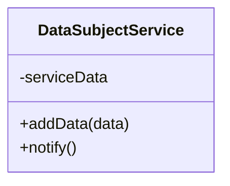
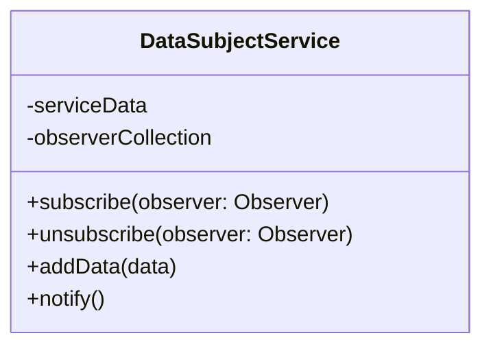

# Vanilla JS Observables

In this subsection we will implement the Observer pattern in vanilla JavaScript using Lit.

## EventTarget Based Solution

Let's start with a service class (which should be located in a `service` folder) that will hold the data we want to observe. Because we want to observe the data and there might be multiple service classes we will call this class `DataSubjectService`. This class will need a method to add data to the service and a method to notify others of the changed data.



For the notification we will use a CustomEvent. But because a service class should not invoke DOM API calls, we will use the `EventTarget` class to dispatch the event. The `EventTarget` class is a built-in class in JavaScript that allows you to create and manage events. This enables us to dispatch events without having to rely on the DOM.
The JavaScript of the `DataSubjectService` class looks like this:

```javascript
class DataSubjectService extends EventTarget {

  #serviceData = [];

  addData(item) {
    this.#serviceData = [...this.#serviceData, item];
    this.notify(this.#serviceData);
  }

  notify(data) {
    this.dispatchEvent(new CustomEvent("dataAdded", { detail: [...this.#serviceData] }));
  } 
}

const dataSubjectService = new DataSubjectService();

export { dataSubjectService };
```

Next we need a class that will listen to the events of changed data generated by the `dataSubjectService`. Once an event is received the class should call a method to handle the event. Normally we would call this method something like `updateDataEventHandler`, but because we are working towards Observables and the method gets invoked because it receives the "next value" of the data stream we observer, we will call this method `next`. And because our `next` function only needs to update the data property of the class, we can write it as an arrow function. This way we don't need to bind the `this` context of the class to the function. We can use the `next` function as a callback for the event listener.
We will use a web component for this, so that we can show the received data in the browser.
We will call this class `DataObserver` and it will look like this:

```javascript
import { LitElement, html } from 'lit';
import { dataSubjectService } from '../../service/data-subject-service';

export class DataObserver extends LitElement {
  static properties = {
    data: { type: Array },
  };

  constructor() {
    super();
    this.data = [];
  }

  next = (event) => { this.data = event.detail };

  connectedCallback() {
    super.connectedCallback();
    dataSubjectService.addEventListener("dataAdded", this.next);
  }

  disconnectedCallback() {
    dataSubjectService.removeEventListener("dataAdded", this.next);
    super.disconnectedCallback();
  }

  render() {
    return html`
      <div>
        <h2>Data Observer</h2>
        <ul>
          ${this.data.map(item => html`<li>${item}</li>`)}
        </ul>
      </div>
    `;
  }
}

customElements.define('data-observer', DataObserver);
```

Finally we need a way to add data to the `DataSubjectService`. We will use a simple web component for this, that generated random numbers and adds them to the `DataSubjectService`. We will call this class `DataGenerator` and it will look like this:

```javascript
import { LitElement, html } from 'lit';
import { dataSubjectService } from '../../service/data-subject-service';

export class DataGenerator extends LitElement {

  // eslint-disable-next-line class-methods-use-this
  addData() {
    dataSubjectService.addData(Math.random());
  }

  render() {
    return html`
      <button @click=${this.addData}>Add Data</button>
    `;
  }
}

customElements.define('data-generator', DataGenerator);
```

If you run this example you will see a button that generates random numbers and if you have one or more `DataObserver` components on the page, they will show the list of generated random numbers stored in the `DataSubjectService`.

We can conclude that we have archived our goal of implementing a solution that informs others about changes in the stored data of the service layer, without using the DOM API and the need to reload the page.
But this solution as a couple of drawbacks. For one it's hard to test and to debug. We further have no clue who is listening to the events our service class is emitting and we can't easily change the event name, which we would like to decouple from the service class.

## Observer Pattern based Solution

The observer pattern offers us a solution that works without the EventTarget class and the need to dispatch events. According to the observer pattern our `DataSubjectService` class should hold a collection of observers and notify them when the data changes. This means that we need to add a couple of methods to our `DataSubjectService` class. We will add a method to subscribe to the service, a method to unsubscribe from the service and a method to notify the observers when the data changes.



According to the observer pattern we expect that the Observer instance offers an method to update the data which in JavaScript normally is called `next`, which we will use in the notify method.
The JavaScript of the `DataSubjectService` class looks like this:

```javascript
class DataSubjectService {

  #serviceData = [];
  #subscribers = [];

  addData(item) {
    this.#serviceData = [...this.#serviceData, item];
    this.notify(this.#serviceData);
  }

  subscribe(observer) {
    this.#subscribers = [...this.#subscribers, observer];
  }

  unsubscribe(observer) {
    this.#subscribers = this.#subscribers.filter(sub => sub !== observer);
  }

  notify(data) {
    this.#subscribers.forEach(observer => observer.next(data));
  } 
}

const dataSubjectService = new DataSubjectService();

export { dataSubjectService };
```

The next step to implement the observer pattern should be the creation of an abstract interface class for the `Observer`. But JavaScript does not have an interface and abstract class concept. There is a way to simulate abstract classes and methods in JavaScript, but that would make our code more complex than it needs to be. So instead of implementing an abstract observer class, we will just create an object witin our concrete observer class (`DataObserver`) with a `next` method that will be used as the observer.

The `DataObserver` class will look like this:

```javascript
import { LitElement, html } from 'lit';
import { dataSubjectService } from '../../service/data-subject-service';

export class DataObserver extends LitElement {
  static properties = {
    data: { type: Array },
  };

  constructor() {
    super();
    this.data = [];
    this.observer = {
      next: (data) => {this.data = data}
    }
  }

  connectedCallback() {
    super.connectedCallback();
    dataSubjectService.subscribe(this.observer);
  }

  disconnectedCallback() {
    dataSubjectService.unsubscribe(this.observer);
    super.disconnectedCallback();
  }

  render() {
    return html`
      <div>
        <h2>Data Observer</h2>
        <ul>
          ${this.data.map(item => html`<li>${item}</li>`)}
        </ul>
      </div>
    `;
  }
}

customElements.define('data-observer', DataObserver);
```

And this concludes our own implementation of the observer pattern. However since observers are so common in JavaScript, there are libraries that implement the observer pattern for us. One of the most popular libraries is [RxJS](https://rxjs.dev/). In the next sub-chapter we will discuss how to use RxJS to implement the observer pattern.

---

## Sources

- [MDN - EventTarget](https://developer.mozilla.org/en-US/docs/Web/API/EventTarget)

---

:house: [Home](../README.md) | :arrow_backward: [Observables](./observables.md) |
:arrow_up: [Data Exchange](./README.md) | [RxJS Observables](./observables-rxjs.md) :arrow_forward:
