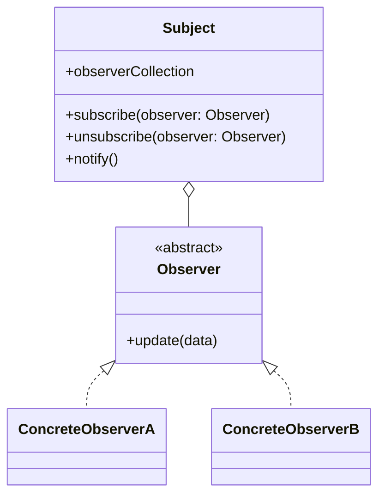

# Observables

In earlier chapters, we explored various methods for exchanging data between web components. Most of these methods were event-driven, meaning the communication was triggered by user actions, such as clicking a button or changing an input field. For these view-layer-only interactions, using events is a suitable and effective solution.

However, there are scenarios where events from the view layer are not ideal:

- **Shared Data Across Components:** When data is stored in the service layer, and multiple components need to be informed about changes to that data. The view layer should not manage this communication, as it violates the separation of concerns principle. The service layer owns the data and should be responsible for notifying interested components.

- **Server-Initiated Updates:** When the service layer receives new data from the server via polling (regular checks for updates), or push notifications (server actively sends updates). The service layer must inform the view layer about these updates.

In both cases, using DOM events is not appropriate, because the service layer should not interact with the DOM, and events are tightly coupled to the view layer and not suitable for broader data communication.

## Observables

To solve this, we use Observables, which are based on the Observer Pattern. Think of Observables like push notifications for data. Any component that subscribes to an observable will be notified automatically when the data changes. This pattern is widely used in libraries like RxJS.

Here’s a clearer and more structured version of your explanation of the Observer Pattern:

## Observer Pattern explained

The Observer Pattern is a design pattern that enables an object (called the Subject) to maintain a list of dependents (called Observers) and automatically notify them of any state changes.

#### 1. Subject

The Subject is the part of your app that has the data. It keeps a list of observers (other parts of your app that want to know when the data changes). It has three main actions:

- `subscribe(observer)` → Add an observer to the list.
- `unsubscribe(observer)` → Remove an observer from the list.
- `notify()` → Tell all observers that something has changed.

#### 2. Observer (Abstract)

This is like a rule or guideline. It says: “Every observer must have an `update(data)` method.” This method is what gets called when the Subject sends out a notification. It doesn’t do anything itself, it just acts as a 'template' that defines what observers should be able to do.

#### 3. Concrete Observers (A & B)

These are the real observers, actual parts of your app that want updates. They follow the rule by implementing the `update(data)` method. They subscribe to the Subject so they can be notified when the data changes. When they get notified, they use the `update(data)` method to do something, like update the screen or log the change.

---

In the upcoming two sections, we’ll explore how to implement the Observer Pattern in practice. First, we’ll build an observable from scratch using [vanilla JavaScript](./observables-vanilla-js.md) to understand the core mechanics. After that, we’ll use a library called [RxJS](./observables-rxjs.md), which simplifies working with observables and offers powerful tools for reactive programming.

---

## Sources

- [YouTube - The Biggest Misconception of PROMISES vs OBSERVABLES](https://youtu.be/vdsujUhFMLY?si=qv7eMB7qHEMqQQNI)
- [Wikipedia - Observer pattern](https://en.wikipedia.org/wiki/Observer_pattern)

---

:house: [Home](../README.md) | :arrow_backward: [Signals](./signals.md) |
:arrow_up: [Data Exchange](./README.md) | [Vanilla JS Observables](./observables-vanilla-js.md) :arrow_forward:
