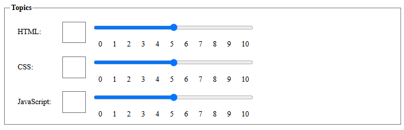

# Single Value Custom Components

Using the input components boilerplate, we’ve created a Topics fieldset where users can rate a topic using either a number input or a range input. This setup works, but it introduces two key issues:

1. **Lack of synchronization**: The number input offers precision, while the range input is more user-friendly. However, they currently operate independently, changing one doesn’t update the other. We want them to stay in sync so that updating one automatically updates the other.
2. **Lengthy render method**: The `render()` method that generates the HTML for these inputs is quite lengthy and repetitive, which also triggers ESLint warnings.



### Our Goal

We aim to build a custom web component that combines both the number and range inputs into a single, synchronized unit. This will not only streamline the user experience but also reduce the amount of HTML in the `render()` method.

There’s real value in this approach: by encapsulating each input field in its own component, we keep the logic for each User Story self-contained and separate from others. This results in a cleaner, more maintainable codebase and a more structured `render()` method. While the benefits are clear, implementing such a component comes with its own set of challenges.

## The Number-Range-Input Component

From the `render` method of the `EvaluationForm` component, we can derive that our new component should have the
following attributes:

- `label`: The label for the input.
- `name`: The name of the input.
- `min`: The minimum value of the input.
- `max`: The maximum value of the input.
- `required`: Whether the input is required or not.
- `value`: The value of the input.

The `name` attribute plays a crucial role in form submission. If it's missing from an input element, the browser won’t include that input’s value in the submitted form data, meaning the backend won’t receive it. So, even though the `name` attribute doesn’t influence the internal behavior of the component itself, it’s essential to include it on the input element to ensure proper data handling during form submission.

In short: the name attribute is irrelevant to the component’s internal behavior, but essential for successful form submission.

Now, let’s create a new file called `number-range-input.js` inside the `src/view/components` folder and begin implementing the component.

```javascript
import { LitElement, html, css } from "lit";

export class NumberRangeInput extends LitElement {
  static styles = css`
    :host {
      display: grid;
      grid-template-columns: 1.5fr auto 10fr;
      align-items: center;
      width: 100%;
    }

    label {
      display: block;
      margin: 0.5rem;
      padding: 0.5rem;
    }

    input {
      margin: 0.5rem;
      padding: 0.5rem;
    }

    input[type="number"] {
      width: 3rem;
      font-size: 1.5rem;
    }

    input[type="range"] {
      width: 50%;
    }

    datalist {
      display: flex;
      margin: 0 0.5rem;
      padding: 0 0.5rem;
      justify-content: space-between;
      width: 50%;
    }
  `;

  static properties = {
    label: { type: String },
    min: { type: Number },
    max: { type: Number },
    required: { type: Boolean },
    value: { type: Number, reflect: true },
  };

  constructor() {
    super();
    this.required = false;
    this.min = 0;
    this.max = 10;
    this.step = 1;
    this.value = this.min;
  }

  firstUpdated() {
    this.shadowRoot.querySelector("#number-input").value = this.value;
    this.shadowRoot.querySelector("#range-input").value = this.value;
  }

  numberInputHandler(event) {
    this.value = event.target.value;
    this.shadowRoot.querySelector("#range-input").value = this.value;
  }

  rangeInputHandler(event) {
    this.value = event.target.value;
    this.shadowRoot.querySelector("#number-input").value = this.value;
  }

  render() {
    return html`
      <label for="number-input">${this.label}:</label>
      <input
        type="number"
        id="number-input"
        name="number-input"
        min="${this.min}"
        max="${this.max}"
        ?required="${this.required}"
        @input=${this.numberInputHandler}
      />
      <div>
        <input
          type="range"
          id="range-input"
          name="range-input"
          list="values"
          aria-label="${this.label}"
          min="${this.min}"
          max="${this.max}"
          ?required="${this.required}"
          @input=${this.rangeInputHandler}
        />
        <datalist id="values">
          ${Array.from({ length: this.max + this.step }).map(
            (_, index) =>
              html` <option value="${index}" label="${index}"></option> `
          )}
        </datalist>
      </div>
    `;
  }
}

customElements.define("number-range-input", NumberRangeInput);
```

Also let's make some small changes to the `EvaluationForm` component, to use the new `number-range-input` component.

```javascript
import { LitElement, html, css } from "lit";
import './number-range-input';

export class EvaluationForm extends LitElement {

  ...

  static styles = css`

  ...

    /* .evaluation-topics {
      grid-template-columns: auto auto 1fr;
      align-items: center;
    } */

  ...
  `;

  ...

  render() {
    return html`
      <h1>Evaluation Form</h1>
      <form @submit=${this.submitHandler}>
        <fieldset class="cursist-info">
          <legend>Cursist Information</legend>
          <label for="name">Name:</label>
          <input type="text" id="name" name="name" required />

          <label for="address">Address:</label>
          <input type="text" id="address" name="address" required />

          <label for="phone">Phone:</label>
          <input type="tel" id="phone" name="phone" required />

          <label for="email">Email:</label>
          <input type="email" id="email" name="email" required />
        </fieldset>

        <fieldset class="evaluation-topics">
          <legend>Topics</legend>
          <number-range-input name="html" label="HTML" min="0" max="10" required></number-range-input>
          <number-range-input name="css" label="CSS" min="0" max="10" required></number-range-input>
          <number-range-input name="javascript" label="JavaScript" min="0" max="10" required></number-range-input>
        </fieldset>

        <button type="submit">Save</button>
      </form>
    `;
  }
}

customElements.define("evaluation-form", EvaluationForm);
```

The new code in the `number-input-range` component links the changes of number input with range input, and vice versa. It does this via two event handlers (called `rangeInputHandler()` and `numberInputHandler()`). Internally we use the reactive property `value`. Using `value` as a reactive property is smart, as any change would generate a re-render of the component. The result in the UI is that the number and range input are now related to each other. This was one of our goals.

In the `number-input-range` component we initialize values in the `firstUpdated` method as when this method runs the shadow DOM has been initialized. We cannot initialize them in the `connectedCallback` method as when this method runs the shadow DOM is not yet loaded, and thus we can't place the values into the HTML elements of the shadow DOM.

### New challenges: Front-End validation

So far, we’ve made solid progress, but now we’re facing a few new challenges:

- The `required` attribute isn’t working. Even if you leave fields empty, the form still submits.
- The `min` and `max` attributes don’t prevent invalid values. You can enter anything, even negative numbers.
- The `value` of the `number-range-input` component is reflected correctly, but it’s not included in the form data when submitted.

To solve these issues, we need to use the [ElementInternals](https://developer.mozilla.org/en-US/docs/Web/API/ElementInternals) elements (like our `number-range-input`) behave like regular form elements (`<input>`, `<select>`, etc.).

With `ElementInternals`, we can:

- Make custom inputs work properly in forms, so they can be validated and submitted like native inputs.
- Improve accessibility, so screen readers and other assistive tools can interact with them correctly.

This API is part of the [Forms module](https://html.spec.whatwg.org/multipage/custom-elements.html#elementinternals).

## Setting the value

The first issue we will address is that the `value` attribute of the `number-range-input` component is not included in
the form data when the form is submitted. The first thing we do to set up the `ElementInternals` in our component is to
add a private property 'internals' to our component. In JavaScript private properties are prefixed with a `#`.

```javascript
export class NumberRangeInput extends LitElement {

  #internals;

  static styles = css`
  ...
  `;
```

Next we have to initialize our `#internals` property in the `constructor` method of our component by calling the
`attachInternals` method of our component. This method returns an `ElementInternals` object that we can use to set up
the form-associated custom element.

```javascript
...
  constructor() {
    super();
    this.#internals = this.attachInternals();

    this.required = false;
    this.min = 0;
    this.max = 10;
    this.step = 1;
    this.value = this.min;
  }
...
```

When you create a custom form element (like this NumberRangeInput), it doesn't automatically integrate with HTML forms. That means if you put it inside a `<form>` and submit the form, its value won't be included by default.

By calling `this.#internals.setFormValue(this.value)` you're telling the browser: "When this form is submitted, include this value as if it were a native input element." This makes the custom element form-associated, meaning it behaves like a regular `<input>` in terms of form submission, validation, and so on.

```javascript
  setValue(value) {
    this.value = value;

  // Register the value with the browser's form system using ElementInternals.
  // This makes the custom element form-associated, so its value is included
  // when the parent <form> is submitted.
    this.#internals.setFormValue(this.value);
  }
```

Next we have to add the `setValue` method to all methods that are setting the value of an input field, so that the value
of the component is always in sync with the value of the input fields.

```javascript
  firstUpdated() {
    this.shadowRoot.querySelector('#number-input').value = this.value;
    this.shadowRoot.querySelector('#range-input').value = this.value;
    this.setValue(this.value);
  }

  numberInputHandler(event) {
    this.setValue(event.target.value);
    this.shadowRoot.querySelector('#range-input').value = this.value;
  }

  rangeInputHandler(event) {
    this.setValue(event.target.value);
    this.shadowRoot.querySelector('#number-input').value = this.value;
  }
```

If you now run the application, you will get an error in the console at the `setFormValue` method, stating that the
element is not a form-associated custom element.

To fix this, we have to add a static property `formAssociated` to our component and set it to `true`. This tells the
browser that our component is a form-associated custom element.

```javascript
export class NumberRangeInput extends LitElement {

  #internals;

  static formAssociated = true;
```

If you now run the application, fill the form and submit it, you will notice that the data of our `number-range-input`
components is included in the form data. However, the `required` attribute of the input elements is still not working,
and the `min` and `max` attributes of the input elements are not working either.

## Setting the constraints

The range slider and the number up/down buttons on the input elements are working as expected and prevent us from
entering values that are not within the range of the `min` and `max` attributes. But we can still enter values in the
input field that are not within the range of the `min` and `max` attributes, which will be included in the form data
when the form is submitted, without any validation check. This is why we will focus on the validation of the number
input field.

Let's start by checking if the value we enter in the input field is valid, by using the validity check method provided
by the DOM API.

```javascript
  numberInputHandler(event) {
    const isValid = event.target.checkValidity();
    console.log(isValid);

    this.setValue(event.target.value);
    this.shadowRoot.querySelector("#range-input").value = this.value;
  }
```

If we enter a value that is not within the range of the `min` and `max` attributes, the `checkValidity` method will
return `false`.

We can use this boolean value to use the DOM API again to report to the user that the value is not valid, using a
standard message of the browser.

```javascript
  numberInputHandler(event) {
    const isValid = event.target.checkValidity();
    if (!isValid) {
      event.target.reportValidity();
    }

    this.setValue(event.target.value);
    this.shadowRoot.querySelector("#range-input").value = this.value;
  }
```

### Handling Invalid Input and Component Validity

Now when a user enters a value outside the defined `min` and `max` range, the browser displays a default validation message using `reportValidity()`. At this point, we face a decision:

- **Option 1:** Stop execution with a `return` after `reportValidity()`. This prevents the invalid value from being set in the input field, but the component’s internal value remains unchanged. This can be confusing because the input field displays the invalid value, while the component retains the last valid one.
- **Option 2 (chosen):** Allow the invalid value to be set in the input field and update the component’s value accordingly. This keeps the UI consistent but requires additional validation when the form is submitted.

To ensure invalid values are not accepted during form submission, we use the `setValidity()` method inside the `setValue()` method:

```javascript
setValue(value) {
  this.value = value;
  this.#internals.setFormValue(this.value);

  const numberInput = this.shadowRoot.querySelector("#number-input");

  const validity = numberInput.checkValidity()
    ? {}
    : {
        rangeUnderflow: this.value < this.min,
        rangeOverflow: this.value > this.max,
      };

  this.#internals.setValidity(
    validity,                     // Validation flags
    numberInput.validationMessage, // Browser-generated message
    numberInput                    // Element to focus on
  );
}
```

Here’s what happens:

1. **Validation Check:** We use checkValidity() to verify the input’s validity.
2. **Set Validity Flags:** If invalid, we create a flags object with `rangeUnderflow` and `rangeOverflow` to indicate the issue.
3. **Set Component Validity:** We call `setValidity()` with:
   - The flags object
   - The browser’s default validation message
   - The input element as the anchor for error focus

This ensures that:

- The component reflects the current (even invalid) input value
- The form will not submit if the value is invalid
- The user receives clear feedback on what went wrong

Even if the input is cleared, the field remains invalid due to the `required` attribute, and the form submission is blocked.

---

## Conclusion

In this tutorial, we built a synchronized number-range input component using LitElement, improving both usability and maintainability. We tackled key challenges like input synchronization, form integration, and validation using the ElementInternals API. By making our custom component form-associated, we ensured proper data submission and validation behavior.

---

## Sources

- MDN - [ElementInternals](https://developer.mozilla.org/en-US/docs/Web/API/ElementInternals)

---

:house: [Home](../README.md) | :arrow_backward: [Input components](./input-components.md) | :arrow_up:
[Lit Web Components](./README.md) | [Multiple values input components](./input-components-multiple-values.md)
:arrow_forward:
