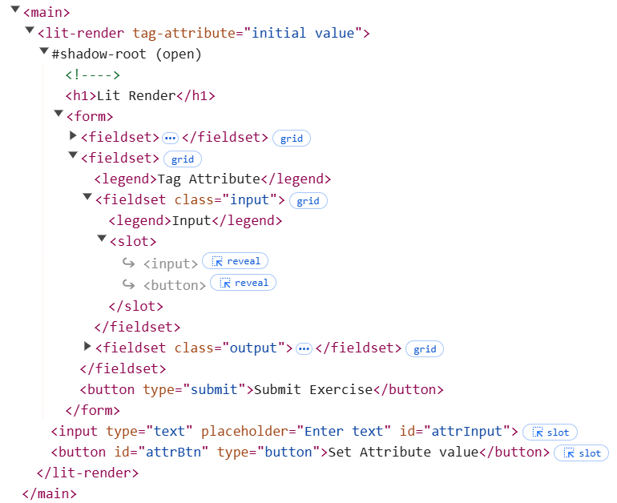

# Rendering

Rendering is the proces of creating the HTML content of a component and adding it to the DOM. Within Lit components, the
`render` method is responsible for rendering the content of the component to the DOM. There should not be any other
method within the component that manipulates the DOM directly. The `render` method is part of the lifecycle hook methods
of a lit component and should not be called directly. What [lifecycle hooks](./lifecycle.md) are will be covered in
another article. For now think about them as methods that are called automatically during the lifecycle of a component.

> [!WARNING]
>
> - Never call the render method directly!
> - The `render` method should be the only method within the component that manipulates the DOM!
> - The only task of the `render` method is to render the content of the component to the DOM!

Not to call the `render` method directly and not to manipulate the DOM part of a component elsewhere in the code, makes
that it is important to understand how the `render` method is triggered and how it works.

## Boilerplate code

Let's demonstrate how rendering works in Lit components with a simple example component. Create a new file
`lit-render.js` in the `src/view/components` folder and add the following code:

```javascript
import { LitElement, html, css } from 'lit';

export class LitRender extends LitElement {
  static styles = css`
    fieldset {
      display: grid;
      gap: 1rem;
      grid-template-columns: 1fr 1fr;
      align-content: center;
      align-items: stretch;
    }

    input output {
      border: 1px solid #333;
      padding: 1rem;
      display: grid;
      align-items: center;
    }

    input[required] {
      border: 2px solid orange;
    }

    .required {
      font-weight: bold;
      color: orangered;
    }

    legend {
      font-weight: bold;
    }

    label {
      display: inline-block;
      margin-bottom: 0.5rem;
    }

    button[type='submit'] {
      margin: 1rem;
      padding: 1rem;
      background-color: yellowgreen;
      color: black;
      border: none;
      border-radius: 0.5rem;
      cursor: pointer;
    }
  `;

  constructor() {
    super();
  }

  // eslint-disable-next-line max-lines-per-function
  render() {
    return html`
      <h1>Lit Render</h1>

      <form>
        <button type="submit">Submit Exercise</button>
      </form>
    `;
  }
}

customElements.define('lit-render', LitRender);
```

> [!NOTE]
>
> We disabled the eslint rule `max-lines-per-function` for the `render` method, because we want to demonstrate a lot of
> different things in this method. Normally you should try to keep the `render` method as small as possible and avoid to
> have to disable this rule.

Also add an import statement to the `src/view/pages/home-page.js` file to include the new component in the application.

```javascript
import '../components/lit-render.js';
```

And finally call the new component in the `index.html` file.

```html
...
<body>
  <main>
    <lit-render></lit-render>
  </main>
</body>
...
```

## Rendering Private Non-Reactive Properties

We start this example by adding a private property to the component and initialize it in the constructor.

```javascript
export class LitRender extends LitElement {
  #privateProperty;

  ...

  constructor() {
    super();
    this.#privateProperty = "initial value";
  }

  ...
```

Next we add a fieldset to the form of the `render` method, that gives us an input text field and an output field to
display the value of the private property.

```javascript
  // eslint-disable-next-line max-lines-per-function
  render() {
    return html`
      <h1>Lit Render</h1>

      <form>
        <fieldset>
          <legend>Private Property</legend>

          <fieldset class="input">
            <legend>Input</legend>
            <input
              type="text"
              aria-label="Private Property"
              @input=${this.updatePrivateProperty}
            />
          </fieldset>
          <fieldset class="output">
            <legend>Output</legend>
            <p>${this.#privateProperty}</p>
          </fieldset>
        </fieldset>

        <button type="submit">Submit Exercise</button>
      </form>
    `;
  }
```

In order to update the value of the private property, we add an event handler to the input field.

```javascript
  updatePrivateProperty(event) {
    this.#privateProperty = event.target.value;
    console.log(this.#privateProperty);
  }
```

When you run the application and type in the input field, you will see that the value of the private property is updated
in the console, but not in the output field. This is because the way we defined the private property makes that it is a
so called non-reactive property. This means that there is no reaction to changes of the property value. You might be
tempted to manipulate the DOM directly within the `updatePrivateProperty` method, but this violates the principle that
the `render` method should be the only method within the component that manipulates the DOM. Therefore you might be
tempted to call the `render` method directly from the `updatePrivateProperty` method, but this is also not the way to
go, since the `render` method should never be called directly. But there is a workaround for this, by calling the
`requestUpdate` method, which you inherit from the `LitElement` class. Calling this method will trigger a re-render of
the component.

```javascript
  updatePrivateProperty(event) {
    this.#privateProperty = event.target.value;
    console.log(this.#privateProperty);
    this.requestUpdate();
  }
```

When you run the application now and type in the input field, you will see that the value of the private property is
updated in the output field.

> [!WARNING]
>
> Calling the `requestUpdate` method is not the way to go in a Lit component, since it is not efficient and can lead to
> performance issues. So prevent calling this method as much as possible, by using reactive properties instead.

## Rendering Tag Attributes

We already covered how to pass attributes to a lit component in the [Lit Attributes](./lit-attributes.md) article. What
we didn't cover is what happens when those attribute values changes after the component is rendered. Let's start by
adding an attribute to the component and initialize it in the constructor.

```javascript
export class LitRender extends LitElement {
  static properties = {
    tagAttribute: { type: String, attribute: "tag-attribute" },
  };

  constructor() {
    super();
    this.#privateProperty = "initial value";
    this.tagAttribute = "initial value";
  }

  ...
```

Next we add a fieldset to the form of the `render` method, that uses a `slot` for the input part and an output field to
display the value of the tag attribute.

```javascript
  // eslint-disable-next-line max-lines-per-function
  render() {
    return html`
      <h1>Lit Render</h1>

      <form>

        ...

        <fieldset>
          <legend>Tag Attribute</legend>

          <fieldset class="input">
            <legend>Input</legend>
            <slot></slot>
          </fieldset>
          <fieldset class="output">
            <legend>Output</legend>
            <p>${this.tagAttribute}</p>
          </fieldset>
        </fieldset>

        <button type="submit">Submit Exercise</button>
      </form>
    `;
  }
```

Since the render method gives us a `html` template, we can use the `slot` element, to render here the slotted content
that is passed in the `index.html` file (see also the
[MDN article about how to use templates and slots](https://developer.mozilla.org/en-US/docs/Web/API/Web_components/Using_templates_and_slots)).
So change the `body` of the `index.html` file to:

```html
<body>
  <main>
    <lit-render>
      <input type="text" placeholder="Enter text" id="attrInput" />
      <button id="attrBtn" type="button">Set Attribute value</button>
    </lit-render>
  </main>
</body>
```

If you run the application now, you will see that the fieldset for the input part now contains an input field and a
button, specified by the code in the `index.html` file. When you take a closer look at the html using the developer
tools of your browser, you will see that within the `slot` element the input field and the button are referenced, but
their code is found after the `form` element. So the slotted content is not part of the `form` element and the
lit-render component does not know about it. But what we archive with this is that the slotted content is rendered in
the `slot` element of the `lit-render` component.

> [!NOTE]
>
> Slotted content is not part of the component and cannot be accessed by the component. Therefore styling of
> slotted content is not possible from within the component.



Since the lit-render component does not know about the slotted content, and cannot access it, we have to add some code
to the `home-page.js` file to add an event listener to the button. This event listener should than read the value of the
input field and set it as the value of the tag attribute of the lit-render component.

Add the following code to the `home-page.js` file:

```javascript
const attrBtn = document.querySelector('#attrBtn');
const attrInput = document.querySelector('#attrInput');
const litRender = document.querySelector('lit-render');

attrBtn.addEventListener('click', () => {
  const attrValue = attrInput.value;
  litRender.setAttribute('tag-attribute', attrValue);
});
```

When you run the application now and type in the input field and click the button, you will see that the value of the
tag attribute is updated in the output field. If you take a closer look at the html using the developer tools of your
browser, you will see that the value of the tag attribute is passed as an attribute to the `lit-render` component.

But notice also that the page is not reloaded and we didn't call the `requestUpdate` method to update the output field
when the value of the tag attribute changes. This is because the tag attribute is a reactive property, which means that
the component reacts to changes of the property value and triggers a re-render of the component.

## Rendering Reactive Properties

Not every property of a web component that gets rendered will be based on an attribute value. Other properties you want
to render might for instance be based on values retrieved by the component itself, received from the controller or
included within an event (we will give examples of the last two situations in other articles). We also want those
properties to be reactive properties, so that the component reacts to changes of the property value and triggers a
re-render of the component.

To define a reactive propery in Lit is easy, just add the property to the `properties` object of the component and
provide its type.

```javascript
...

  static properties = {
    tagAttribute: { type: String, attribute: "tag-attribute", reflect: true },
    reactiveProperty: { type: String },
  };

  constructor() {
    super();
    this.#privateProperty = "initial value";
    this.tagAttribute = "initial value";
    this.reactiveProperty = "initial value";
  }

...
```

We further add a fieldset to the form of the `render` method, that gives us an input text field and an output field to
display the value of the reactive property.

```javascript
...
        <fieldset>
          <legend>Reactive Property</legend>

          <fieldset class="input">
            <legend>Input</legend>
            <input
              type="text"
              aria-label="Add Item"
              @input=${this.updateReactiveProperty}
            />
          </fieldset>
          <fieldset class="output">
            <legend>Output</legend>
            <p>${this.reactiveProperty}</p>
          </fieldset>
        </fieldset>
...
```

And we add an event handler to the input field to update the value of the reactive property.

```javascript
  updateReactiveProperty(event) {
    this.reactiveProperty = event.target.value;
    console.log(this.reactiveProperty);
  }
```

When you run the application now and type in the input field, you will see that the value of the reactive property is
updated in the output field. But notice that that the value of the reactive property is not passed as an attribute to
the `lit-render` component, but is a property of the component itself. However what happens if you add an attribute to
the `lit-render` component in the `index.html` file, that has the same name as the reactive property of the component?

```html
<body>
  <main>
    <lit-render reactiveProperty="Some Value">
      <input type="text" placeholder="Enter text" id="attrInput" />
      <button id="attrBtn" type="button">Set Attribute value</button>
    </lit-render>
  </main>
</body>
```

When you run the application now, you will see in the browser that in the output of the reactive property that the
initial value of the reactive property is no longer the value that is set in the constructor, but the value that is
passed as an attribute to the `lit-render` component in the `index.html` file. So our reactive property is also a
reactive attribute. Notice also that if you change the value of the reactive property in the input field, the value of
the reactive property in the output field is updated, but the value of the reactive attribute is not updated (you have
to use the dev tools of your browser to see this).

To make the reactive property also a reactive attribute, we have to add the `reflect` property option to the
`properties` object of the component.

```javascript
  static properties = {
    tagAttribute: { type: String, attribute: "tag-attribute", reflect: true },
    reactiveProperty: { type: String, reflect: true },
  };
```

But this is not what we wanted. We didn't want that our reactive property also is a reactive attribute. To archive our
goal we have to remove the `reflect` property option from the `properties` object of the component and add the
`attribute` property option to the reactive property which we set to false.

```javascript
  static properties = {
    tagAttribute: { type: String, attribute: "tag-attribute", reflect: true },
    reactiveProperty: { type: String, attribute: false },
  };
```

When you now run the application you will see that the attribute value passed to the `lit-render` component in the
`index.html` file is no longer reflected in the output of the reactive property, as are the changes of the value of the
reactive property in the input field.

## Passing Boolean Attributes within a render

Passing a boolean attribute in HTML is different than passing other attributes. This is because you don't pass the value
of the attribute, but the attribute itself. If the attribute is present, its value is considered to be true, if it is
not present, its value is considered to be false. To demonstrate this with an reactive property, we add a boolean
reactive property to the component and initialize it in the constructor.

```javascript
  static properties = {
    tagAttribute: { type: String, attribute: "tag-attribute", reflect: true },
    reactiveProperty: { type: String, attribute: false },
    requiredInput: { type: Boolean, attribute: false },
  };

  constructor() {
    super();
    this.#privateProperty = "initial value";
    this.tagAttribute = "initial value";
    this.reactiveProperty = "initial value";
    this.requiredInput = false;
  }
```

Next we define a method that updates the value of the boolean reactive property.

```javascript
  updatedRequired(event) {
    this.requiredInput = event.target.id === "fields_required";
    console.log(this.requiredInput);
  }
```

And finally we add a fieldset to the form of the `render` method, that gives us an input text field and an output field
to display the value of the boolean reactive property.

```javascript
...
        <fieldset>
          <legend>Boolean attribute passing</legend>
          <fieldset class="input">
            <legend class="${this.requiredInput ? 'required' : ''}">
              Some text input
            </legend>
            <input
              type="text"
              id="text_input"
              name="text_input"
              ?required=${this.requiredInput}
            />
            ${this.requiredInput
              ? html`<output>Required</output>`
              : html`<output>Optional</output>`}
          </fieldset>

          <fieldset class="input">
            <legend>Toggle Required</legend>
            <input
              type="radio"
              id="fields_required"
              name="text_input_required"
              @input=${this.updatedRequired}
            />
            <label for="fields_required">Required</label>
            <input
              type="radio"
              id="fields_optional"
              name="text_input_required"
              @input=${this.updatedRequired}
            />
            <label for="fields_optional">Optional</label>
          </fieldset>
        </fieldset>
...
```

Note that in the input with the id 'text_input' we used `?` prefix to pass the `required` boolean parameter to the
input. This is a special syntax in Lit to pass boolean attributes (see
[Lit Expressions](https://lit.dev/docs/templates/expressions/)). If the value of the boolean property is true, the
attribute is added to the element, if the value is false, the attribute is removed from the element.

> [!TIP]
>
> The code provided is just one way to solve our problem. Lit also offers a lot of other Built-in directives like
> `ifDefined`, `when`, `choose` etc. that might be useful in some situations to conditionally render content. See the
> [Lit documentation](https://lit.dev/docs/templates/directives/) for more information.

Note further that we used the `requiredInput` reactive property also to set the class of the legend of the input field,
as well as to set the text behind the input field. We used the
[ternary operator](https://developer.mozilla.org/en-US/docs/Web/JavaScript/Reference/Operators/Conditional_operator) to
do this. This is a common way to [conditionally render](https://lit.dev/docs/templates/conditionals/) content in a lit
component.

When you run the application now and click the radio buttons, you will see that the input field is set to required or
optional and the text behind the input field is set to Required or Optional. And that in case you set it to required,
leaf the input field empty and try to submit the form, you will see that the browser gives you a message that the input
field is required.

## Rendering Reactive Array Properties

In this final part of this article we want to discuss complex properties, like arrays, since they require a slightly
different approach to make them reactive (but the same is true for objects).

To demonstrate this we add a reactive property `arrayList` and initialize it in the constructor.

```javascript
  static properties = {
    tagAttribute: { type: String, attribute: "tag-attribute", reflect: true },
    reactiveProperty: { type: String, attribute: false },
    requiredInput: { type: Boolean, attribute: false },
    arrayList: { type: Array, attribute: false },
  };

  constructor() {
    super();
    this.#privateProperty = "initial value";
    this.tagAttribute = "initial value";
    this.reactiveProperty = "initial value";
    this.requiredInput = false;
    this.arrayList = [];
  }
```

Next we add a fieldset to the form of the `render` method, that gives us an input text field and a button to add the
value of the input field to the array list and an output field to display the array list.

```javascript
...
        <fieldset>
          <legend>Array List</legend>

          <fieldset class="input">
            <legend>Input</legend>
            <input type="text" id="arrayItem" />
            <button type="button" @click=${this.updateArrayList}>
              Add to Array
            </button>
          </fieldset>
          <fieldset class="output">
            <legend>Output</legend>
            <ul>
              ${this.arrayList.map((item) => html`<li>${item}</li>`)}
            </ul>
          </fieldset>
        </fieldset>
...
```

Finally we add a method that updates the value of the array list when the button is clicked, by reading the value of the
input field and adding it to the array list. After the value is added to the array list, we clear the input field by
setting its value to an empty string. To check the content of the array list we also log it to the console.

```javascript
  updateArrayList() {
    const arrayItem = this.shadowRoot.querySelector("#arrayItem");
    this.arrayList.push(arrayItem.value);
    arrayItem.value = "";
    console.log(this.arrayList);
  }
```

When you run the application now and type in the input field and click the button, you will see that the value of the
input field is added to the array list as we can see in the console, but the output field is not updated. The reason for
this is that an array is a reference type property and not a value type property. This means that when you change the
content of the array, the reference to the array does not change. Therefore the component does not see that the array
has changed and does not trigger a re-render of the component. To trigger a re-render of the component we have to create
a new array with the new content and assign this new array to the array list. Using the
[spread operator (...)](https://developer.mozilla.org/en-US/docs/Web/JavaScript/Reference/Operators/Spread_syntax) is a
common way to do this.

```javascript
  updateArrayList() {
    const arrayItem = this.shadowRoot.querySelector("#arrayItem");
    this.arrayList = [...this.arrayList, arrayItem.value];
    arrayItem.value = "";
    console.log(this.arrayList);
  }
```

When you run the application now and type in the input field and click the button, you will see that the value of the
input field is added to the array list and the output field is updated.

```javascript
  updateArrayList() {
    const arrayItem = this.shadowRoot.querySelector("#arrayItem");
    this.arrayList = [...this.arrayList, arrayItem.value];
    arrayItem.value = "";
    console.log(this.arrayList);
  }
```

When you run the application now and type in the input field and click the button, you will see that the value of the
input field is added to the array list and the output field is updated.

---

## Sources

- [MDN - Using Templates and Slots](https://developer.mozilla.org/en-US/docs/Web/API/Web_components/Using_templates_and_slots)
- [MDN - Conditional (ternary) operator](https://developer.mozilla.org/en-US/docs/Web/JavaScript/Reference/Operators/Conditional_operator)
- [MDN - Spread syntax](https://developer.mozilla.org/en-US/docs/Web/JavaScript/Reference/Operators/Spread_syntax)
- [LIT - Reactive properties](https://lit.dev/docs/components/properties/)
- [LIT - Expressions](https://lit.dev/docs/templates/expressions/)
- [LIT - Conditionals](https://lit.dev/docs/templates/conditionals/)
- [LIT - Build-in directives](https://lit.dev/docs/templates/directives/)

---

:house: [Home](../README.md) | :arrow_backward: [Input and Events](./inputs-and-events.md) | :arrow_up:
[Lit Web Components](./README.md) | [Lifecycle](./lifecycle.md) :arrow_forward:
