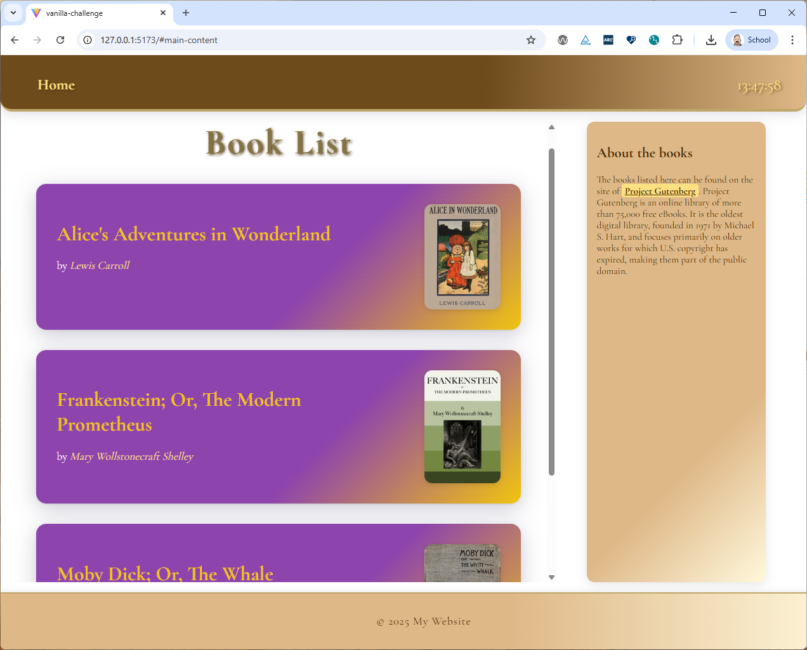
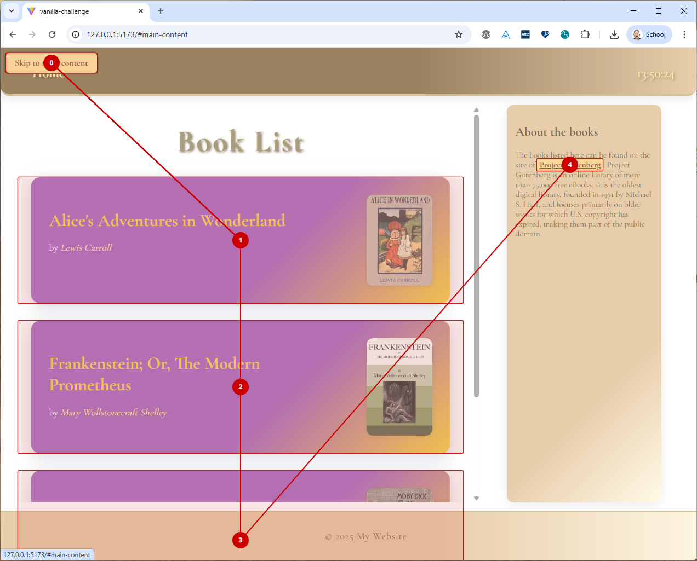

# Challenges

## Book List Site

We want to create a simple static book list site that looks like this:

### Task 1 - Boilerplate

Create the boilerplate code for this vanilla web components challenge.

### Task 2 - Design Documentation

#### Task 2.1 - Component Identification

Copy the image above into a drawing tool like [excalidraw](https://excalidraw.com/) or [draw.io](https://app.diagrams.net/) and mark the different components that you will need to create this site with vanilla web components.  

Label each component in the image with a tag name. Save the drawing as an image and store it in the docs folder of the repository of this challenge.

Wait for the calibration with the class before proceeding to the next task.

Update you design documentation if needed after the calibration.

#### Task 2.2 - Documentation

Add a markdown file to the docs folder called `frontend-design.md`. The markdown itself should contain the image you create above and a list of each component you identified. Each component in this list should be linked to a markdown file with the same name as the tag name of the component within the docs folder (e.g. if you have a component with the tag name `book-item`, there should be a file `book-item.md` in the docs folder).

Developers who wants to use your component or has to interact with it, don't want to read and understand the implementation of the component. They just want to know how to use it. Therefore, each markdown file should document how to use the component.
To achieve this, each web component markdown file should (for now) contain the following information:

- A header with the name of the component (i.e. the tag name). The Header should also be linked to the source code of the component.
- A short description of the purpose of the component.
- A list of the attributes that the component will need. For each attribute, provide:
  - The name of the attribute
  - The type of the attribute (e.g. string, number, boolean) and in case of a complex type (e.g. object, array) provide the structure of the type.
  - slots (and the name of the slot) that the component provides (if any)

> [!IMPORTANT]
>
> This is for now the bare minimum of documentation you should provide within this challenge. In the future, the bare minimum documentation should also include:
> - Events that the component emitss
> - (Custom)Events that the component listens to
> - REST API calls that the component makes (if any)
>
> Other information that would also be useful but is not part of the minimum documentation required by this course is:
> - Examples of how to use the component
> - Screenshots of the component
> - Styling information (e.g. CSS variables that can be used to style the component)
> - ...

### Task 3 - Skeleton creation

Create the skeleton of the book list site by implementing all components as empty components (i.e. without any logic
or styling). Just make sure that the components are rendered in the right place on the site.
Make sure that you have at least 3 book items in the skeleton. Use the site https://www.gutenberg.org/ to find some books to list here (and copy/paste here the information you need for the attributes of the book item component).

### Task 4 - Footer component

Implement the footer component, which only holds static content.

### Task 5 - Sidebar component

Implement the sidebar component, but make sure that the content of the sidebar is not part of the webcomponent itself, but is provided using a slot.

### Task 6 - Book list components

Implement the book list component using a template tag to render each book item. Let the web component clone the template and fill it with the data provided via the attributes of the book item component.
Let the site open the link to the book in a new tab when clicking on the web component.

### Task 7 - The Header

Implement the header including the part that shows the current time.

### Task 8 - Accessibility

Make sure that the site is accessible, test your site with AXE. Also test your site with the tab key (use an extension like TabA11y) to make sure that all interactive elements (like each book item) can be reached using the keyboard only.

---

:house: [Home](../README.md) | :arrow_backward: [Lifecycle Callbacks](./lifecycle-callbacks.md) | :arrow_up:
[Vanilla Web Components](./README.md)
