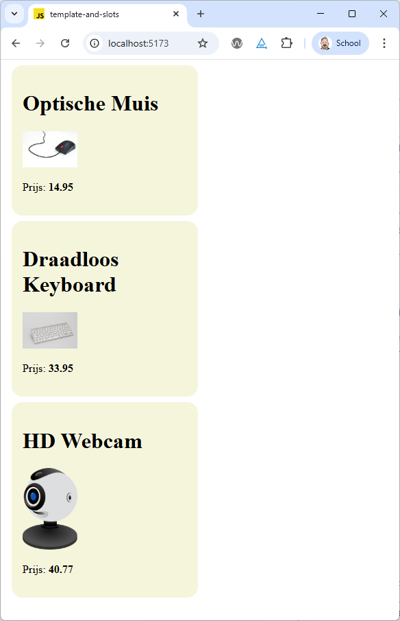
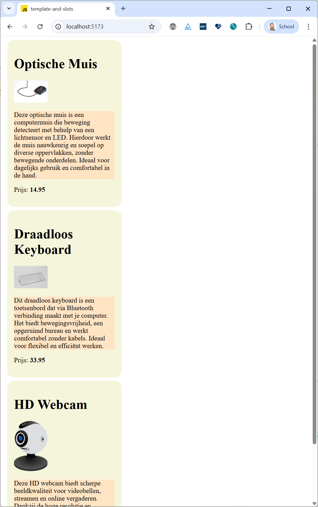

# Template and Slots

Until now we have altered the DOM of our custom web components directly from the constructor or a lifecycle hook method. This is fine if the component is very simple and does not have a lot of HTML structure. But as soon as the component becomes more complex, it is better to use HTML templates.
But in case of even more complex components, we might want to allow the user of the component to provide some HTML structure themselves. This is where slots come in handy.

## HTML Templates

Imagine we want to create a site that lists a couple of products, like in this screenshot:



We can clearly see that each product has the same structure: a productname, an image and a price and if we would look at the HTML code, we would see that each product element has an id that contains the article number of the product.

So let's create a web component called `<product-item>`, that gets it's properties via attributes. For our example the html required would that looks like this:

```html
  <product-item 
    name="Optische Muis" 
    articlenr="21307752" 
    price="14.95" 
    image="https://upload.wikimedia.org/wikipedia/commons/thumb/f/f5/ComputerMouseCloseup3.jpg/960px-ComputerMouseCloseup3.jpg">
  </product-item>
  <product-item 
    name="Draadloos Keyboard" 
    articlenr="22347582" 
    price="33.95" 
    image="https://upload.wikimedia.org/wikipedia/commons/thumb/2/24/Apple_Wireless_Bluetooth_Tastatur.jpg/960px-Apple_Wireless_Bluetooth_Tastatur.jpg">
  </product-item>
  <product-item 
    name="HD Webcam" 
    articlenr="19543567" 
    price="40.77" 
    image="https://upload.wikimedia.org/wikipedia/commons/thumb/0/08/Spherical_webcam.svg/500px-Spherical_webcam.svg.png">
  </product-item>
```

To render each product item, we could add some code to our web component that creates the required HTML structure using the innerHTML property.But the innerHTML property can lead to security issues if the content is not properly sanitized and is also not very efficient.
Using the DOM API to create the required elements (eg. document.createElement, document.appendChild, ...) would be better, but also quite verbose.

A better way to create the required HTML structure is to use HTML templates. HTML templates are defined using the `<template>` element. The content of a template is not rendered when the page loads, but can be cloned and inserted into the DOM using JavaScript.

So let's add a template to the html file to define the structure of our product item:

```html
  <template id="product-item-template">
    <link rel="stylesheet" href="./src/view/components/product-item.css" />
    <article class="product">
      <h1 class="product-name"></h1>
      
      <p>Prijs: <span class="product-price"></span></p>
    </article>
  </template>
```

In this template we also include a link to a CSS file that contains the styles for our product item component. But remember that changes to the css will not trigger a reload of the site when using a development server with hot module replacement, so you will have to reload the page manually to see the changes.
But notice that the styles defined in this css file will only apply to the shadow DOM of the product item component. That is why we include the link to the css file inside the template.

To use this template in our web component, we add some code to the constructor of the component to locate the template, extracts its content and clone the template content. Then we attach the cloned content to the shadow DOM of the component. This will create the required HTML structure for our component.

When the component gets added to the DOM, the connectedCallback lifecycle hook method is called. In this method we call a render method that has the task to update the content of the component based on the attributes.
Because the HTML structure is already created from the template, the render method only has to update the content of the elements inside the shadow DOM.

```javascript
export class ProductItem extends HTMLElement {

  static get observedAttributes() {
    return ['name', 'articlenr', 'price', 'image'];
  }

  attributeChangedCallback(name, oldValue, newValue) {
    switch (name) {
      case 'name':
        this.name = newValue;
        break;
      case 'articlenr':
        this.articlenr = newValue;
        break;
      case 'price':
        this.price = newValue;
        break;
      case 'image':
        this.image = newValue;
        break;
      default:
        break;
    }
    this.render();
  }

  constructor() {
    super();

    const template = document.querySelector('#product-item-template');
    const templateContent = template.content;

    const shadowRoot = this.attachShadow({ mode: 'open' });
    shadowRoot.appendChild(templateContent.cloneNode(true));
    
    this.name = '';
    this.articlenr = '';
    this.price = '';
    this.image = '';
  }

  connectedCallback() {
    this.render();
  }

  render() {
    this.shadowRoot.querySelector('.product').setAttribute('id', this.articlenr);
    this.shadowRoot.querySelector('.product-name').textContent = this.name;
    this.shadowRoot.querySelector('.product-price').textContent = this.price;
    this.shadowRoot.querySelector('.product-image').setAttribute('src', this.image);
    this.shadowRoot.querySelector('.product-image').setAttribute('alt', this.name); 
  }
}

customElements.define('product-item', ProductItem);
```

This is what makes the template tag so powerful: we can define the HTML structure of our component in a declarative way using HTML, and then use JavaScript to populate the content of the component.

## Slots

The way we are defining our web components right now is fine for simple components, but what if we want to create a more complex component, that contains html structure which isn't always the same and where we want to give the user of the component more flexibility to define the content themselves?

Perhaps you already have noticed that when you add html content inside a custom web component, that content is not displayed:

```html
  <product-item
    name="Optische Muis"
    articlenr="21307752"
    price="14.95"
    image="https://upload.wikimedia.org/wikipedia/commons/thumb/f/f5/ComputerMouseCloseup3.jpg/960px-ComputerMouseCloseup3.jpg"
  >
    <p>
      Deze optische muis is een computermuis die beweging detecteert met behulp van een lichtsensor en LED. Hierdoor
      werkt de muis nauwkeurig en soepel op diverse oppervlakken, zonder bewegende onderdelen. Ideaal voor dagelijks
      gebruik en comfortabel in de hand.
    </p>
  </product-item>
  <product-item
    name="Draadloos Keyboard"
    articlenr="22347582"
    price="33.95"
    image="https://upload.wikimedia.org/wikipedia/commons/thumb/2/24/Apple_Wireless_Bluetooth_Tastatur.jpg/960px-Apple_Wireless_Bluetooth_Tastatur.jpg"
  >
    <p>
      Dit draadloos keyboard is een toetsenbord dat via Bluetooth verbinding maakt met je computer. Het biedt
      bewegingsvrijheid, een opgeruimd bureau en werkt comfortabel zonder kabels. Ideaal voor flexibel en efficiënt
      werken.
    </p>
  </product-item>
  <product-item
    name="HD Webcam"
    articlenr="19543567"
    price="40.77"
    image="https://upload.wikimedia.org/wikipedia/commons/thumb/0/08/Spherical_webcam.svg/500px-Spherical_webcam.svg.png"
  >
    <p>
      Deze HD webcam biedt scherpe beeldkwaliteit voor videobellen, streamen en online vergaderen. Dankzij de hoge
      resolutie en automatische aanpassing aan lichtomstandigheden ben je altijd duidelijk zichtbaar. Eenvoudig aan te
      sluiten via USB.
    </p>
  </product-item>
```

This is where slots come in handy. Slots allow us to define placeholders in our web component's template where the user can insert their own HTML content.
We don't have to change anything in the JavaScript code of our web component, we only have to modify the template to include a slot element where we want to insert the user-defined content.

```html
  <template id="product-item-template">
    <link rel="stylesheet" href="./src/view/components/product-item.css" />
    <article class="product">
      <h1 class="product-name"></h1>
      
      <slot></slot>
      <p>Prijs: <span class="product-price"></span></p>
    </article>
  </template>
```

When you now take a look at the rendered product items, you will see that the description paragraphs are now displayed inside each product item, right between the image and the price.

But when you try to style the content inside the slot using the css file of the product item component, you will notice that the styles are not applied. This is because the content inside the slot is part of the light DOM of the component, and not part of the shadow DOM.
To style the content inside the slot, we have to use the `::slotted` pseudo-element in the css file of the component:

```css
::slotted(p) {
  background-color: bisque;
}
```

This will apply the background color to all paragraph elements that are inserted into the slot of the component.



You may also want to define multiple slots in your component, to allow the user to insert different types of content in different places. For example, we could define a slot for the product description and another slot for additional information:

```html
  <template id="product-item-template">
    <link rel="stylesheet" href="./src/view/components/product-item.css" />
    <article class="product">
      <h1 class="product-name"></h1>
      
      <slot name="description"></slot>
      <p>Prijs: <span class="product-price"></span></p>
      <slot name="additional-info"></slot>
    </article>
  </template>
```

To use these named slots, the user of the component has to specify the slot attribute on the elements they want to insert into the slots:

```html
  <product-item
    name="Optische Muis"
    articlenr="21307752"
    price="14.95"
    image="https://upload.wikimedia.org/wikipedia/commons/thumb/f/f5/ComputerMouseCloseup3.jpg/960px-ComputerMouseCloseup3.jpg"
  >
    <p slot="description">
      Deze optische muis is een computermuis die beweging detecteert met behulp van een lichtsensor en LED. Hierdoor
      werkt de muis nauwkeurig en soepel op diverse oppervlakken, zonder bewegende onderdelen. Ideaal voor dagelijks
      gebruik en comfortabel in de hand.
    </p>
    <p slot="additional-info">
      Extra info: Deze muis heeft een DPI-instelling van 800 tot 1600 en is compatibel met Windows, MacOS en Linux.
    </p>
  </product-item>
```

This way, the user can insert different types of content into the component, and we can style them separately using the `::slotted` pseudo-element in the css file:

```css
::slotted([slot="description"]) {
  font-style: italic;
}
::slotted([slot="additional-info"]) {
  font-size: 0.9em;
  color: gray;
}
```

With templates and slots, we can create powerful and flexible web components that can be easily reused and customized by the users of the component.

---

:house: [Home](../README.md) | :arrow_backward: [Lifecycle callbacks](./lifecycle-callbacks.md) | :arrow_up:
[Vanilla Web Components](./README.md) | [Challenges](./challenges.md) :arrow_forward: