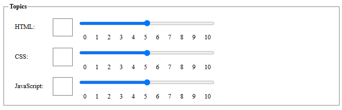

# Input Components

## Introduction

## The Problem

Let's first build a simple component that gives us an Evaluation form to demonstrate the problem.
Create a new file `evaluation-form.js` in the `src/view/components` folder and add the following code:

```javascript
import { LitElement, html, css } from 'lit';

export class EvaluationForm extends LitElement {
  constructor() {
    super();
    this.data = {};
  }

  static styles = css`
    form {
      display: grid;
      grid-template-columns: 1fr;
      gap: 1rem;
      margin: 1rem;
      justify-items: center;
      align-items: center;
    }

    fieldset {
      border: 1px solid gray;
      display: grid;
      width: 100%;
    }

    .cursist-info {
      grid-template-columns: auto 1fr;
    }

    .evaluation-topics {
      grid-template-columns: auto auto 1fr;
      align-items: center;
    }

    legend {
      font-weight: bold;
    }

    label {
      display: block;
      margin: 0.5rem;
      padding: 0.5rem;
    }

    input {
      margin: 0.5rem;
      padding: 0.5rem;
    }

    input[type='number'] {
      width: 2rem;
      font-size: 1.5rem;
    }

    input[type='range'] {
      width: 50%;
    }

    datalist {
      display: flex;
      margin: 0 0.5rem;
      padding: 0 0.5rem;
      justify-content: space-between;
      width: 50%;
    }

    button {
      margin: 0rem 1rem;
      padding: 0.5rem 2rem;
      background-color: green;
      color: white;
      border: none;
      border-radius: 0.5rem;
      font-size: 1.5rem;
    }
  `;

  submitHandler(event) {
    event.preventDefault();
    const formData = new FormData(event.target);
    this.data = Object.fromEntries(formData.entries());
    console.log(this.data);
  }

  render() {
    return html`
      <h1>Evaluation Form</h1>
      <form @submit=${this.submitHandler}>
        <fieldset class="cursist-info">
          <legend>Cursist Information</legend>
          <label for="name">Name:</label>
          <input type="text" id="name" name="name" required />

          <label for="address">Address:</label>
          <input type="text" id="address" name="address" required />

          <label for="phone">Phone:</label>
          <input type="tel" id="phone" name="phone" required />

          <label for="email">Email:</label>
          <input type="email" id="email" name="email" required />
        </fieldset>

        <fieldset class="evaluation-topics">
          <legend>Topics</legend>
          <label for="html-value">HTML:</label>
          <input
            type="number"
            id="html-value"
            name="html"
            min="0"
            max="10"
            required
          />
          <div>
            <input
              type="range"
              id="html-slider"
              name="html"
              list="values"
              aria-label="html-slider"
              min="0"
              max="10"
              required
            />
            <datalist id="values">
              <option value="0" label="0"></option>
              <option value="1" label="1"></option>
              <option value="2" label="2"></option>
              <option value="3" label="3"></option>
              <option value="4" label="4"></option>
              <option value="5" label="5"></option>
              <option value="6" label="6"></option>
              <option value="7" label="7"></option>
              <option value="8" label="8"></option>
              <option value="9" label="9"></option>
              <option value="10" label="10"></option>
            </datalist>
          </div>

          <label for="css-value">CSS:</label>
          <input
            type="number"
            id="css-value"
            name="css"
            min="0"
            max="10"
            required
          />
          <div>
            <input
              type="range"
              id="css-slider"
              name="css"
              list="values"
              aria-label="css-slider"
              min="0"
              max="10"
              required
            />
            <datalist id="values">
              <option value="0" label="0"></option>
              <option value="1" label="1"></option>
              <option value="2" label="2"></option>
              <option value="3" label="3"></option>
              <option value="4" label="4"></option>
              <option value="5" label="5"></option>
              <option value="6" label="6"></option>
              <option value="7" label="7"></option>
              <option value="8" label="8"></option>
              <option value="9" label="9"></option>
              <option value="10" label="10"></option>
            </datalist>
          </div>

          <label for="js-value">JavaScript:</label>
          <input
            type="number"
            id="js-value"
            name="js"
            min="0"
            max="10"
            required
          />
          <div>
            <input
              type="range"
              id="js-slider"
              name="js"
              list="values"
              aria-label="js-slider"
              min="0"
              max="10"
              required
            />
            <datalist id="values">
              <option value="0" label="0"></option>
              <option value="1" label="1"></option>
              <option value="2" label="2"></option>
              <option value="3" label="3"></option>
              <option value="4" label="4"></option>
              <option value="5" label="5"></option>
              <option value="6" label="6"></option>
              <option value="7" label="7"></option>
              <option value="8" label="8"></option>
              <option value="9" label="9"></option>
              <option value="10" label="10"></option>
            </datalist>
          </div>
        </fieldset>

        <button type="submit">Save</button>
      </form>
    `;
  }
}

customElements.define('evaluation-form', EvaluationForm);
```

Import the component in the `home-page.js` file of the `src/view/pages` folder.

```javascript
import '../components/evaluation-form';
```

And adapt the `index.html` file to use the `evaluation-form` component.

```html
...
<body>
  <main>
    <evaluation-form></evaluation-form>
  </main>
</body>
...
```

If you run the application you should get a form that asks for some information of the cursist (to keep the evaluation private :wink") and some topics to evaluate. That the form is not working correctly is something we will fix later.
But for now, we see that the topics are rated using either a number input or a range input. The range input is a bit more user-friendly, but the number input is more precise. But the inputs are not related yet, meaning we can rate the HTML topic with a 4 using the number input and a 7 using the range input. This is not what we want. We want the inputs to be related, so if we change the number input, the range input should change accordingly and vice versa.

Another issue we face is that HTML code for those inputs is basically the same for each topic and takes up a lot of space, causing ESLint to complain about the number of lines in our method.



By creating a component that combines the number and range input, we can solve both issues.

## The Number-Range-Input Component

From the `render` method of the `EvaluationForm` component, we can derive that our new component should have the following attributes:

- `label`: The label for the input.
- `name`: The name of the input.
- `min`: The minimum value of the input.
- `max`: The maximum value of the input.
- `required`: Whether the input is required or not.
- `value`: The value of the input.

Note that the `name` attribute is required for the form data to extract the value of the input, but does not have any meaning within the component itself.
We will therefore not add this attribute in our component, but remember that if you don't add the `name` attribute to the input element, 
the value of the input will not be included in the form data when the form is submitted.
Let's create a new file `number-range-input.js` in the `src/view/components` folder and add the following code:

```javascript
import { LitElement, html, css } from 'lit';

export class NumberRangeInput extends LitElement {
  static styles = css`
    :host {
      display: grid;
      grid-template-columns: 1.5fr auto 10fr;
      align-items: center;
      width: 100%;
    }

    label {
      display: block;
      margin: 0.5rem;
      padding: 0.5rem;
    }

    input {
      margin: 0.5rem;
      padding: 0.5rem;
    }

    input[type='number'] {
      width: 3rem;
      font-size: 1.5rem;
    }

    input[type='range'] {
      width: 50%;
    }

    datalist {
      display: flex;
      margin: 0 0.5rem;
      padding: 0 0.5rem;
      justify-content: space-between;
      width: 50%;
    }
  `;

  static properties = {
    label: { type: String },
    min: { type: Number },
    max: { type: Number },
    required: { type: Boolean },
    value: { type: Number, reflect: true },
  };

  constructor() {
    super();
    this.required = false;
    this.min = 0;
    this.max = 10;
  }

  firstUpdated() {
    this.value = this.min;
    this.shadowRoot.querySelector('#number-input').value = this.value;
    this.shadowRoot.querySelector('#range-input').value = this.value;
  }

  numberInputHandler(event) {
    this.value = event.target.value;
    this.shadowRoot.querySelector('#range-input').value = this.value;
  }

  rangeInputHandler(event) {
    this.value = event.target.value;
    this.shadowRoot.querySelector('#number-input').value = this.value;
  }

  render() {
    return html`
      <label for="number-input">${this.label}:</label>
      <input
        type="number"
        id="number-input"
        name="number-input"
        min="${this.min}"
        max="${this.max}"
        @input=${this.numberInputHandler}
      />
      <div>
        <input
          type="range"
          id="range-input"
          name="range-input"
          list="values"
          aria-label="${this.label}"
          min="${this.min}"
          max="${this.max}"
          ?required="${this.required}"
          @input=${this.rangeInputHandler}
        />
        <datalist id="values">
          <option value="0" label="0"></option>
          <option value="1" label="1"></option>
          <option value="2" label="2"></option>
          <option value="3" label="3"></option>
          <option value="4" label="4"></option>
          <option value="5" label="5"></option>
          <option value="6" label="6"></option>
          <option value="7" label="7"></option>
          <option value="8" label="8"></option>
          <option value="9" label="9"></option>
          <option value="10" label="10"></option>
        </datalist>
      </div>
    `;
  }
}

customElements.define('number-range-input', NumberRangeInput);
```

Also let's make some small changes to the `EvaluationForm` component, to use the new `number-range-input` component.

```javascript
import { LitElement, html, css } from "lit";
import './number-range-input';

export class EvaluationForm extends LitElement {

  ...

  static styles = css`

  ...

    /* .evaluation-topics {
      grid-template-columns: auto auto 1fr;
      align-items: center;
    } */

  ...
  `;

  ...

  render() {
    return html`
      <h1>Evaluation Form</h1>
      <form @submit=${this.submitHandler}>
        <fieldset class="cursist-info">
          <legend>Cursist Information</legend>
          <label for="name">Name:</label>
          <input type="text" id="name" name="name" required />

          <label for="address">Address:</label>
          <input type="text" id="address" name="address" required />

          <label for="phone">Phone:</label>
          <input type="tel" id="phone" name="phone" required />

          <label for="email">Email:</label>
          <input type="email" id="email" name="email" required />
        </fieldset>

        <fieldset class="evaluation-topics">
          <legend>Topics</legend>
          <number-range-input name="html" label="HTML" min="0" max="10" required></number-range-input>
          <number-range-input name="css" label="CSS" min="0" max="10" required></number-range-input>
          <number-range-input name="javascript" label="JavaScript" min="0" max="10" required></number-range-input>
        </fieldset>

        <button type="submit">Save</button>
      </form>
    `;
  }
}

customElements.define("evaluation-form", EvaluationForm);
```

As you can now experience, the form is much more compact and the number and range input are related to each other. If you change the number input, the range input changes accordingly and vice versa. This is because we have added event handlers to the number and range input that update the value of the other input as well as the reactive property `value` causing a rerender of the component.

The initialization of the values of the two input components within our `number-input-range` component is done in the `firstUpdated` method. You might expect that this should be done in the `connectedCallback` method, but this is not the case. The `connectedCallback` method is called when the element is added to the DOM, but the shadow DOM is not yet created at that time. So we cannot access the elements of the shadow DOM yet.
The `firstUpdated` method is called after the first update of the element, which is after the shadow DOM is created. This is the moment we can access the shadow DOM and initialize the values of the inputs.

But if you play around with the component, you will notice that there are also some new issues we have to deal with:

- The `required` attribute of the input elements is not working. If you submit the form without filling in the required fields, the form is still submitted.
- The `min` and `max` attributes of the input elements are not working. You can enter any value in the input fields, even negative values.
- The `value` attribute of the `number-range-input` component is reflected to the attribute of the element, but when we submit the form, the value of the input fields is not included in the form data.

The reason for these issues is that the [ElementInternals](https://developer.mozilla.org/en-US/docs/Web/API/ElementInternals) of our component are not correctly initialized.
The `ElementInternals` is a new API that is part of the [Forms module](https://html.spec.whatwg.org/multipage/custom-elements.html#elementinternals) of the HTML specification.
It provides a way to access the form-associated custom elements of a custom element.

## Setting the value

The first issue we will address is that the `value` attribute of the `number-range-input` component is not included in the form data when the form is submitted.
The first thing we do to set up the `ElementInternals` in our component is to add a private property 'internals' to our component.
In JavaScript private properties are prefixed with a `#`.

```javascript
export class NumberRangeInput extends LitElement {

  #internals;

  static styles = css`
  ...
  `;
```

Next we have to initialize our `#internals` property in the `constructor` method of our component by calling the `attachInternals` method of our component.
This method returns an `ElementInternals` object that we can use to set up the form-associated custom element.

```javascript
...
  constructor() {
    super();
    this.#internals = this.attachInternals();
    
    this.required = false;
    this.min = 0;
    this.max = 10;
  }
...
```

Using the `#internals` property we can now set the value of the component as a form-associated value by calling the `setFormValue` method of the `ElementInternals` object.
Let's add a method `setValue` to our component that sets the value of the component and calls the `setFormValue` method.

```javascript
  setValue(value) {
    this.value = value;
    this.#internals.setFormValue(this.value);
  }
```

Next we have to replace all the statements that sets the value of the component with a call to the `setValue` method.

```javascript
  firstUpdated() {
    this.setValue(this.min);
    this.shadowRoot.querySelector('#number-input').value = this.value;
    this.shadowRoot.querySelector('#range-input').value = this.value;
  }

  numberInputHandler(event) {
    this.setValue(event.target.value);
    this.shadowRoot.querySelector('#range-input').value = this.value;
  }

  rangeInputHandler(event) {
    this.setValue(event.target.value);
    this.shadowRoot.querySelector('#number-input').value = this.value;
  }
```

If you now run the application, you will get an error in the console at the `setFormValue` method, stating that the element is not a form-assiciated custom element.

To fix this, we have to add a static property `formAssociated` to our component and set it to `true`.
This tells the browser that our component is a form-associated custom element.

```javascript
export class NumberRangeInput extends LitElement {

  #internals;

  static formAssociated = true;
```

If you now run the application, fill the form and submit it, you will notice that the data of our `number-range-input` components is included in the form data.
However, the `required` attribute of the input elements is still not working, and the `min` and `max` attributes of the input elements are not working either.

## Setting the constraints

The range slider and the number up/down buttons on the input elements are working as aspected and prevent us from entering values that are not within the range of the `min` and `max` attributes.
But we can still enter values in the input field that are not within the range of the `min` and `max` attributes,
which will be included in the form data when the form is submitted, without any validation check.
This is why we will focus on the validation of the number input field.

Let's start by checking if the value we enter in the input field is valid, by using the validity check method provided by the DOM API.

```javascript
  numberInputHandler(event) {
    const isValid = event.target.checkValidity();
    console.log(isValid);

    this.setValue(event.target.value);
    this.shadowRoot.querySelector("#range-input").value = this.value;
  }
```

If we enter a value that is not within the range of the `min` and `max` attributes, the `checkValidity` method will return `false`.

We can use this boolean value to use the DOM API again to rapport to the user that the value is not valid, using a standaard message of the browser.

```javascript
  numberInputHandler(event) {
    const isValid = event.target.checkValidity();
    if (!isValid) {
      event.target.reportValidity();
    }

    this.setValue(event.target.value);
    this.shadowRoot.querySelector("#range-input").value = this.value;
  }
```

If we now enter a value that is not within the range of the `min` and `max` attributes, the browser will show a message that the value is not valid.
We will however set the value to keep the number input and the range slider in sync (even if the value is not valid and the range slider cannot show the value).


TODO: uitwerken van onderstaande items


Next we will report to the user that a value is not valid.

This validation and rapportation however doesn't prevent the form from being submitted.

We can prevent this by setting the validity of the input element (this method requires three attributes, the first is the flags object specifying the error if any and the second is the error message, and the third is an anchor element to focus on in case of an error))


---

## Sources

---

:house: [Home](../README.md) | :arrow_backward: [Inputs and Events](./input-and-events.md) | :arrow_up: [Learning Stories](./README.md) | []() :arrow_forward:
