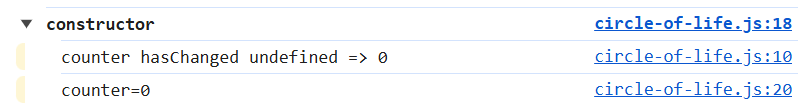
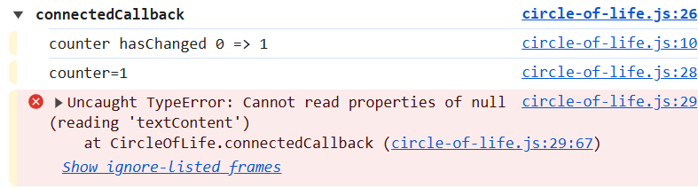
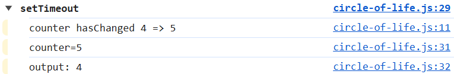
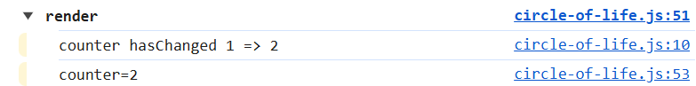
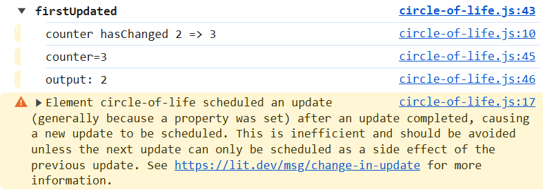
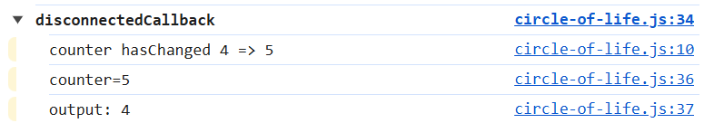

# Lifecycle

In the vanilla web components article we already discussed the lifecycle callbacks. In Lit, we have a few more lifecycle callbacks which we will discuss in this article.

## Boilerplate

To understand the lifecycle callbacks, we will create a new helper component. The task of the helper component is to provide the user with the option to add or remove a component from the DOM as well as to change the attribute properties of that component.
Create a new file `col-helper.js` in the `src/view/components` folder and add the following code:

```javascript
import { LitElement, html, css } from "lit";
import { when } from "lit/directives/when.js";
import {ifDefined} from 'lit/directives/if-defined.js';
import "@material/web/switch/switch";
import "./circle-of-life";

export class ColHelper extends LitElement {
  static styles = css`
    nav {
      width: 50%;
      margin: 1rem;
      padding: 1rem;
      border: 1px solid gray;
      display: grid;
      align-items: center;
      vertical-align: middle;
      grid-template-columns: 1fr auto;
      gap: 1rem;
    }
  `;

  static properties = {
    showCol: { type: Boolean },
    counterValue: { type: Number, state: true },
  };

  constructor() {
    super();
    this.showCol = false;
    this.counterValue = null;
  }

  switchUpdateHandler(event) {
    this.showCol = event.target.selected;
    console.log(`------------------------------------`);
  }

  updateCounterAttribute() {
    const counterValue = this.shadowRoot.querySelector("#colCounter").value;
    if (counterValue) {
      this.counterValue = counterValue;
    } else {
      this.counterValue = null;
    }
  }

  render() {
    return html`
      <nav>
        <label for="colSwitch">
          Remove/Add the Circle of Life component to the DOM
        </label>
        <md-switch
          id="colSwitch"
          @input=${this.switchUpdateHandler}
        ></md-switch>
        <input type="number" id="colCounter" />
        <button @click=${this.updateCounterAttribute}>Set Value</button>
      </nav>

      ${when(
        this.showCol,
        () =>
          html`<circle-of-life counter=${ifDefined(this.counterValue)}></circle-of-life>`,
        () => html``,
      )}
    `;
  }
}

customElements.define("col-helper", ColHelper);
```

Note that we using the lit build-in directives `when` and `ifDefined` in the `col-helper.js` file. The `when` directive is used to conditionally render the `circle-of-life` component based on the value of the `showCol` property. The `ifDefined` directive is used to conditionally render the `counter` attribute of the `circle-of-life` component based on the value of the `counterValue` property.

As can be seen from the imports in the code, we are using the `md-switch` component from the material web components library. This component is not part of the standard web components library and needs to be installed separately. To install the material web components library, run the following command in the terminal:

```bash
npm install @material/web
```

Next we have to add our new helper component to the `home-page.js` file in the `src/view/pages` folder. Add the following code to the `home-page.js` file:

```javascript
import '../components/col-helper';
```

And we need to add the `col-helper` component to the `index.html` file, by changing the body content to:

```html
...
  <body>
    <main>
      <col-helper></col-helper>
    </main>
  </body>
...
```

Finally we also need to create a new file `circle-of-life.js` in the `src/view/components` folder and add the following code:

```javascript
import { LitElement, html } from "lit";

const INCREMENT_VALUE = 1;
const ONE_SECOND = 1000;

export class CircleOfLife extends LitElement {
  static properties = {
    counter: {
      type: Number,
      hasChanged: (newValue, oldValue) => {
        console.info(`counter hasChanged ${oldValue} => ${newValue}`);
        return newValue !== oldValue;
      },
    },
  };

  constructor() {
    super();
    console.group("constructor");
    this.counter = 0;
    console.log(`counter=${this.counter}`);
    console.groupEnd();
  }

  connectedCallback() {
    super.connectedCallback();

    setTimeout(() => {
      console.group("setTimeout");
      this.counter += INCREMENT_VALUE;
      console.log(`counter=${this.counter}`);
      console.log(`output: ${this.shadowRoot.querySelector("output").textContent}`);
      console.groupEnd();
    }, ONE_SECOND);

    console.group("connectedCallback");
    this.counter += INCREMENT_VALUE;
    console.log(`counter=${this.counter}`);
    console.log(`output: ${this.shadowRoot.querySelector("output").textContent}`);
    console.groupEnd();
  }

  disconnectedCallback() {
    console.group("disconnectedCallback");
    this.counter += INCREMENT_VALUE;
    console.log(`counter=${this.counter}`);
    console.log(`output: ${this.shadowRoot.querySelector("output").textContent}`);
    console.groupEnd();
    super.disconnectedCallback();
  }

  firstUpdated() {
    console.group("firstUpdated");
    this.counter += INCREMENT_VALUE;
    console.log(`counter=${this.counter}`);
    console.log(`output: ${this.shadowRoot.querySelector("output").textContent}`);
    console.groupEnd();
  }

  render() {
    console.group("render");
    this.counter += INCREMENT_VALUE;
    console.log(`counter=${this.counter}`);
    console.groupEnd();
    return html`
      <h1>Circle of Life</h1>
      <p>Open the console to see the lifecycle callbacks</p>
      <p>Counter value: <output>${this.counter}</output></p>
    `;
  }
}

customElements.define("circle-of-life", CircleOfLife);
```

> [!NOTE] We make use of the `console.group` and `console.groupEnd` functions to group the console output of the lifecycle callbacks. This makes it easier to see which lifecycle callback is being executed.

## The lifecycle callbacks

Run the application and open the console. Make sure that the input field in the `col-helper` component is empty and your console should be empty as well.
If you now click on the switch in the `col-helper` component, you will see that the circle-of-life component is shown.

Let's take a closer look at the lifecycle callbacks by inspecting the console output.

---

### constructor



The first lifecycle callback function that is called is the `constructor`. Normally the constructor is called when an `new` instance of the class is created with the `new` keyword. In our case, the constructor is called when the `circle-of-life` component is created by using the tag `<circle-of-life></circle-of-life>` in the `col-helper` component.

> [!NOTE]
> The first statement of the `constructor` of a LitElement always is `super()`. This calls the constructor of the parent class, which is the `LitElement` class. The `LitElement` class is a subclass of the `HTMLElement` class and provides the functionality to create custom elements.

The constructor is a good place to initialize properties with default values. In our case, we initialize the `counter` property with the value `0`.
Notice that the assignment of a new value to the `counter` property triggers the `hasChanged` hook function, which we defined in the `counter` property.

> [!WARNING]
> Never call functions that return a promise in the constructor! This can lead to unexpected behavior.

---

### connectedCallback



The next lifecycle callback function that gets called is the `connectedCallback`. The `connectedCallback` is called when the custom element is added to the DOM.
This means that the tag of our component (in our case `circle-of-life`) is now part of the DOM.

> [!NOTE]
> The first statement of the `connectedCallback` of a LitElement always is `super.connectedCallback()`. This calls the `connectedCallback` of the parent class, which is the `LitElement` class.

The connectedCallback is the place where you can perform tasks like setting up event listeners or **assign values to reactive properties using asynchronous tasks** like fetching data from an API or better the controller. Remember that assigning a new value to a reactive property will trigger a re-render of the component.

In the screenshot of the connectedCallback, you can also see that we get an error. This is because our code tries to access the `output` element in the shadow DOM of the `circle-of-life` component. This is because the `connectedCallback` is called before the `render` function is called, so while the tag of the component itself already is available in the DOM the shadow DOM content of the component is not.

From the code in the `connectedCallback` function, you can see that we also use an asynchronous task to increment the `counter` property, by setting a timeout of one second. From the console output, you can see that the `connectedCallback` is finished before the `setTimeout` is executed. But when the `setTimeout` gets executed, the `counter` property gets incremented by 1, which causes a re-render, which is exactly what we wanted.



---

### render



The `render` function is called after the `connectedCallback`. The `render` function is responsible for rendering the component's template. 

> [!WARNING]
> The `render` function should be a pure function, meaning that it should not have any side effects. The `render` function should only return the template of the component.

In our case the `render` function is not a pure function, because we increment the `counter` property in the `render` function.
This is not a good practice and should be avoided. The `render` function should only be used to render the template of the component.
Fortunately, Lit seems to shield us from a race condition here, because the increment of the `counter` property in the `render` function also triggers a re-render of the component, which would mean that we have an infinite loop of re-renders. But Lit seems to prevent this from happening.

---

### firstUpdated



After the `render` function is called for the first time, the `firstUpdated` lifecycle callback is called. This means that the shadow DOM content of the component is now available, as can be seen from the sceenshot (the `output` element is now available).

The `firstUpdated` lifecycle callback should be used to perform tasks that require the shadow DOM content of the component. This is the place where you can access the shadow DOM content of the component, so we can add for instance event listeners to the shadow DOM content.

> [!WARNING]
> The `firstUpdated` lifecycle callback should not be used to trigger a re-render of the component, meaning that you should not assign new values to reactive properties in the `firstUpdated` lifecycle callback.

As can be seen from the warning in the screenshot, our code increments the `counter` property in the `firstUpdated` lifecycle callback, triggering a re-render. This is not a good practice and should be avoided. If you need to assign a new value to a reactive property, you should do this in the `connectedCallback` or in an event handler.

---

### disconnectedCallback

When you now click on the switch in the `col-helper` component to remove the `circle-of-life` component from the DOM, the `disconnectedCallback` lifecycle callback is called.



The `disconnectedCallback` is called when the custom element is removed from the DOM. This is the place where you can perform tasks like removing event listeners or cleaning up resources.

> [!NOTE]
> The **LAST STATEMENT** of the `disconnectedCallback` of a LitElement always is `super.disconnectedCallback()`. This calls the `disconnectedCallback` of the parent class, which is the `LitElement` class. This is important because the `LitElement` class does some cleanup in the `disconnectedCallback`.

> [!WARNING]
> The `disconnectedCallback` should not be used to trigger a re-render of the component, meaning that you should not assign new values to reactive properties in the `disconnectedCallback`. Doing so will trigger a re-render of the component, which is not necessary because the component is removed from the DOM and can cause unexpected behavior.

Again we provided bad practice code in the `disconnectedCallback` function. We increment the `counter` property in the `disconnectedCallback` function, which triggers a re-render of the component. This is not a good practice and should be avoided.

---

### Incomming Events

Try for yourself to see what happens to the lifecycle callbacks when you:
- Set a value in the input field of the `col-helper` component and click on the `Set Value` button before the `circle-of-life` component is added to the DOM.
- Set a different value in the input field of the `col-helper` component and click on the `Set Value` button after the `circle-of-life` component is added to the DOM.

---

## Sources

- [MDN -console](https://developer.mozilla.org/en-US/docs/Web/API/console)
- [LIT - when](https://lit.dev/docs/templates/directives/#when)
- [LIT - ifDefined](https://lit.dev/docs/templates/directives/#ifdefined)
- [Material Web Components - Switch](https://github.com/material-components/material-web/blob/main/docs/components/switch.md)

---

:house: [Home](../README.md) | :arrow_backward: [Rendering](./rendering.md) | :arrow_up: [Learning Stories](./README.md) | [Input Components](./input-components.md) :arrow_forward:
