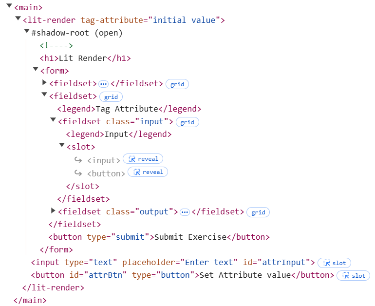

# Rendering

Rendering is the proces of creating the HTML content of a component and adding it to the DOM.
Within Lit components, the `render` method is responsible for rendering the content of the component to the DOM.
There should not be any other method within the component that manipulates the DOM directly.
The `render` method is part of the lifecycle hook methods of a lit component and should not be called directly. What [lifecycle hooks](./lifecycle.md) are will be covered in another article. For now think about them as methods that are called automatically during the lifecycle of a component.

> [!WARNING]
>
> * Never call the render method directly!
> * The `render` method should be the only method within the component that manipulates the DOM!

Not to call the `render` method directly and not to manipulate the DOM part of a component elsewhere in the code, makes that it is important to understand how the `render` method is triggered and how it works.

## Boilerplate code

Let's demonstrate how rendering works in Lit components with a simple example component. Create a new file `lit-render.js` in the `src/view/components` folder and add the following code:

```javascript
import { LitElement, html, css } from "lit";

export class LitRender extends LitElement {

  static styles = css`
    fieldset {
      display: grid;
      gap: 1rem;
      grid-template-columns: 1fr 1fr;
      align-content: center;
      align-items: stretch;
    }

    input output {
      border: 1px solid #333;
      padding: 1rem;
      display: grid;
      align-items: center;
    }

    legend {
      font-weight: bold;
    }

    label {
      display: inline-block;
      margin-bottom: 0.5rem;
    }

    button[type="submit"] {
      margin: 1rem;
      padding: 1rem;
      background-color: yellowgreen;
      color: black;
      border: none;
      border-radius: 0.5rem;
      cursor: pointer;
    }
  `;

  constructor() {
    super();
  }
  
  // eslint-disable-next-line max-lines-per-function
  render() {
    return html`
      <h1>Lit Render</h1>

      <form>
        <button type="submit">Submit Exercise</button>
      </form>
    `;
  }
}

customElements.define("lit-render", LitRender);
```

Also add an import statement to the `src/view/pages/home-page.js` file to include the new component in the application.

```javascript
import '../components/lit-render.js';
```

And finally call the new component in the `index.html` file.

```html
...
  <body>
    <main>
      <lit-render></lit-render>
    </main>
  </body>
...
```

## Rendering Private Non-Reactive Properties

We start this example by adding a private property to the component and initialize it in the constructor.

```javascript
export class LitRender extends LitElement {
  #privateProperty;

  ...

  constructor() {
    super();
    this.#privateProperty = "initial value";
  }

  ...
```

Next we add a fieldset to the form of the `render` method, that gives us an input text field and an output field to display the value of the private property.

```javascript
  // eslint-disable-next-line max-lines-per-function
  render() {
    return html`
      <h1>Lit Render</h1>

      <form>
        <fieldset>
          <legend>Private Property</legend>

          <fieldset class="input">
            <legend>Input</legend>
            <input
              type="text"
              aria-label="Private Property"
              @input=${this.updatePrivateProperty}
            />
          </fieldset>
          <fieldset class="output">
            <legend>Output</legend>
            <p>${this.#privateProperty}</p>
          </fieldset>
        </fieldset>

        <button type="submit">Submit Exercise</button>
      </form>
    `;
  }
```

In order to update the value of the private property, we add an event handler to the input field.

```javascript
  updatePrivateProperty(event) {
    this.#privateProperty = event.target.value;
    console.log(this.#privateProperty);
  }
```

When you run the application and type in the input field, you will see that the value of the private property is updated in the console, but not in the output field.
This is because the way we defined the private property makes that it is a so called non-reactive property. This means that there is no reaction to changes of the property value.
You might be tempted to manipulate the DOM directly within the `updatePrivateProperty` method, but this violates the principle that the `render` method should be the only method within the component that manipulates the DOM. Therefore you might be tempted to call the `render` method directly from the `updatePrivateProperty` method, but this is also not the way to go, since the `render` method should never be called directly.
But there is a workaround for this, by calling the `requestUpdate` method, which you inherit from the `LitElement` class. Calling this method will trigger a re-render of the component.

```javascript
  updatePrivateProperty(event) {
    this.#privateProperty = event.target.value;
    console.log(this.#privateProperty);
    this.requestUpdate();
  }
```

When you run the application now and type in the input field, you will see that the value of the private property is updated in the output field.

> [!NOTE]
> Calling the `requestUpdate` method is not the way to go in a Lit component, since it is not efficient and can lead to performance issues.
> So prevent calling this method as much as possible, by using reactive properties instead.

## Rendering Tag Attributes

We already covered how to pass attributes to a lit component in the [Lit Attributes](./lit-attributes.md) article. What we didn't cover is what happens when those attribute values changes after the component is rendered.
Let's start by adding an attribute to the component and initialize it in the constructor.

```javascript
export class LitRender extends LitElement {
  static properties = {
    tagAttribute: { type: String, attribute: "tag-attribute" },
  };

  constructor() {
    super();
    this.#privateProperty = "initial value";
    this.tagAttribute = "initial value";
  }

  ...
```

Next we add a fieldset to the form of the `render` method, that uses a `slot` for the input part and an output field to display the value of the tag attribute.

```javascript
  // eslint-disable-next-line max-lines-per-function
  render() {
    return html`
      <h1>Lit Render</h1>

      <form>

        ...

        <fieldset>
          <legend>Tag Attribute</legend>

          <fieldset class="input">
            <legend>Input</legend>
            <slot></slot>
          </fieldset>
          <fieldset class="output">
            <legend>Output</legend>
            <p>${this.tagAttribute}</p>
          </fieldset>
        </fieldset>

        <button type="submit">Submit Exercise</button>
      </form>
    `;
  }
```

Since the render method gives us a `html` template, we can use the `slot` element, to render here the slotted content that is passed in the `index.html` file (see also the [MDN article about how to use templates and slots](https://developer.mozilla.org/en-US/docs/Web/API/Web_components/Using_templates_and_slots)).
So change the `body` of the `index.html` file to:

```html
  <body>
    <main>
      <lit-render>
        <input type="text" placeholder="Enter text" id="attrInput" />
        <button id="attrBtn" type="button">Set Attribute value</button>
      </lit-render>
    </main>
  </body>
```

If you run the application now, you will see that the fieldset for the input part now contains an input field and a button, specified by the code in the `index.html` file.
When you take a closer look at the html using the developer tools of your browser, you will see that within the `slot` element the input field and the button are referenced, but their code is found after the `form` element. So the slotted content is not part of the `form` element and the lit-render component does not know about it.
But what we archive with this is that the slotted content is rendered in the `slot` element of the `lit-render` component.

> [!NOTE]
> Slotted content is not part of the component and cannot be accessed by the component. Therefore styling of slotted content is not possible from within the component.



Since the lit-render component does not know about the slotted content, and cannot access it, we have to add some code to the `home-page.js` file to add an event listener to the button. This event listener should than read the value of the input field and set it as the value of the tag attribute of the lit-render component.

Add the following code to the `home-page.js` file:

```javascript
const attrBtn = document.querySelector('#attrBtn');
const attrInput = document.querySelector('#attrInput');
const litRender = document.querySelector('lit-render');

attrBtn.addEventListener('click', () => {
  const attrValue = attrInput.value;
  litRender.setAttribute('tag-attribute', attrValue);
});
```

When you run the application now and type in the input field and click the button, you will see that the value of the tag attribute is updated in the output field.
If you take a closer look at the html using the developer tools of your browser, you will see that the value of the tag attribute is passed as an attribute to the `lit-render` component.

But notice also that the page is not reloaded and we didn't call the `requestUpdate` method to update the output field when the value of the tag attribute changes. This is because the tag attribute is a reactive property, which means that the component reacts to changes of the property value and triggers a re-render of the component.

## Rendering Reactive Properties

TODO: Add reflect to the property options, to show that the attribute is updated when the property is updated.

## Passing Boolean Attributes within a render

## Rendering Reactive Array Properties

---

De taak en verantwoordelijkheid van de render functie in een Lit component is het om de inhoud van het component te renderen, dus de DOM te manipuleren.
Het is niet de bedoeling dat dit elders in de code gebeurt, maar altijd in de render functie.

Het is niet de bedoeling dat deze functie direct door eigen code wordt aangeroepen, maar altijd via de lifecycle methoden. De render methode zelf maakt zelf ook deel uit van de lifecycle van een component. 

Voorbeeld van een simpel formulier met input en output gedeelte per item.

- Item 1: Prive Property van een klasse, deze wijzigingen van de input worden wel op de console getoond, maar niet in gerenderd. Pas met een request Update wordt de render opnieuw uitgevoerd.
- Item 2: Tag Attribute, wijzigingen van deze property worden wel direct gerenderd, dit soort properties worden ook wel reactive properties genoemd.
- Item 3: Reactive Property die niet als attribute is gedeclareerd. Ook deze is reactive en wordt direct gerenderd, maar de nieuwe inhoud ervan wordt niet in de tag weergeven.
- Item 4: Boolean reactive property die we gebruiken om een input veld wel/niet verplicht te maken. Als ook dat we de tekst op de site aanpassen ('Required' / 'Optional').
- Item 5: Een lijst van items (Array) die als reactive property wordt weergegeven. De inhoud van de array wordt in een lijst weergegeven, deze wordt echter pas opnieuw gerenderd als het array object zelf veranderd, niet de inhoud van de array.

In lifecycle gaan we verder in op connectedCallback, firstUpdated, disconnectedCallback, attributeChangedCallback, adoptedCallback en hoe we requestUpdate kunnen voorkomen.


Voorbeeld van een simpel form waarvan de inhoud eronder wordt weergegeven.
> Hoe werkt het renderen van een lit component?
> Wat triggerd een re-render?  
> verschil tussen attributes, properties en reactive properties (property options: reflect, attribute, hasChanged).
> Hoe om te gaan met boolean attributes `?attribute`  
> (... zie https://lit.dev/docs/templates/expressions/)
> Initialiseren van properties in de constructor en/of in de connectedCallback (Promises). => life cycle => voorkomen van Request Update
> Werken met SLOTs  

---

## Sources

- [MDN - Using Templates and Slots](https://developer.mozilla.org/en-US/docs/Web/API/Web_components/Using_templates_and_slots)
- [LIT - Reactive properties](https://lit.dev/docs/components/properties/)

---

:house: [Home](../README.md) | :arrow_backward: [Input and Events](./inputs-and-events.md) | :arrow_up: [Learning Stories](./README.md) | [Lifecycle](./lifecycle.md) :arrow_forward:
