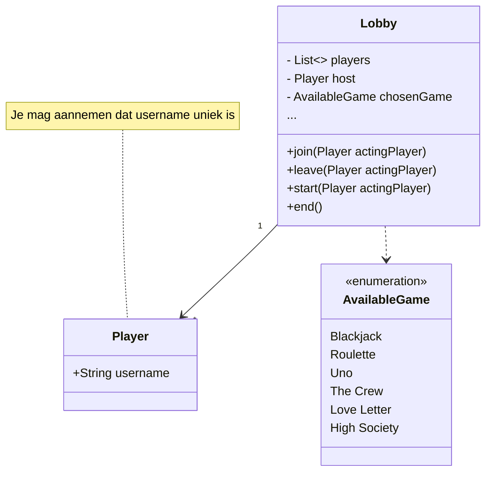

# Plugin Tests

## JEmoji

Krijgen we hier een mooie blush emoji?: :blush:

## Mermaid Diagrams

Mermaid diagrams worden client-side gerenderd, dmv. een ander HTML-template (zie het --- blok bovenaan)

## Plant-UML-diagrams

PlantUML wordt door een Jekyll plugin via de plantuml website gegenereerd (build-time)


@startuml
 class Example {
    - String name
    - int number 
    
    +void getName()
    +void getNumber()
    +String toString()
  }
@enduml


PlantUML is kennelijk ook nukkig, want dit is **iets anders**??


@startuml
testdot
@enduml
